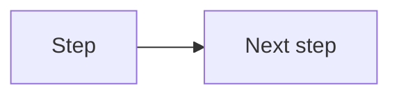

# Lesson NN — <Title>

> **Prereq:** Lesson NN-1. **You'll be able to:** <one concrete capability>.

---

## 1. Concept

<Problem first, solution second. Open with the situation that makes this idea necessary —
ideally something that breaks if you don't have it. Then derive the mechanism.

Teach the WHY. Where a default is surprising or an error message is misleading, stop and
explain the root cause; those are the moments that stick.

Sub-sections 1.1, 1.2, … as needed. Tables beat paragraphs for comparisons.>

### 1.x <A sub-idea>

<...>

---

## 2. Diagram

<Match effort to difficulty:
 - easy idea → skip the diagram entirely, or one small Mermaid block
 - middle → Mermaid (quote every node label so it survives printing)
 - genuinely hard (race conditions, lock/lease timing, partitioning, backpressure,
   distributed failure) → build a standalone interactive HTML visual at
   learn/visuals/<course>/NN-<slug>.html using the course design system, and link it here.>



▶ **Interactive:** open `learn/visuals/<course>/NN-<slug>.html` in a browser.

---

## 3. Walkthrough

<Build the working example piece by piece. For each piece: show the fragment, say what it
does, say WHY it exists, and only then move on. Never dump the finished file first.>

**Step 1 — <what and why>**

```ts
// fragment
```

**Step 2 — <what and why>**

```ts
// fragment
```

### Reference code (keep this)

<Now, and only now, the clean complete working version.>

```ts
// full file
```

---

## 4. Exercise

**The problem:** <a real, general, open-ended task — "simulate X", "build a Y that survives Z".
NOT "create file A and put B in it". Many solutions must be valid.>

**What to hand in:** working code plus the observations it produced (log captures, counts,
whatever proves the behaviour).

**Constraints / hints:** <the minimum needed to keep them unstuck, not a recipe.>

Run it with: `<command>`

---

## 5. Mini challenge

<2–4 questions or a small extension that tests whether the concept actually landed.
Do NOT include the answers. These are the questions I'll grade.>

1. ...
2. ...

---

## Go deeper

- **<Owned course>** — <exact section titles that cover this lesson>. <Flag anything
  hands-on that won't transfer to this stack as "watch conceptually".>
- **<Canonical free article/doc>** — <why this one, in half a line>.
