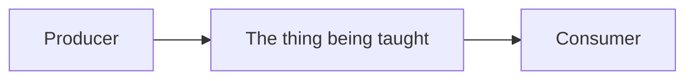

# Learn <TOPIC> — Course Roadmap

<One paragraph: what this course is, what concrete stack it uses, and what the reader is
assumed to already know. If it builds on an earlier course in this repo, say so explicitly
and promise not to re-teach what they already own.>

<Optional but high-value: a one-line thesis the first lesson unpacks. The Kafka course used
"A queue is a to-do list; a topic is a durable, replayable log — that single difference
reshapes everything downstream.">

## How these lessons work

Each lesson is a numbered markdown file with four parts:

1. **Concept** — the idea and, crucially, the _why_.
2. **Diagram** — Mermaid inline (Cmd+Shift+V to preview); a standalone interactive HTML
   visual for the genuinely hard bits.
3. **Walkthrough** — annotated reference code, built up piece by piece.
4. **Exercise** — an open-ended, real problem. _You_ write the code; I review by severity.
   I won't hand you the solution unless you're stuck.

## Prerequisites (set up for you)

- ✅ <service> running at <address> — start/stop: `<command>`
- ✅ <library> installed in <package>
- ✅ <ENV_VAR> wired into the env schema

Sanity check: `<one command that proves the stack is alive>`

## Roadmap

| #   | Lesson | What you'll learn |
| --- | ------ | ----------------- |
| 01  | **<Fundamentals — the one idea everything rests on>** | ... |
| 02  | ...    | ... |
| ... | ...    | ... |
| 10  | Production reliability & ops | failure modes, observability, backpressure |
| 11  | **Capstone** | build one end-to-end system that uses every earlier lesson |

<8–12 lessons. Order them so each one is only possible because of the previous one.
Lesson 01 is always fundamentals; the last is always a capstone that composes the rest.>

## The big picture (where we're headed)

Start with **`01-<slug>.md`**.
