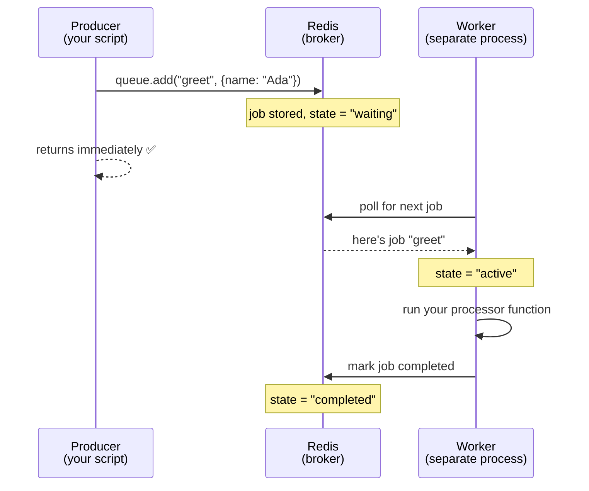

# Lesson 01 — Fundamentals & Your First Queue

## 1. Concept

A **queue** lets you separate *asking for work* from *doing the work*.

Without a queue, if a request needs heavy work (resize an image, send an email,
charge a card), you do it inside the HTTP handler. The user waits. If the server
crashes mid-way, the work is **lost**.

With a queue, the handler just **drops a job onto the queue and returns
immediately**. A separate **worker** process picks the job up later and does the
real work. If the worker crashes, the job is still sitting in Redis and gets
retried.

Three roles, memorize them:

| Role | What it does | In BullMQ |
|------|--------------|-----------|
| **Producer** | Creates a job, puts it on the queue. Returns fast. | `queue.add(name, data)` |
| **Broker / Queue** | Durable middle storage. Holds jobs until processed. | Redis + a `Queue` object |
| **Consumer / Worker** | Pulls jobs, does the actual work. | `new Worker(name, fn)` |

A **job** is just a small JSON payload + a name describing what to do.

### Why Redis + BullMQ?

- **Redis** is an in-memory data store that persists to disk. It's the *broker* —
  the durable place jobs live. It has the right primitives (lists, streams, atomic
  ops) to act as a queue.
- **BullMQ** is a TypeScript library that turns Redis into a proper job queue with
  a clean API: retries, delays, scheduling, concurrency, events — so you don't
  hand-write Redis commands.

The key mental shift: **the Producer and the Worker are different processes.** They
never call each other directly. They only know about the queue. That decoupling is
the whole point — you can restart, scale, or crash either side independently.

## 2. Diagram



Notice the Producer is **done** the moment it adds the job. The Worker runs on its
own clock. They communicate *only* through Redis.

## 3. Walkthrough

BullMQ needs three building blocks. Here's each piece annotated — read it, you'll
write your own version in the exercise.

### a) A Redis connection

BullMQ talks to Redis through `ioredis`. One important quirk: BullMQ requires
`maxRetriesPerRequest: null` on the connection (it manages reconnection itself).

```ts
import { Redis } from "ioredis";
import { env } from "@learn-broker/env/server";

export const connection = new Redis(env.REDIS_URL, {
  maxRetriesPerRequest: null, // required by BullMQ
});
```

### b) A Queue (the producer side)

A `Queue` is a named channel. Both producer and worker refer to the *same name*
("greetings" here) — that's how they find each other.

```ts
import { Queue } from "bullmq";
import { connection } from "./connection";

export const greetingsQueue = new Queue("greetings", { connection });

// Producing a job:
await greetingsQueue.add("greet", { name: "Ada" });
//                       ^name     ^data (any JSON)
```

### c) A Worker (the consumer side)

A `Worker` listens on the same queue name and runs your function for each job.
The function receives the `job`; `job.data` is the payload you added.

```ts
import { Worker } from "bullmq";
import { connection } from "./connection";

const worker = new Worker(
  "greetings",                          // same name as the queue
  async (job) => {
    console.log(`Hello, ${job.data.name}!`);
    return { greeted: true };           // optional return value, stored on the job
  },
  { connection },
);

worker.on("completed", (job) => console.log(`✅ job ${job.id} done`));
worker.on("failed", (job, err) => console.log(`❌ job ${job?.id}:`, err.message));
```

When you run the worker process, it stays alive, polling Redis and processing jobs
as they arrive.

## 4. Exercise

Build the "hello world" of queues: a producer that adds greeting jobs, and a worker
that processes them — **as two separate processes** so you feel the decoupling.

### Your task

Create these files under `apps/server/src/`:

1. **`queue/connection.ts`** — export a configured `ioredis` connection (part `a` above).

2. **`queue/greetings.ts`** — export a `Queue` named `"greetings"` (part `b`).

3. **`producer.ts`** — a script that adds **3 greeting jobs** with different names
   (e.g. Ada, Alan, Grace), logs each job's `id` after adding, then exits cleanly.
   - Hint: after adding, call `await greetingsQueue.close()` and `connection.quit()`
     so the process can exit. (Or `process.exit(0)`.)

4. **`worker.ts`** — a script that creates a `Worker` on `"greetings"` which logs
   `Hello, <name>!` for each job. Add `completed` and `failed` event listeners.
   This process should **stay running** (don't close it).

### How to run it

Open **two terminals** in `apps/server`:

```bash
# Terminal 1 — start the worker and leave it running
pnpm tsx src/worker.ts

# Terminal 2 — fire the producer (run it a few times!)
pnpm tsx src/producer.ts
```

### What success looks like

- Producer terminal prints 3 job IDs and exits.
- Worker terminal prints `Hello, Ada!`, `Hello, Alan!`, `Hello, Grace!` and
  `✅ job ... done` for each.
- **Now the cool part:** stop the worker (Ctrl-C). Run the producer again — it still
  succeeds (jobs pile up in Redis). Start the worker again — it immediately drains
  the backlog. *That's durability and decoupling, live.*

### Things to think about (we'll discuss)

- Why did the jobs survive while the worker was off?
- What do you think `job.id` is for?
- If you started a **second** worker, who would process the jobs?

When you've written the four files (or if you get stuck), tell me and I'll review
your code, line by line. Don't peek ahead — struggling with it a little is the point.
