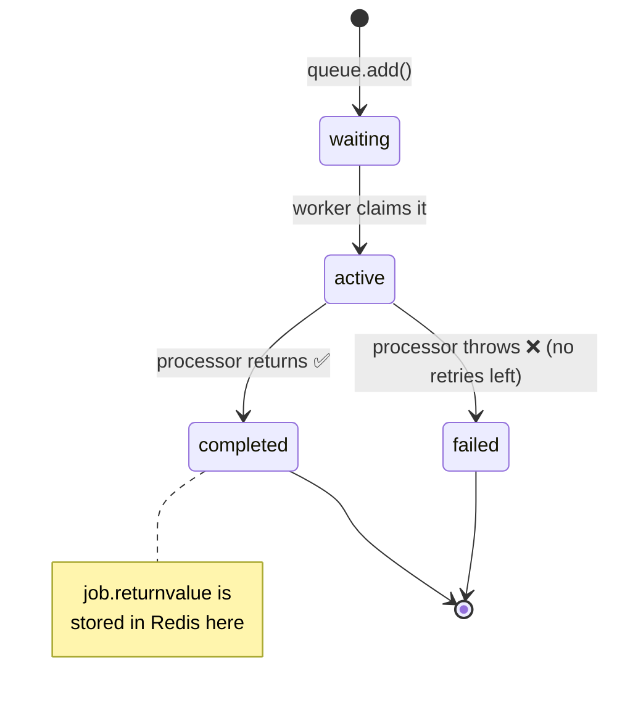

# Lesson 02 — Job Lifecycle & Data

In Lesson 01 you watched jobs go in and come out. Now we open the box: what
_states_ a job moves through, how to **inspect** them, and how data flows **in**
(`job.data`) and **out** (`job.returnvalue`) — including how to get a result back on
the producer side when you actually need it.

## 1. Concept

### A job is a little state machine

Every job moves through a lifecycle. You already triggered all of these in Lesson 01
without seeing the labels:

| State         | Meaning                                                                       |
| ------------- | ----------------------------------------------------------------------------- |
| **waiting**   | In the queue, nobody's picked it up yet. (Producer added it; no free worker.) |
| **active**    | A worker has claimed it and is running your processor function right now.     |
| **completed** | Processor returned successfully. The return value is stored on the job.       |
| **failed**    | Processor threw and ran out of retry attempts (Lesson 03).                    |
| **delayed**   | Scheduled to become `waiting` later (Lesson 04).                              |

The transitions are the important part:

- `waiting → active` happens when a worker is free and **atomically claims** the job
  (the "exactly one worker" guarantee from your Q3).
- `active → completed` when your function **returns**.
- `active → failed` when it **throws** (and no retries remain).

### Data in, data out

A job carries two payloads:

- **`job.data`** — the **input** you passed to `queue.add(name, data)`. Read-only
  from the worker's perspective (it's what you were given to work on).
- **`job.returnvalue`** — the **output**: whatever your processor function
  `return`s gets serialized and stored **on the job in Redis**. That's why your
  `return { greeted: true }` in Lesson 01 wasn't thrown away — BullMQ persisted it.

Both must be **JSON-serializable** (BullMQ uses MessagePack under the hood). No
functions, no class instances, no `Date` objects that you expect to survive as
`Date` — they become strings. Stick to plain data.

### Two ways to "get the result"

This is the subtle part of the lesson. Once a job completes, its return value lives
in Redis. You can get it two ways:

1. **Look it up later** (the normal, async way) — fetch the job by id whenever you
   like and read `job.returnvalue`. The producer does **not** block.
2. **Wait for it inline** (`job.waitUntilFinished`) — the producer _blocks_ until the
   worker finishes and hands you the return value directly. This turns your queue
   into a **request/reply** channel.

⚠️ Option 2 is a **trap if overused.** The whole point of a queue is that the
producer _doesn't wait_. If you `waitUntilFinished` on every job, you've rebuilt a
slow synchronous function call with extra steps. Use it only when the caller
genuinely needs the answer before responding (e.g. an API endpoint that must return
a computed result). We'll use it once here so you understand it — then mostly avoid
it.

## 2. Diagram



## 3. Walkthrough

### Inspecting a single job's state

`queue.getJob(id)` fetches a job; `job.getState()` tells you where it is.

```ts
const job = await queue.add("add", { a: 2, b: 3 });
console.log(await job.getState()); // "waiting" (or "active" if a worker grabbed it instantly)
// ...later...
const fresh = await queue.getJob(job.id!);
console.log(await fresh!.getState()); // "completed"
console.log(fresh!.returnvalue); // { sum: 5 }   ← what the worker returned
```

Note `queue.getJob` gives you a **snapshot**. `job.returnvalue` on _your_ original
`job` object won't auto-update — re-fetch (or use events) to see the latest.

### Counting jobs by state

Great for dashboards and sanity checks:

```ts
console.log(await queue.getJobCounts());
// { waiting: 2, active: 1, completed: 9, failed: 0, delayed: 0, ... }
```

### Returning a computed value from the worker

Whatever you `return` becomes `job.returnvalue`:

```ts
new Worker(
  "math",
  async (job) => {
    const { a, b } = job.data;
    return { sum: a + b }; // ← stored on the job as returnvalue
  },
  { connection },
);
```

### Getting the result back inline (request/reply)

To block until a job finishes, you need a `QueueEvents` listener (it streams state
changes from Redis), then `job.waitUntilFinished(queueEvents)`:

```ts
import { Queue, QueueEvents } from "bullmq";

const queueEvents = new QueueEvents("math", { connection });
await queueEvents.waitUntilReady();

const job = await mathQueue.add("add", { a: 2, b: 3 });
const result = await job.waitUntilFinished(queueEvents); // blocks here
console.log("got result:", result); // { sum: 5 }
```

`waitUntilFinished` **resolves** with the return value if the job completes, and
**rejects (throws)** if the job fails — so wrap it in try/catch in real code.

## 4. Exercise

Build a tiny "math service" and observe the full lifecycle. Do it **step by step** —
each step teaches one thing.

### Setup

Create a new queue + worker (keep your greetings ones; this is separate):

- **`math.queue.ts`** — a `Queue` named `"math"` (reuse your existing `connection`).
- **`math.worker.ts`** — a `Worker` on `"math"` whose processor:
  - reads `{ a, b }` from `job.data`,
  - waits ~1500ms (so you can catch the `active` state — like you did in Lesson 01),
  - `return`s `{ sum: a + b }`.
  - Keep the `completed` / `failed` listeners.

### Step 1 — Watch the states change

Create **`math.inspect.ts`** that:

1. Adds one job `{ a: 2, b: 3 }`.
2. Logs `await job.getState()` **immediately** after adding.
3. Waits ~2500ms (longer than the worker's delay), then re-fetches the job with
   `queue.getJob(job.id!)` and logs its state **and** its `returnvalue`.

Run the worker in one terminal, then `math.inspect.ts` in another. You should see
the state go from `waiting`/`active` → `completed`, and the return value appear.

> Question to answer in a comment: what state did step 2 print, and **why** that one?

### Step 2 — Count the jobs

In the same script (or a new one), log `await queue.getJobCounts()` **before** adding
any jobs and **after** the job completes. Note how the numbers move between buckets.

### Step 3 — Get the result inline (request/reply)

Create **`math.request.ts`** that uses `QueueEvents` + `job.waitUntilFinished()` to
add a job and **print the sum directly**, without manually re-fetching. Make sure the
worker is running.

> Question to answer in a comment: how is this different, from the _producer's_
> point of view, from Step 1? When would blocking like this be a **bad** idea?

### Step 4 (think, don't code) — Force a failure

What do you predict happens to `waitUntilFinished` if the worker throws instead of
returning? (We'll verify this for real in Lesson 03.) Write your prediction in a
comment.

### What success looks like

- Step 1: you see `waiting`/`active` → `completed` and `{ sum: 5 }`.
- Step 2: counts shift from `waiting`/`active` into `completed`.
- Step 3: the script prints `5` (well, `{ sum: 5 }`) directly, no manual re-fetch.

When you've written it (and your comment answers), tell me and I'll review. As
always — wrestle with it first; don't ask me for the solution unless you're stuck.
