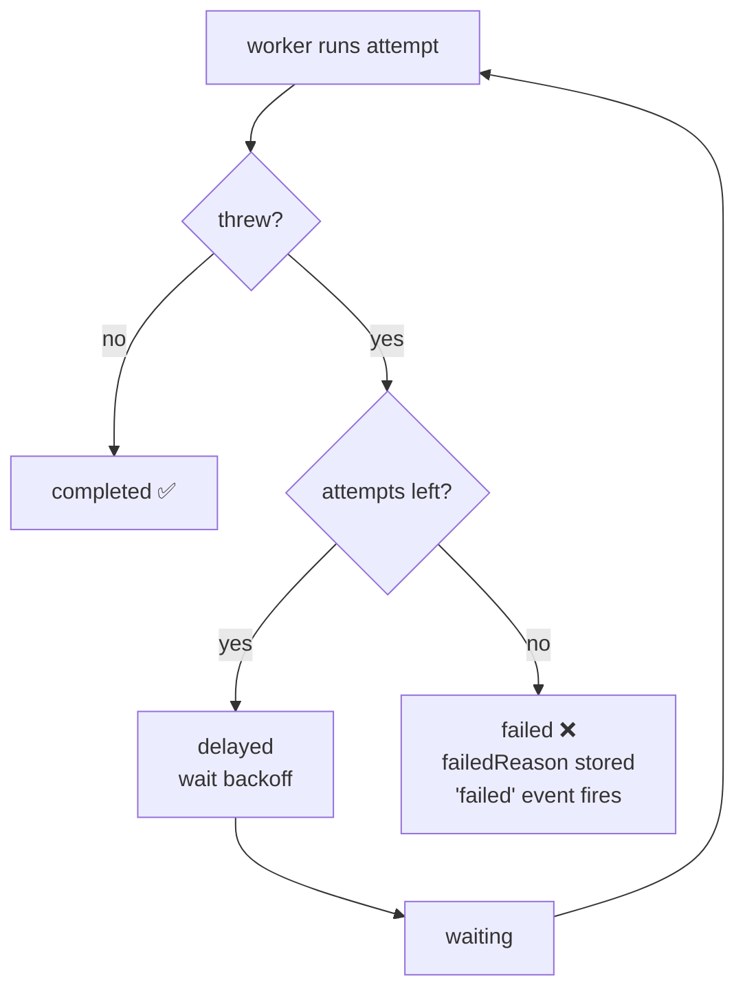

# Lesson 03 — Failure & Retries

This is the lesson that makes you *trust* a queue. Up to now your jobs always
succeeded. Real jobs call flaky APIs, hit timeouts, and crash. Here you'll make a
worker fail **on purpose** and watch BullMQ do the thing that justifies its
existence: **retry the work automatically, with backoff, and only give up
deliberately.**

## 1. Concept

### What "throwing" means to BullMQ

Your processor function has a contract:

- **return** → job **succeeded** → state `completed`.
- **throw** (or reject) → job **failed *this attempt***.

A failed attempt is **not** the same as a failed job. When an attempt throws,
BullMQ asks: *are there retry attempts left?*

- **Yes** → the job goes back to be re-run later (often after a delay). It is **not**
  lost.
- **No** → the job moves to the **`failed`** state for good, and the `failed` event
  fires.

This is the heart of durability you observed in Lesson 01: the broker holds the job
and keeps trying. A crash mid-job isn't data loss — it's just a failed attempt that
gets retried.

### `attempts` — how many tries

By default a job gets **1** attempt (no retries). You opt into retries per job (or as
a queue default):

```ts
await queue.add("charge", data, { attempts: 3 });
//                                ^ try up to 3 times before giving up
```

`job.attemptsMade` tells you how many attempts have happened — log it to *see* the
retries.

### `backoff` — how long to wait between tries

Retrying instantly is usually wrong: if an API is down or rate-limiting you,
hammering it again immediately just fails again. **Backoff** spaces retries out.

| Strategy | Delay between attempts | Use when |
|----------|------------------------|----------|
| `fixed` | same every time (e.g. 2s, 2s, 2s) | predictable, simple |
| `exponential` | grows: ~1s, 2s, 4s, 8s… | external services, rate limits (gives them time to recover) |

```ts
await queue.add("charge", data, {
  attempts: 5,
  backoff: { type: "exponential", delay: 1000 }, // 1s, 2s, 4s, 8s ...
});
```

While a job waits between retries, it sits in the **`delayed`** state (remember that
one from the lifecycle table?).

### When it finally fails

Once attempts are exhausted, the job lands in `failed` and stays there (in Redis's
failed set) so you can inspect or replay it later. Two useful fields:

- **`job.failedReason`** — the error message of the last attempt.
- **`job.stacktrace`** — array of stack traces from the attempts.

That retained failed job is the seed of a **Dead Letter Queue** (Lesson 06).

### And your Step-4 prediction

You predicted `waitUntilFinished` *throws* if the job fails. Correct — when the job
exhausts its attempts, `waitUntilFinished` **rejects** with the job's error. So a
producer using request/reply must `try/catch`.

## 2. Diagram



The loop on the left is durability in action. The only way out the bottom (`failed`)
is **running out of attempts** — a deliberate decision you configured, not an
accident.

## 3. Walkthrough

### A worker that fails, then succeeds

To *see* retries, make the worker fail the first couple of attempts and then succeed.
`job.attemptsMade` lets you do this deterministically:

```ts
new Worker("flaky", async (job) => {
  console.log(`attempt #${job.attemptsMade + 1} for job ${job.id}`);
  if (job.attemptsMade < 2) {
    throw new Error("simulated transient failure (e.g. API timeout)");
  }
  return { ok: true }; // succeeds on the 3rd attempt
}, { connection });
```

> Note: `attemptsMade` counts attempts already completed. Don't over-index on the
> exact number — **log it and observe** what your version prints; semantics like this
> are exactly the kind of thing worth verifying empirically rather than assuming.

### Configuring retries + backoff on the producer

```ts
await flakyQueue.add("task", { foo: 1 }, {
  attempts: 3,
  backoff: { type: "exponential", delay: 1000 },
});
```

### Listening for the outcomes

```ts
worker.on("completed", (job) =>
  console.log(`✅ ${job.id} done after ${job.attemptsMade} attempt(s)`));

worker.on("failed", (job, err) =>
  console.log(`❌ ${job?.id} gave up after ${job?.attemptsMade} attempt(s): ${err.message}`));
```

(Note we're using `failed` — the fix from your Lesson 02 review. `failed` fires only
once attempts are exhausted, **not** on every intermediate retry.)

### Inspecting a permanently-failed job

```ts
const job = await flakyQueue.getJob(id);
console.log(await job?.getState());   // "failed"
console.log(job?.failedReason);       // last error message
console.log(await flakyQueue.getJobCounts()); // { failed: 1, ... }
```

### Defaults vs per-job

You can set retry policy once for the whole queue instead of per `add`:

```ts
const flakyQueue = new Queue("flaky", {
  connection,
  defaultJobOptions: { attempts: 3, backoff: { type: "exponential", delay: 1000 } },
});
```
Per-`add` options override the defaults. In real apps you usually set sensible
defaults on the queue and override only for special jobs.

## 4. Exercise

Build a **flaky job** queue and watch the retry machinery work. Remember the cleanup
fixes from last lesson (don't let one-shot scripts hang; use the `failed` event).

### Part A — Retry, then succeed

1. **`flaky.queue.ts`** — a `Queue` named `"flaky"` (reuse your shared `@/connection`,
   per last lesson's connection-sprawl note).
2. **`flaky.worker.ts`** — a worker that:
   - logs the attempt number (`job.attemptsMade`),
   - **throws** while `job.attemptsMade < 2`, otherwise returns `{ ok: true }`,
   - has both `completed` and `failed` listeners (use `failed`, not `error`!).
3. **`flaky.producer.ts`** — adds one job with `attempts: 3` and
   `backoff: { type: "exponential", delay: 1000 }`. Then exits cleanly.

Run the worker, fire the producer. **Watch the timing** of the attempt logs — you
should see the gaps grow (~1s, then ~2s) as exponential backoff kicks in, and the
job should end **completed** on attempt 3.

> In a comment: roughly how long between attempt #1 and #2, and between #2 and #3?
> Does it match exponential backoff?

### Part B — Permanent failure

1. Add a second producer (or a flag) that enqueues a job which **always throws**
   (e.g. data `{ alwaysFail: true }`, and have the worker throw unconditionally for
   that case), still with `attempts: 3`.
2. After it gives up, write a small **`flaky.inspect.ts`** that fetches the job and
   logs its `getState()`, `failedReason`, and `getJobCounts()`.

> In a comment: how many times did the worker run before the job became `failed`?
> Where does the failed job *go* — is it gone, or still in Redis?

### Part C — Confirm the `waitUntilFinished` prediction

Take an always-failing job and `await job.waitUntilFinished(queueEvents)` around it.
Confirm it **throws**, and catch the error:

```ts
try {
  await job.waitUntilFinished(queueEvents);
} catch (err) {
  console.log("waitUntilFinished rejected:", (err as Error).message);
}
```

> In a comment: was your Lesson-02 Step-4 prediction right?

### What success looks like

- Part A: attempts #1 and #2 throw, growing delay between them, attempt #3 completes.
- Part B: worker runs 3× then the job is `failed`; `failedReason` shows your error;
  `getJobCounts()` shows `failed: 1`. The job is **still in Redis**, not gone.
- Part C: `waitUntilFinished` throws, caught cleanly.

When you've got it (with your comment answers), tell me and I'll review. Pay
attention to the **delays** — that's the part people don't expect.
