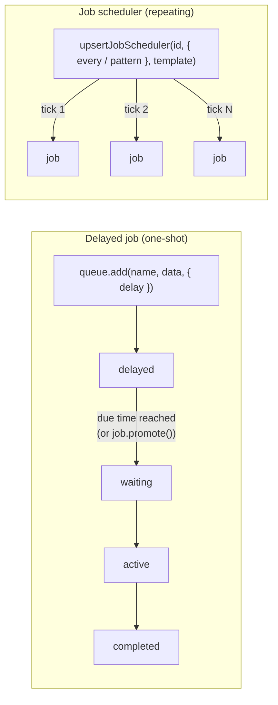

# Lesson 04 — Delays & Scheduling

You've already met the `delayed` state without asking for it: in Lesson 03,
**backoff between retries IS a delayed job** — BullMQ parked your flaky job in
`delayed` for 2s, then 4s, before re-running it. This lesson makes you use that
machinery *deliberately*, two ways:

1. **Delayed jobs** — "run this once, but not before time X" (reminders, trial
   expirations, "send follow-up email in 24h").
2. **Job schedulers** — "run this *repeatedly* on a schedule" (cron-like: nightly
   cleanup, weekly digest, poll an API every 30s).

## 1. Concept

### Delayed jobs: a one-shot timer that survives restarts

Add a `delay` (milliseconds) and the job enters the **`delayed`** state instead of
`waiting`:

```ts
await queue.add("send-reminder", { userId: 42 }, { delay: 5000 }); // run in ~5s
```

Why is this better than `setTimeout`? Same reason a queue beats a function call:
**the timer lives in Redis, not in your process.** If your server restarts, a
`setTimeout` is gone forever; a delayed job is still there, waiting for its moment.

Mechanics worth knowing:

- Delayed jobs sit in a Redis sorted set, scored by their due timestamp.
- When the time comes the job is **promoted**: `delayed → waiting`, and a worker
  picks it up like any other job.
- The delay is a **"not before"**, not an exact appointment. If all workers are busy
  (or none are running!) when the job becomes due, it runs later. Expect close-to-
  on-time, not millisecond precision.
- You can inspect them (`queue.getDelayed()`) and **skip the wait** manually:
  `await job.promote()` moves it to `waiting` right now. Useful in tests and admin
  tools ("send it now" button).

### Job schedulers: cron, but in your queue

A **job scheduler** is a factory registered in Redis that *produces a new job* every
tick. The modern API (BullMQ ≥ 5.16) is `upsertJobScheduler`:

```ts
await queue.upsertJobScheduler(
  "nightly-report",                      // scheduler id (unique per queue)
  { every: 60_000 },                     // tick every 60s...
  // { pattern: "0 3 * * *" },          // ...or real cron syntax (3 AM daily)
  {
    name: "report",                      // each tick adds a job with this name
    data: { kind: "nightly" },           // ...and this data
    opts: { attempts: 3 },               // ...and these options
  },
);
```

Three properties that make this production-friendly:

- **Upsert = idempotent.** Calling it again with the same id *updates* the schedule
  instead of duplicating it. So you can run it on every app startup, fearlessly —
  this is the standard pattern: register your schedulers when the server boots.
- **Each tick is a normal job.** Retries, backoff, events, `failed` state — all of
  Lesson 03 applies to every tick individually.
- **It lives in Redis.** No worker running at 3 AM? The scheduler doesn't care —
  ticks are produced by the queue machinery, and workers process them when they're
  back. (Missed ticks don't pile up into a thundering herd, though — verify what
  *your* version does, as always.)

Manage them with `queue.getJobSchedulers()` and
`queue.removeJobScheduler("nightly-report")`.

### When to use which

| You want | Use |
|----------|-----|
| run once, later | `delay` option |
| run every N seconds/minutes | scheduler with `every` |
| run at specific times (cron) | scheduler with `pattern` |
| retry spacing | you already have it — `backoff` (L03) |

## 2. Diagram



One-shot: a single job slides through `delayed` on its way to a worker.
Scheduler: a *template* in Redis that stamps out a fresh, ordinary job per tick.

## 3. Walkthrough

### Watching a delayed job wait

```ts
const job = await queue.add("remind", { msg: "hi" }, { delay: 5000 });
console.log(await job.getState());        // "delayed"
console.log(await queue.getDelayed());    // [ the job ]
console.log(await queue.getJobCounts());  // { delayed: 1, ... }
// ~5s later (worker running): state becomes completed
```

### Skipping the line

```ts
const job = await queue.add("remind", { msg: "now please" }, { delay: 60 * 60 * 1000 });
await job.promote();                      // delayed → waiting immediately
```

### A scheduler ticking

```ts
await queue.upsertJobScheduler("heartbeat", { every: 3000 }, {
  name: "beat",
  data: { source: "lesson-04" },
});
// worker logs a fresh job every ~3s, each with a NEW job id

console.log(await queue.getJobSchedulers());     // [ { key: "heartbeat", every: 3000, ... } ]
await queue.removeJobScheduler("heartbeat");     // ticking stops
```

> ⚠️ A scheduler keeps ticking until you **remove** it — closing your script does
> NOT stop it (it lives in Redis, remember). If jobs keep appearing "from nowhere"
> later, you forgot to remove a scheduler. `getJobSchedulers()` is your friend.

## 4. Exercise

Build a **reminder service**. New folder `apps/server/src/reminder/`.

**House rules this time (the open cleanups from Lesson 03 — now they're graded):**

- Every `Queue` / `Worker` / `QueueEvents` uses the shared `@/connection` —
  delete `math/redis-connection.ts` and fix `flaky.queue.ts` while you're at it.
- Every one-shot script **exits cleanly** (close + `process.exit(0)`). I will run
  `pgrep` after your scripts. The nemesis ends here. 🙂

### Part A — Delayed job

1. **`reminder.queue.ts`** + **`reminder.worker.ts`** — queue named `"reminder"`;
   the worker just logs `job.data.msg` and returns. Log the job id too.
2. **`reminder.delayed.ts`** (producer) that:
   - adds a job with `{ msg: "drink water" }` and `delay: 5000`,
   - immediately logs `getState()` and `getJobCounts()`,
   - then waits ~7s, re-fetches the job, and logs its state again,
   - exits cleanly.

Run worker + producer. You should see `delayed` → (5s pause) → worker logs the
reminder → `completed`.

> In a comment: kill the worker, run the producer, wait 10s, **then** start the
> worker. What happens to the reminder — lost or late? Why is that the whole point?

### Part B — Promote

In a new script **`reminder.promote.ts`**: add a job with a delay of **1 hour**,
log its state, then `await job.promote()` and log the state again. With the worker
running, confirm it executes immediately instead of at +1h.

> In a comment: name one real-world feature where `promote()` is exactly what an
> admin panel needs.

### Part C — Scheduler

**`reminder.schedule.ts`**:

1. `upsertJobScheduler("hydrate", { every: 3000 }, ...)` with name/data of your
   choice.
2. Let the worker log 3–4 ticks (note: **each tick has a different job id**).
3. Log `getJobSchedulers()`.
4. Then remove the scheduler, confirm ticking stops, and exit cleanly.

> Two questions to answer in comments:
> 1. Run `reminder.schedule.ts` **twice** without removing the scheduler in
>    between. How many schedulers exist? How many jobs tick per 3s? Why is that
>    the behavior you'd want on server restarts?
> 2. What's the difference between a job sitting in `delayed` because of
>    **backoff** (L03) vs because of **`delay`** (now)? (Hint: trick question.)

### What success looks like

- Part A: `delayed` state observed, reminder fires ~5s later, survives a
  worker-less gap and fires late rather than never.
- Part B: state flips `delayed → waiting/active` on `promote()`, runs immediately.
- Part C: a tick every ~3s with fresh job ids; `getJobSchedulers()` shows exactly
  one `"hydrate"` even after a double-run; removal stops it; **no orphan scheduler
  left ticking in Redis** after your script ends.
- `pgrep -f reminder` finds nothing after your one-shot scripts finish.

When you're done (with comment answers), tell me and I'll review.
