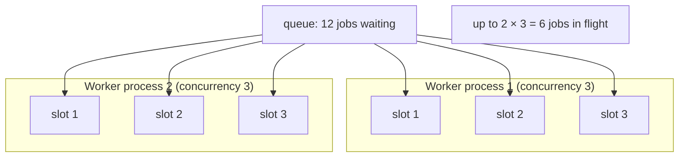

# Lesson 05 — Concurrency & Scaling

So far you've run **one worker doing one job at a time**. That's a bottleneck: 100
jobs that each take 1 second take 100 seconds. This lesson is about throughput — how
to process many jobs at once — and the subtle, genuinely-confusing part: **Node is
single-threaded**, so "concurrency" doesn't mean what people think it means.

You actually saw a preview of this already: while reviewing Lesson 03, your worker
and my worker accidentally **split the flaky jobs between them** (~22/23). That was
two competing consumers scaling out. Now we do it on purpose.

## 1. Concept

There are **two independent knobs** for processing more jobs at once. People confuse
them constantly, so pin them down:

### Knob 1 — `concurrency` (within ONE worker process)

```ts
new Worker("q", processor, { connection, concurrency: 5 });
```

This lets a **single worker** pull up to 5 jobs and run their processor functions
**concurrently**. But — and this is the whole lesson — it runs them on **one thread,
one event loop**. It is `async` concurrency, not parallelism. The 5 jobs make
progress by **taking turns** whenever one of them `await`s something (a DB query, an
HTTP call, a `setTimeout`).

- **I/O-bound work** (awaiting network/DB/disk): concurrency is a **huge** win. While
  job A waits on its `await fetch(...)`, the event loop runs job B, C, D, E. Five
  jobs that each spend 1s *waiting* finish in ~1s total, not 5s.
- **CPU-bound work** (hashing, image resize, a `while` loop crunching numbers):
  concurrency gives you **almost nothing**. A tight CPU loop never yields the event
  loop, so jobs B–E are frozen until A finishes. You just get A, then B, then C...
  serially, with extra overhead. ← the trap.

### Knob 2 — number of worker **processes** (horizontal scaling)

Run the *same* worker file in **multiple OS processes** (or on multiple machines):

```bash
tsx worker.ts &   # process 1
tsx worker.ts &   # process 2
```

Now you have **real OS-level parallelism** — separate threads, separate memory,
separate CPU cores. This *does* help CPU-bound work, and it's how you survive a crash
(one worker dies, the others keep going) and how you scale across machines. Each job
is still claimed by **exactly one** worker (competing consumers, from L01).

### The formula

```
max jobs running at once  =  (number of worker processes) × (concurrency per worker)
```

`2 workers × concurrency 5 = up to 10 jobs in flight.` Which knob to turn depends on
your bottleneck: **I/O-bound → crank concurrency** (cheap, one process). **CPU-bound
→ add processes** (real parallelism). Usually you use both.

### Two consequences you must internalize

- **Ordering is gone.** With concurrency > 1, jobs finish in whatever order they
  complete, *not* the order you added them. If you need strict ordering, you need
  concurrency 1 (or BullMQ's *flows*/*groups* — later). Don't assume FIFO once you
  scale.
- **Rate limiting** is the *opposite* knob — sometimes you must process *slower* (a
  payment API allows 10 req/s). BullMQ has a built-in limiter:

  ```ts
  new Worker("q", processor, {
    connection,
    concurrency: 50,
    limiter: { max: 10, duration: 1000 }, // at most 10 jobs started per 1000ms
  });
  ```

  Concurrency says "how many *can* run"; the limiter says "but no faster than this
  rate." They work together.

## 2. Diagram — open the interactive visual

Mermaid can't show *timing*, and timing is the entire point here. So this lesson has
an **interactive HTML visual**. Open it in a browser:

```
learn/visuals/05-concurrency.html
```

(In the IDE: right-click the file → *Open with Live Server* or *Reveal in Finder* →
double-click. It's a standalone file, no server needed.)

Play with it: set **workers** and **concurrency**, toggle **I/O-bound vs CPU-bound**,
and watch 12 jobs flow through the slots on a live timeline. Watch specifically how
**CPU-bound mode collapses concurrency back to serial** within a process — that's the
intuition the prose can't give you.

A static snapshot of the idea:



## 3. Walkthrough

### Setting concurrency

```ts
const worker = new Worker("slow", async (job) => {
  console.log(`▶ start ${job.id} @ ${Date.now() % 100000}`);
  await new Promise((r) => setTimeout(r, 1000)); // simulate I/O (await = yields!)
  console.log(`■ end   ${job.id} @ ${Date.now() % 100000}`);
  return job.id;
}, { connection, concurrency: 5 });
```

With `concurrency: 5` and 10 jobs, you'll see **5 `start` lines burst out together**,
~1s pass, **5 `end` lines**, then the next 5. That interleaving *is* the concurrency.

### Running multiple worker processes

Just start the file twice. Each process gets its own slots; they compete for jobs
off the same Redis queue. Add a label so you can tell them apart:

```ts
const who = process.env.WORKER_NAME ?? "w?";
// ...inside processor: console.log(`[${who}] start ${job.id}`)
```

```bash
WORKER_NAME=A tsx src/scale/scale.worker.ts &
WORKER_NAME=B tsx src/scale/scale.worker.ts &
```

You'll watch jobs split across `[A]` and `[B]` — competing consumers, deliberately
this time.

### The CPU-bound trap (the thing to actually feel)

Swap the `await setTimeout` for a **synchronous** burn:

```ts
// CPU-bound: a tight loop that never yields the event loop
const end = Date.now() + 1000;
while (Date.now() < end) { /* spin */ }
```

Now `concurrency: 5` buys you **nothing** — the jobs run one after another, because
the spinning loop never lets the event loop switch tasks. Same concurrency setting,
totally different behavior. This is *the* Node gotcha for queue workers.

### Rate limiting

```ts
new Worker("slow", processor, {
  connection,
  concurrency: 50,
  limiter: { max: 5, duration: 1000 }, // no more than 5 starts per second
});
```

Even though 50 *could* run, the limiter releases at most 5 per second — for being a
polite client to a rate-limited downstream API.

## 4. Exercise

New folder: `apps/server/src/scale/`. Same house rules (shared `@/connection`, clean
exits on one-shot scripts).

### Part A — Feel I/O concurrency (measure wall-clock)

1. **`scale.queue.ts`** — queue `"scale"`.
2. **`scale.worker.ts`** — processor logs `start`/`end` with a timestamp and the job
   id, does `await setTimeout(1000)`, returns. Read concurrency from an env var:
   `concurrency: Number(process.env.CC ?? 1)`.
3. **`scale.producer.ts`** — adds **10** jobs, then exits cleanly.

Run it **twice** and compare wall-clock (use `time`, or log timestamps):

```bash
CC=1 tsx src/scale/scale.worker.ts &   # then fire producer
CC=5 tsx src/scale/scale.worker.ts &   # then fire producer (fresh jobs)
```

> In a comment: how long did 10 jobs take with `CC=1` vs `CC=5`? Explain the ratio.
> Did the `end` order match the `start` order? Why not?

### Part B — Scale out to two processes (competing consumers, on purpose)

Keep `CC=1`. Start **two** worker processes with names `A` and `B` (env var), fire 10
jobs, and watch them split.

> In a comment: roughly how did the 10 jobs divide between A and B? Is the split
> guaranteed 50/50? What claims a job for one worker and not the other? (Tie this
> back to the atomic-claim guarantee from Lesson 01.)

### Part C — The CPU-bound trap (predict, then verify)

**First write your prediction in a comment**, *then* run it:

1. Make a second processor (or a `MODE=cpu` branch) that burns the CPU **synchronously**
   for ~1s (the `while (Date.now() < end)` loop) instead of awaiting.
2. Run it with `CC=5` and 10 jobs.

> In a comment: did `CC=5` speed it up like Part A did? Was your prediction right?
> **Why** does the same `concurrency: 5` behave so differently? What would you change
> to actually parallelize CPU-bound work?

### Part D (think, don't code) — Rate limit

You must call an API that allows **3 requests/second**, but you want 100 jobs done
ASAP. What `concurrency` and `limiter` would you set, and why are those two settings
not in conflict?

### What success looks like

- Part A: `CC=5` finishes ~5× faster than `CC=1`; `end` order ≠ `start` order.
- Part B: jobs split across `[A]`/`[B]`, each job done exactly once, split *roughly*
  even but not guaranteed.
- Part C: `CC=5` does **not** speed up the CPU-bound version — it runs ~serially —
  and you can explain why (single event loop, no yield) and what fixes it (more
  processes / sandboxed processors).

Open the interactive visual first, play with the knobs, *then* write the code — the
visual gives you the prediction, the code confirms it. Ping me when done.
