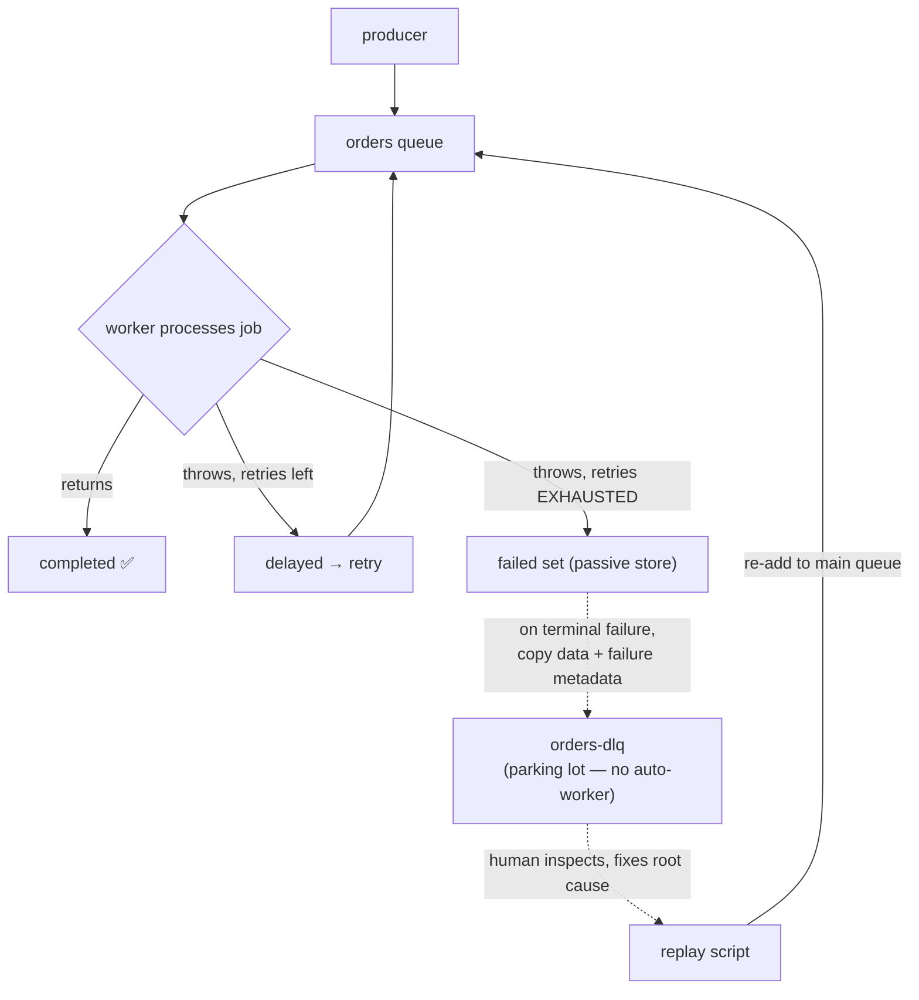

# Lesson 06 — Dead Letter Queues (DLQ)

In Lesson 03 you made jobs fail permanently and saw them land in the **`failed`**
set. We left a question hanging: *then what?* In production, "it's in the failed set"
isn't an answer. Someone has to **notice**, **diagnose**, and often **replay** those
jobs after a fix ships. That's what a **Dead Letter Queue** is for.

## 1. Concept

### The failed set is already a (passive) dead-letter store

Good news first: BullMQ **does not lose** terminally-failed jobs. They sit in the
queue's `failed` set with their `failedReason` and `stacktrace`, exactly where you
inspected them in L03. So in a sense you already have dead-letter *storage*.

The limitation is that it's **passive and entangled with the main queue**:

- It grows without bound unless you cap it (`removeOnFail`), and a flood of failures
  bloats the *same* queue you're trying to run healthy jobs on.
- There's no natural place to **alert** ("page me when an order dies").
- Replaying is ad-hoc — you'd be re-`add`ing from the same queue's failed set by hand.
- You can't give failures their own **retention / priority / ownership** (often a
  different team cares about the dead ones).

### A dedicated DLQ: a separate queue for the dead

The pattern: when a job **terminally** fails, you copy it — its data plus failure
metadata — into a **separate, dedicated queue** (e.g. `"orders-dlq"`). The main queue
stays clean; the DLQ becomes the single place to monitor, inspect, and replay from.

> **Cross-broker note (this transfers!):** RabbitMQ has this as a *native* feature —
> a **Dead Letter Exchange (DLX)** routes rejected/expired messages automatically.
> Kafka teams use a dedicated **dead-letter topic**. BullMQ has **no built-in DLQ
> primitive** — you assemble it from a second `Queue` + the `failed` event. Knowing
> *the pattern* is what carries across all three.

### ⚠️ The gotcha we verified together

We tested this live, and it's the crux of doing DLQ right in BullMQ:

```
worker 'failed' event fired:  3 times   ← once PER failed attempt
  #1 attemptsMade=1/3 terminal=false
  #2 attemptsMade=2/3 terminal=false
  #3 attemptsMade=3/3 terminal=true     ← only THIS one is the real death
```

The worker's `failed` event fires on **every** failed attempt, not just the last.
So if you route to the DLQ on every `failed`, a job with `attempts: 3` gets
dead-lettered **three times**. You must detect the **terminal** failure:

```ts
worker.on("failed", async (job, err) => {
  if (!job) return;
  const maxAttempts = job.opts.attempts ?? 1;
  if (job.attemptsMade >= maxAttempts) {
    // TERMINAL — retries exhausted, this is a real death → DLQ it
  }
  // else: just a transient attempt that will be retried; do nothing
});
```

(Alternatively, listen on `QueueEvents` for the terminal-only signal — in our test
`QueueEvents 'failed'` fired **once** and there was a `retries-exhausted` event. The
`attemptsMade >= attempts` check is the most explicit and version-robust, so we'll
use that.)

### A DLQ usually has no auto-worker

Counterintuitive but important: you typically **don't** attach a worker that
auto-processes the DLQ. If the job failed 3× already, immediately reprocessing it just
fails again. The DLQ is a **parking lot**: humans (or an alert) look at it, fix the
root cause (bad data, a downstream bug, a deploy), and then **deliberately replay**.
Auto-processing a DLQ usually recreates the original failure loop.

## 2. Diagram



The dashed arrows are **your code** (the routing and the replay). The solid arrows are
BullMQ's built-in lifecycle. A DLQ is just "wire the dashed arrows."

## 3. Walkthrough

### Routing a terminally-failed job to the DLQ

```ts
import { Queue, Worker } from "bullmq";
import { connection } from "@/connection";

const dlq = new Queue("orders-dlq", { connection });

const worker = new Worker("orders", processor, { connection });

worker.on("failed", async (job, err) => {
  if (!job) return;
  const maxAttempts = job.opts.attempts ?? 1;
  if (job.attemptsMade < maxAttempts) return; // transient — will retry, ignore

  // terminal death → dead-letter it with everything you'll need to debug/replay
  await dlq.add("dead", {
    originalId: job.id,
    name: job.name,
    data: job.data,                 // the original payload (to replay later)
    failedReason: err.message,
    attemptsMade: job.attemptsMade,
    diedAt: new Date().toISOString(),
  });
});
```

Store the **original `data`** — that's what you'll re-enqueue on replay. The rest is
forensics.

### Inspecting the DLQ

```ts
const dead = await dlq.getJobs(["waiting", "completed", "failed"]);
for (const j of dead) {
  console.log(j.data.originalId, j.data.failedReason, j.data.data);
}
console.log(await dlq.getJobCounts());
```

(Where the dead jobs *sit* in the DLQ depends on whether the DLQ has a worker. With
no worker they stay `waiting`. That's fine — `getJobs(["waiting"])` lists them.)

### Replaying after a fix

```ts
const ordersQueue = new Queue("orders", { connection });
const dead = await dlq.getJobs(["waiting"]);

for (const j of dead) {
  await ordersQueue.add(j.data.name, j.data.data, { attempts: 3 }); // back to the main queue
  await j.remove();                                                  // clear it from the DLQ
}
console.log(`replayed ${dead.length} jobs`);
```

That's the whole point of keeping the data: **after you ship a fix, you can re-drive
every dead job through the (now-working) pipeline** instead of losing the work.

## 4. Exercise

Build an order-processing pipeline with a real DLQ. New folder
`apps/server/src/orders/`. House rules as always (shared `@/connection`, one-shot
scripts exit cleanly).

### Part A — Route terminal failures to a DLQ

1. **`order.queue.ts`** — queue `"orders"`.
2. **`order.dlq.ts`** — queue `"orders-dlq"`.
3. **`order.worker.ts`** — processor that:
   - reads `job.data` (an order like `{ id, amount, valid }`),
   - **throws** if `job.data.valid === false` (simulating a permanently-bad order),
     otherwise returns `{ charged: true }`.
   - In a `failed` handler, **only on terminal failure** (`attemptsMade >= attempts`),
     route the job to `orders-dlq` with its data + `failedReason`. Log clearly when
     you DLQ something.
4. **`order.producer.ts`** — adds a **mix**: a few valid orders and 2 invalid ones
   (`valid: false`), all with `attempts: 3`. Exit cleanly.

Run the worker, fire the producer. The valid orders complete; the invalid ones retry
3× then get dead-lettered **once each**.

> In a comment, **predict first**: if you forgot the `attemptsMade >= attempts` check
> and DLQ'd on every `failed`, how many entries would each bad order create in the
> DLQ? Then (optionally) remove the check, run, and confirm. (We saw the answer
> together — this makes it stick.)

### Part B — Inspect the graveyard

**`order.inspect-dlq.ts`** — list every job in `orders-dlq` with its `originalId`,
`failedReason`, and original `data`; print `getJobCounts()`. Exit cleanly.

> In a comment: are the dead jobs in `waiting`, `failed`, or somewhere else? Why does
> that depend on whether the DLQ has a worker?

### Part C — Replay after a "fix"

**`order.replay.ts`** that:
1. reads all dead jobs from `orders-dlq`,
2. re-adds each one's original `data` to the `"orders"` queue,
3. removes it from the DLQ,
4. exits cleanly.

To make replay actually *succeed* this time, simulate the fix: in the replay, flip
`valid: true` before re-adding (pretend you corrected the bad data). Run the worker,
then replay, and watch the previously-dead orders now complete.

> In a comment: why is keeping the original `data` in the DLQ entry the thing that
> makes replay possible? What would you lose if you'd only stored the `failedReason`?

### Part D (think, don't code) — Should the DLQ have its own worker?

Write 2–3 sentences: why is auto-processing a DLQ with its own worker usually a bad
idea? When *might* it be legitimate (hint: think delayed retry with a long backoff,
or a different processor that handles the failure differently)?

### What success looks like

- Part A: valid orders complete; each invalid order retries 3× and lands in
  `orders-dlq` **exactly once**; your log shows the DLQ routing.
- Part B: you can list the dead orders with their failure reasons and original data.
- Part C: replay re-drives them through `orders`, and with the simulated fix they
  **complete** — the work wasn't lost.

When it's done (with your comment answers), tell me and I'll review. Watch the
**exactly once** in the DLQ — that's the part the terminal-check protects.
