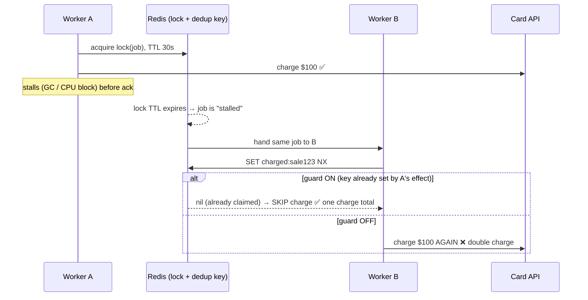

# Lesson 07 — Idempotency & Exactly-Once

Back in Lesson 01 you had an instinct: _"I can pass my own unique number (a sale
number), then with a lock make sure the job runs exactly once."_ That instinct was
half-right in a really instructive way. This lesson completes it — and it's the most
important _correctness_ lesson in the course. Get this wrong and you double-charge a
customer. Get it right and your system is safe to retry, crash, and scale.

## 1. Concept

### Three delivery semantics

| Semantic          | Meaning                             | Risk                           |
| ----------------- | ----------------------------------- | ------------------------------ |
| **at-most-once**  | every job delivered 0 or 1 times    | **lost work** (a crash = gone) |
| **at-least-once** | every job delivered 1 or more times | **duplicates** (may reprocess) |
| **exactly-once**  | every job processed once, period    | the dream                      |

**BullMQ is at-least-once.** It deliberately errs toward _never losing your job_ —
which means under the wrong timing it will **run a job more than once**. That's not a
bug; it's the only safe choice a broker can make (the alternative is losing work).

### Why exactly-once _delivery_ is impossible

Your worker has to do two things: **the side effect** (charge the card) and **the ack**
(tell Redis "done"). These are in two different systems, so they can't be one atomic
step. Whatever order you pick, a crash in the gap breaks you:

- charge → 💥 crash → (no ack) → job retried → **charge again** (double charge)
- ack → 💥 crash → (no charge) → job gone → **never charged** (lost work)

There is no order of two non-atomic operations that survives a crash in between. So
**exactly-once delivery cannot exist.** Anyone selling it is really selling the next
thing:

### The real goal: effectively-once = at-least-once + idempotent processing

You stop trying to make _delivery_ exactly-once. Instead you make **processing
idempotent**: running the job twice has the _same effect_ as running it once. Then
at-least-once delivery is fine — duplicates are harmless. This is what "exactly-once"
means in every real system (Kafka included).

### Where duplicates actually come from in BullMQ

Three sources — you've already met two:

1. **Retries (L03).** A job whose side effect succeeded but threw/crashed _after_ →
   retried → side effect repeats.
2. **Stalled-job lock expiry (the hard one — see the visual).** A worker holds a job
   under a **lock with a TTL**. If that worker stalls (a long synchronous block — hi,
   Lesson 05 CPU trap — or a GC pause, or it crashes), the lock **expires**, and
   BullMQ hands the _same job_ to **another worker**. Now two workers run it. The lock
   is a **best-effort lease, not a mutex** — this is the part your Lesson-01 instinct
   underestimated.
3. **Producer double-add.** The `add()` network call times out, your code retries it,
   and the job gets enqueued twice.

### Two layers of defense

**Layer 1 — producer-side dedup with a custom `jobId`** (your sale-number idea!):

```ts
await queue.add("charge", data, { jobId: `sale:${saleId}` });
```

BullMQ won't create a second job with an existing `jobId` (while it still exists). This
gives you **at-most-once _enqueue_** — it kills source #3 (double-add). But it does
**not** save you from #1 and #2, because those re-run an _already-accepted_ job. So
jobId dedup is necessary but **not sufficient**.

**Layer 2 — idempotent consumer (the real protection):** before doing the side effect,
**atomically** check "have I already done this?" using an idempotency key in a store:

```ts
// Redis SET key NX = "set only if not exists" — atomic check-and-claim
const first = await connection.set(`charged:${saleId}`, "1", "NX");
if (!first) return; // someone already charged this sale → no-op
await chargeCard(data); // safe: only the first claimant reaches here
```

or a database unique constraint (`INSERT ... ON CONFLICT DO NOTHING`). The key is that
the dedup check and the work are guarded by an **atomic** operation, so even two
concurrent workers can't both pass it.

### Naturally idempotent vs not

Some operations are idempotent for free — design toward these when you can:

| Idempotent (safe to repeat) | NOT idempotent (needs a guard) |
| --------------------------- | ------------------------------ |
| `SET balance = 100`         | `balance = balance + 100`      |
| `status = 'shipped'`        | `attempts = attempts + 1`      |
| upsert by primary key       | `INSERT` a new row each time   |
| delete by id                | send an email / charge a card  |

## 2. Diagram — open the interactive visual

The stalled-lock race is genuinely hard to picture in prose, so this lesson has an
interactive one. Open it in a browser:

```
learn/visuals/07-exactly-once.html
```

Toggle **"Stall Worker A"** and **"Idempotency guard"**, hit Run, and watch the
**charge ledger**. The lesson lands when you see: stall + no guard → **2 charges** from
one job; flip the guard on → **1 charge**, because Worker B's atomic `SET NX` finds the
key already claimed. Same delivery, different _processing_ — that's effectively-once.



## 3. Walkthrough

### Producer-side dedup (jobId)

```ts
const id = "sale:1001";
await queue.add("charge", { saleId: 1001, amount: 100 }, { jobId: id });
await queue.add("charge", { saleId: 1001, amount: 100 }, { jobId: id }); // ignored
console.log(await queue.getJobCounts()); // only ONE waiting
```

### Idempotent consumer (the guard that actually protects you)

```ts
const worker = new Worker(
  "charge",
  async (job) => {
    const { saleId, amount } = job.data;
    // atomic claim: only the first worker to reach this wins
    const won = await connection.set(`charged:${saleId}`, "1", "NX", "EX", 86400);
    if (won !== "OK") {
      console.log(`sale ${saleId} already charged — skipping (idempotent no-op)`);
      return { deduped: true };
    }
    await chargeCard(amount); // real side effect, runs once per saleId
    return { charged: true };
  },
  { connection },
);
```

Note `NX` (set if not exists) + `EX` (expire) makes the claim atomic _and_ self-cleaning.
Two workers racing on the same `saleId` → exactly one gets `"OK"`.

### Making the retry-duplicate safe

If your processor charges and then throws (so BullMQ retries it), the guard makes the
retry a no-op — the second run finds the key already set and skips the charge. The job
still completes after retrying; the customer is charged once.

## 4. Exercise

Build a **payment processor** that's safe under duplicates. New folder
`apps/server/src/pay/`. House rules as always. Use a shared "ledger" so you can _count_
real charges — e.g. increment a Redis key `ledger:charges:<saleId>` each time you
_actually_ charge, then read it to prove how many times the charge ran.

### Part A — Producer-side dedup with jobId

1. **`pay.queue.ts`** + **`pay.worker.ts`** (worker just logs + returns for now).
2. **`pay.dedup.ts`** — add the **same** job 3× with the same `jobId: "sale:1001"`,
   then log `getJobCounts()`. Exit cleanly.

> In a comment: how many jobs exist? Which duplicate source (#1/#2/#3 from the lesson)
> does jobId dedup defend against — and which two does it **not**?

### Part B — Idempotent consumer (the real guard)

1. In `pay.worker.ts`, before "charging", do an **atomic** `SET NX` on
   `charged:<saleId>`. If you didn't win the key, **skip** and return `{ deduped: true }`.
   If you won, increment `ledger:charges:<saleId>` (this represents the real charge) and
   return `{ charged: true }`.
2. **`pay.duplicate.ts`** — enqueue **two** jobs for the same `saleId` but with
   **different** jobIds (e.g. `jobId: "a"` and `jobId: "b"`) so BullMQ does NOT dedup
   them — simulating the same logical sale arriving twice. Run the worker; both jobs
   run, but only one should actually charge.
3. Read and log `ledger:charges:1001` at the end.

> In a comment: jobId dedup let both jobs through (different ids) — so what stopped the
> double charge? Why does the `NX` need to be **atomic** (what breaks if you did
> `GET` then `SET` in two steps)?

### Part C — Survive a retry-duplicate (the realistic crash)

1. Make a variant job that **charges, then throws** on its first attempt (e.g. throw
   while `attemptsMade < 1`), with `attempts: 2`, so BullMQ retries it.
2. With the guard **in place**, run it and check `ledger:charges:<saleId>`.

> **Predict in a comment first:** with the guard, how many times does the ledger
> increment across the 2 attempts? Then run it and confirm. What would the number be
> **without** the guard?

### Part D (think, don't code) — Lock is not a mutex

Re-read your Lesson-01 idea ("a lock makes it exactly-once"). In 3–4 sentences:
why is BullMQ's job lock a **best-effort lease** and not a real mutex? What real event
makes the lock expire while the work is _still running_, and why does that mean the
**consumer-side idempotency guard** — not the lock — is what actually protects you?

### What success looks like

- Part A: 3 adds, same jobId → **1** job.
- Part B: two un-deduped jobs both run, `ledger:charges:1001` == **1**.
- Part C: across 2 attempts (charge-then-throw-then-retry), the ledger increments
  **once** with the guard (would be **2** without it).

Open the visual, play the stall + guard toggles until the ledger behavior is obvious,
_then_ write the code. Ping me when done — this is the one I most want to see you get
right, because it's the difference between a toy and a system you'd trust with money.
