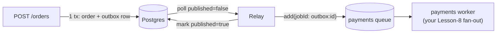

# Lesson 09 — API → Queue: the Transactional Outbox

In Lesson 08 you built fan-out, and then — in your own `order.worker.ts` — you walked
straight into the **partial fan-out** problem: a job that charges, enqueues some
downstream work, and could leave the rest unsent. You fixed the *duplicates* with
`jobId`. This lesson fixes the thing underneath it: the moment where your system has to
write to **two systems at once** and can't.

We move one step earlier — to the **API endpoint** that starts everything. This is the
canonical production pattern, and you already derived most of it. Now we build it for
real, on your Postgres + BullMQ stack.

---

## 1. The problem — the dual write

Your `POST /orders` endpoint, stripped to its essence, must do **two writes to two
different systems**:

```ts
app.post("/orders", async (req, res) => {
  const order = await db.insert(orders).values({ total }).returning(); // (A) Postgres
  await payments_queue.add("charge", { orderId: order.id });           // (B) Redis
  res.json({ id: order.id });
});
```

There is no transaction spanning a database **and** a message broker. So a crash in the
gap leaves you broken, and there are exactly two orderings, each with its own disaster:

- **(A) then (B):** order saved, crash before enqueue → order sits `pending` **forever**,
  no charge job ever emitted → **lost order.**
- **(B) then (A):** job enqueued, crash before insert → a worker picks up `charge` for an
  order **that doesn't exist** → **orphan job** charging a ghost.

### Why you can't just "wrap it in a transaction"

A database transaction only governs **its own database's** writes. `payments_queue.add()`
is a network call to Redis — Postgres can't enroll it, can't roll it back. And the
deeper killer: rollback is *code*, and **a crash runs no code.** If the process is
`kill -9`'d in the gap, there is no `catch`, no `finally` — nothing executes to undo
anything. This is the same wall as Lesson 07: **no atomicity across two systems.**

### Why idempotency keys don't save *this* boundary

In Lesson 08 idempotency rescued you because **BullMQ retried the job** — something
*drove* the operation to happen again. At the API boundary, if the process dies between
(A) and (B), **who retries the missing enqueue?** Nobody. The HTTP request is dead and
took the intent with it. Idempotency means "safe to repeat" — it says nothing about
"will it ever happen at all." Different disease.

---

## 2. The principle — two escape hatches

You can never make **N writes to 2 systems** atomic. You only ever have two options:

> **(A)** make every write **safe to repeat**, then **retry** until they all land
> (idempotency) — *requires a durable retry driver.*
> **(B)** collapse it to **one** atomic write, then **reliably project** that outward.

The API boundary has no retry driver, so we take **(B)**.

---

## 3. The trick — make both writes land in the *same* system

You can't put the enqueue inside the DB transaction… so **don't enqueue inside it.**
Replace the enqueue with a plain **row in an `outbox` table.** Now *both* writes are
Postgres, so one **real** transaction covers them:

```ts
await db.transaction(async (tx) => {
  const [order] = await tx.insert(orders).values({ total }).returning();
  await tx.insert(outbox).values({ topic: "charge", payload: { orderId: order.id } });
});
// ONE commit. Both rows, or neither. The dual write is gone.
```

After commit you have a **durable to-do** — an outbox row that exists *exactly when* the
order exists. The job still isn't in Redis, but the **intent** to enqueue it survived the
crash. A separate **relay** then carries it the rest of the way:



The relay is **at-least-once** (it might enqueue, crash, and enqueue again) — and that's
fine, because the enqueue is **idempotent** (Lesson 07/08). The full formula:

> **atomic outbox write** (no lost, no orphan) + **at-least-once relay** (guaranteed
> emission) + **idempotent consumer** (duplicates free) = **effectively-once**, API → worker.

---

## 4. Build it piece by piece

### Piece 1 — the schema (`orders` + `outbox`)

```ts
// packages/db/src/schema/index.ts
import { pgTable, uuid, text, jsonb, boolean, integer, serial, timestamp } from "drizzle-orm/pg-core";

export const orders = pgTable("orders", {
  id: uuid("id").defaultRandom().primaryKey(),
  status: text("status").notNull().default("pending"),
  total: integer("total").notNull(),
  createdAt: timestamp("created_at").defaultNow().notNull(),
});

export const outbox = pgTable("outbox", {
  id: serial("id").primaryKey(),          // monotonic → natural ordering + a stable jobId
  topic: text("topic").notNull(),         // which queue/event, e.g. "charge"
  payload: jsonb("payload").notNull(),    // the job data
  published: boolean("published").notNull().default(false), // the relay's flag
  createdAt: timestamp("created_at").defaultNow().notNull(),
});
```

Why each piece: `outbox.id` is a `serial` so it both **orders** events and gives the
relay a **stable, unique key** to dedup on. `published` is the entire coordination
mechanism — `false` means "owed," `true` means "the relay got it to Redis."

### Piece 2 — the atomic write (the API handler)

```ts
const placeOrder = (total: number) =>
  db.transaction(async (tx) => {
    const [order] = await tx.insert(orders).values({ total }).returning();
    await tx.insert(outbox).values({ topic: "charge", payload: { orderId: order.id, total } });
    return order; // tx commits here — both rows or neither
  });
```

The customer's request blocks only until **this commit** — order *placed*, durably. It
does **not** wait for the charge or any fan-out. (That's the Lesson-08 "block until
placed, not until reactions finish" requirement, now crash-safe.)

### Piece 3 — the relay (the only new moving part)

```ts
import { asc, eq } from "drizzle-orm";

async function relayOnce() {
  const rows = await db.select().from(outbox)
    .where(eq(outbox.published, false))
    .orderBy(asc(outbox.id))
    .limit(100);

  for (const row of rows) {
    // jobId derived from the immutable row id → re-running this is a no-op
    await payments_queue.add(row.topic, row.payload, { jobId: `outbox:${row.id}` });
    await db.update(outbox).set({ published: true }).where(eq(outbox.id, row.id));
  }
}
setInterval(relayOnce, 1000); // its own process; this is the durable retry driver
```

Read the two lines in the loop in order: **enqueue first, mark published second.** That
ordering is deliberate — if it crashes *between* them, the row stays `published: false`,
so next tick re-enqueues it, and `jobId: outbox:<id>` makes the duplicate a no-op. Never
the reverse (mark-then-enqueue would *lose* the event on a crash).

### Piece 4 — the consumer is your Lesson-8 worker, unchanged

The `payments` worker already charges idempotently (your `SET NX` ledger) and fans out
with `jobId`. The outbox feeds it; nothing about the worker changes. That's the point:
the outbox is a **producer-side** fix, invisible to consumers.

### Now trace every crash — nothing leaks

| Crash point | Outcome |
| --- | --- |
| before `COMMIT` | order **and** outbox row vanish → client just retries. Clean. |
| after `COMMIT`, before relay runs | row sits `published:false` → relay picks it up next tick. **Not lost.** |
| after `add()`, before `update()` | re-enqueued next tick → `jobId` dedups. **Not duplicated.** |
| worker sees a job | the order **provably exists** (job only born from a committed row). **No orphan.** |

---

## 5. Reference code (keep this)

```ts
// schema — packages/db/src/schema/index.ts   (see Piece 1)

// place-order — apps/server/src/order/place-order.ts
import { db } from "@learn-broker/db";
import { orders, outbox } from "@learn-broker/db/schema";

export const placeOrder = (total: number) =>
  db.transaction(async (tx) => {
    const [order] = await tx.insert(orders).values({ total }).returning();
    await tx.insert(outbox).values({ topic: "charge", payload: { orderId: order.id, total } });
    return order;
  });

// relay — apps/server/src/order/relay.ts
import { db } from "@learn-broker/db";
import { outbox } from "@learn-broker/db/schema";
import { asc, eq } from "drizzle-orm";
import { payments_queue } from "@/pay/pay.queue";

export async function relayOnce() {
  const rows = await db.select().from(outbox)
    .where(eq(outbox.published, false)).orderBy(asc(outbox.id)).limit(100);
  for (const row of rows) {
    await payments_queue.add(row.topic, row.payload, { jobId: `outbox:${row.id}` });
    await db.update(outbox).set({ published: true }).where(eq(outbox.id, row.id));
  }
}
setInterval(relayOnce, 1000);
```

---

## 6. Scaling note — polling vs. CDC

The `setInterval` poller is correct and totally fine for real workloads. Two upgrades you
should *know exist* but not reach for early:

- **Multiple relay instances** for throughput → the naive `WHERE published=false` lets two
  relays grab the same rows. Fix with one SQL clause: `SELECT … FOR UPDATE SKIP LOCKED`,
  so each relay claims a disjoint batch.
- **Change Data Capture (CDC)** → at large scale you don't poll at all; a tool like
  **Debezium** tails Postgres's **write-ahead log** and streams committed changes to
  Kafka. The outbox table *is* the log. Same pattern, the DB's replication does the relay.

---

## 7. Mini challenge (predict first — don't write code yet)

1. The relay does `add()`, then `kill -9` lands **before** `update(published:true)`. Walk
   the next tick: what happens, and **which exact property** of the `add` makes it
   harmless?
2. You run **two** relay processes to go faster. With the plain `WHERE published=false`
   query, describe the concrete bug two relays cause — and name the single SQL clause that
   removes it.
3. The outbox makes `API → payments` crash-safe. But your Lesson-8 worker still fans out
   to shipping/warehouse **before** it's sure the charge stuck. Does the outbox stop a
   *permanently failing* charge from having already shipped goods? If not — **which**
   pattern (not the outbox) does, and what's its core idea?
4. Why key the job `outbox:${row.id}` and **not** `charge:${orderId}`? (Hint: what's the
   true "unit of owed emission" — the order, or the event row?)

Answer #3 cleanly and you'll see exactly where the outbox's job ends and the next
pattern's begins.

---

## 8. Exercise — make your order flow crash-proof

Take your **Lesson-8 order flow** and put a transactional outbox in front of it, so the
`API → payments` boundary can survive a crash at any instant. The requirements (the
*what* — the *how*, file layout, and naming are yours):

- A **place-order** path writes the order row **and** the "charge" outbox row in a **single
  Postgres transaction** — both or neither. The caller blocks only until that commit.
- A **relay** process moves committed outbox rows to your `payments` queue, **at-least-once**
  and **idempotently** (re-running it creates no duplicate jobs).
- Your existing `payments` worker consumes it and fans out (keep its idempotency guards).
- **Prove it.** Simulate a crash in each of the three gaps (before commit / after commit,
  before relay / after `add`, before mark) and show: **no lost order, no orphan job, no
  duplicate charge.** A simple way to "crash": `throw`/`process.exit(1)` at the chosen line,
  restart, and inspect the `orders` + `outbox` tables and the queue.
- **Stretch:** run **two** relays without double-publishing (`FOR UPDATE SKIP LOCKED`), and
  decide — and justify — what should happen to the downstream fan-out when a charge fails
  *permanently*.

Run `pnpm db:start` (Postgres + Redis) and `pnpm db:push` to create your tables. When
you've got it, show me your code and your crash-test evidence — I'll review the business
logic by severity, and we'll see whether your "permanent charge failure" decision points
at the **Saga** pattern (Lesson 10 territory).
