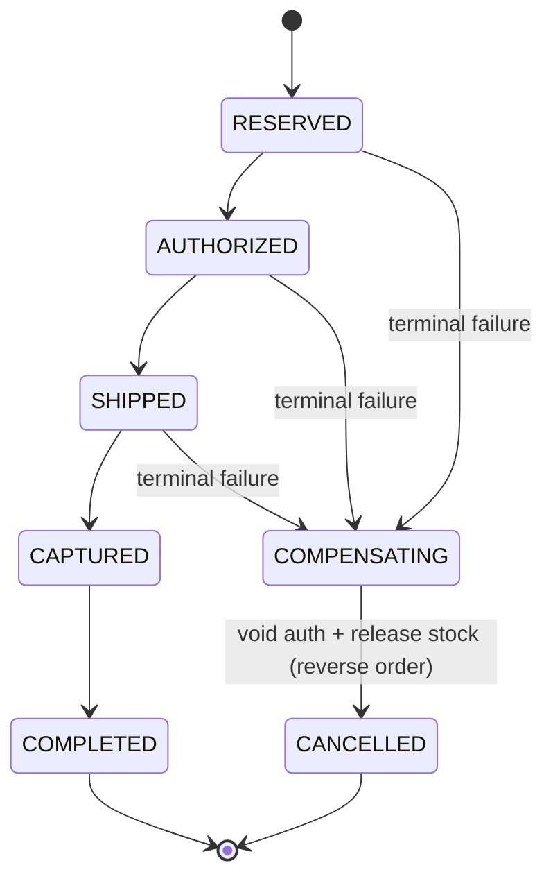

# Lesson 10 — Sagas: when you can't go forward, go back

Every pattern so far assumed failures are **temporary** — crash, timeout, stall — and that
*retrying* eventually wins. This lesson is about the failure class that breaks that
assumption, and it's the natural end of the correctness arc: **idempotency → outbox → saga.**

You've already built almost all the machinery. A Saga is just your Lesson-9 outbox
pointed in **two directions.**

---

## 1. The problem — permanent failure after an irreversible step

Your pipeline: `charge → reserve → ship → notify`. The charge **succeeds** (money moved),
then shipping returns **"we don't deliver to this address."** That is not a hiccup — it's
**permanent**. Retrying it a thousand times will never make it deliverable.

The same step can fail two completely different ways, and they demand **opposite** responses:

| Step | Transient → **retry** (forward recovery) | Permanent → **compensate** (backward recovery) |
| --- | --- | --- |
| charge | gateway 503 / timeout | card declined |
| reserve | DB deadlock | out of stock |
| ship | carrier API down | non-deliverable region |

Everything you built — retries, at-least-once, the outbox — is **forward recovery**: "keep
trying until it works." Against a *permanent* failure that lands *after* an irreversible
step, forward recovery is useless. The card is charged; no amount of retrying ships the
package. The only honest way back to a consistent state is to go **backward**: undo what
you already did.

---

## 2. The idea — compensation (and why it isn't a rollback)

> A **compensation is not a database rollback.** A rollback erases history as if it never
> happened. A compensation is a **new forward action that *semantically* undoes** a
> previous one — `charge → refund`, `reserve → release`. And some actions are expensive,
> slow, or **impossible** to undo: you can't un-ship a package or un-send an email; the
> best you can do is a *recall* or a *correction*.

That irreversibility is the hardest constraint in the whole pattern, and it drives two rules:

**Rule 1 — put the point of no return LAST.** Do all cheaply-reversible steps first,
validate everything, and place the irreversible step at the very end — so a failure only
ever compensates *cheap* earlier steps and you **never have to un-ship**.

**Rule 2 — turn "hard" steps into reversible *holds* until the last moment.** This is how
real systems dodge "charged but can't ship":
- **Payment: authorize** (a reversible *hold*) early; **capture** (actually take the money)
  only at the end. Undo before capture = void the hold — free and instant, no refund.
- **Inventory: reserve** (a row in a reservations table; `available = on_hand − reserved`)
  early; **commit** the decrement at the end. Undo = delete the reservation row.

So the mature order flow is: **`reserve → authorize → …validate deliverability… →
ship → capture`.** Move every *permanent-failure check* (address, stock, deliverability)
**before** the point of no return, so that by the time you `ship`/`capture`, the only
failures left are transient → retryable → **no compensation ever needed at the last step.**

---

## 3. A Saga = a persisted state machine, driven by your outbox

Here's the unlock: a Saga is a **state machine whose state lives in Postgres**, and whose
transitions are driven by the **exact outbox mechanism from Lesson 9** — atomic DB write +
enqueue — except it can run **backward** as well as forward.



> 🚆 **Interactive visual:** open `learn/visuals/10-saga.html`. An order rides a transit
> line through the states; arm a **transient** vs **permanent** failure on any step and
> watch it either retry-and-continue or **reverse and compensate** back to `CANCELLED`.
> Compare failing **Ship** permanently (clean — auth only *held*, no refund) vs. **Capture**
> permanently (expensive — already shipped) to feel why capture goes last.

On each step's **success**, the orchestrator atomically records the new state **and**
enqueues the next step (outbox). On a **terminal failure**, it flips `status` to
`COMPENSATING` and enqueues the compensations for the completed steps **in reverse** until
it reaches `CANCELLED`. Every step and every compensation is **idempotent**; every
transition is durable; your **reconciler** is the backstop. Crash mid-refund? The persisted
state says "still owes a stock-release," and the driver re-drives it.

### Orchestration, not choreography

Two ways to coordinate a Saga:

- **Choreography** — no central brain; each service reacts to an event and emits the next.
  Loosely coupled, but the flow is smeared across services and a *reverse* unwind is a
  nightmare to coordinate. Fine for 2–3 steps.
- **Orchestration** — one **orchestrator** owns the whole sequence: do step X, await
  result, decide next step *or* start compensation. The entire flow **and** its
  compensation logic live in one readable place. **Use this for anything with
  compensations.** (Managed engines like **Temporal** / **AWS Step Functions** are exactly
  this, with the persistence and retries handled for you — we hand-roll it on the outbox.)

---

## 4. Build it piece by piece

### Piece 1 — the saga state

Track each order's position in the machine. Reuse `orders.status` as the state column, or a
dedicated `sagas` table for richer flows:

```ts
// status: 'reserved' | 'authorized' | 'shipped' | 'captured' | 'completed'
//       | 'compensating' | 'cancelled'
export const orders = pgTable("orders", {
  id: uuid("id").defaultRandom().primaryKey(),
  status: text("status").notNull().default("reserved"),
  total: integer("total").notNull(),
  // ...auth id, reservation id, etc. so compensations know what to undo
});
```

### Piece 2 — a transition = the outbox trick

Advancing the saga is one atomic DB transaction: update the state **and** write the next
step's outbox row. Identical to Lesson 9 — that's the whole point.

```ts
const advance = (orderId: string, toStatus: string, nextTopic: string, payload: object) =>
  db.transaction(async (tx) => {
    await tx.update(orders).set({ status: toStatus }).where(eq(orders.id, orderId));
    await tx.insert(outbox).values({ topic: nextTopic, payload, published: false });
  });
```

### Piece 3 — classify failures inside the worker

Retryable vs terminal is a decision the step makes. BullMQ gives you the switch:

```ts
import { UnrecoverableError } from "bullmq";

// transient → throw a normal Error → BullMQ retries with backoff
if (res.status === 503) throw new Error("gateway down, retry");

// permanent → skip remaining attempts, go straight to failed → triggers compensation
if (res.code === "NON_DELIVERABLE") throw new UnrecoverableError("cannot ship here");
```

### Piece 4 — the orchestrator drives forward, or flips to reverse

```ts
// on a step's success → advance to the next state (Piece 2)
// on a step's terminal failure → begin compensation
worker.on("failed", async (job, err) => {
  if (!(err instanceof UnrecoverableError)) return; // transient: let retries handle it
  await beginCompensation(job.data.orderId); // sets status='compensating', enqueues undo steps in reverse
});
```

### Piece 5 — compensations are jobs too (and must never be lost)

Each compensation is an idempotent job on its own queue. Because a stuck compensation is
**real money not refunded**, they retry hard and then **alert a human** — not a silent DLQ:

```ts
await refund_queue.add("void-auth", { authId }, {
  jobId: `void_${orderId}`, attempts: 50, backoff: { type: "exponential", delay: 5000 },
});
// on final failure → page a human. "Failed to refund" is an incident, not a log line.
```

---

## 5. Reference shape (keep this)

```
POST /orders ──▶ tx{ order(status=reserved) + outbox("authorize") }      (Lesson 9 outbox)
   relay ──▶ authorize job ──success──▶ advance→authorized, enqueue "ship"
   ship job ──success──▶ advance→shipped, enqueue "capture"
            └─UnrecoverableError──▶ beginCompensation:
                    status=compensating → enqueue "release-stock", "void-auth" (reverse)
                        each idempotent, retried hard, human-alert on exhaustion
   capture job ──success──▶ advance→completed
```

Every arrow is an atomic `state + outbox` transition; every job is idempotent; the
reconciler re-drives anything stuck. Forward = the happy path; the compensation branch is
the *same machine run backward*.

---

## 6. Mini challenge (predict first — no code)

1. Your saga is at `AUTHORIZED` (money held, not captured) when the deliverability check
   permanently fails. List the compensations that run, in order — and explain why the
   customer is **never refunded** here (there's a difference between "refund" and what
   actually happens).
2. The orchestrator crashes **after** it enqueued `void-auth` but **before** it enqueued
   `release-stock`. How does the system still finish the unwind? Which two Lesson-9/6
   mechanisms guarantee it?
3. Why must a compensation be **idempotent** even though it "only runs once"? Give the exact
   sequence of events that makes a refund fire twice if it isn't.
4. Design judgment: your teammate wants to put `capture` **before** `ship` ("take the money
   first, then send it"). What failure does that reintroduce, and what does putting `ship`
   before `capture` (with deliverability validated even earlier) buy you?

---

## 7. Exercise — turn your Lesson-9 outbox into a Saga

Extend your Lesson-9 order flow into an **orchestrated Saga** with compensations. The
requirements (the *how* is yours):

- Model the order as a **state machine** in Postgres (`status` column or a `sagas` table),
  using **authorize/capture** and a **reservation** row so early steps are reversible.
- Each forward transition is an **atomic `state + outbox` write** (reuse your relay).
- A step classifies its failure: **transient → retry**, **terminal →
  `UnrecoverableError`** → the orchestrator flips to `compensating` and enqueues the
  completed steps' **compensations in reverse**.
- Compensations are **idempotent** jobs, retried hard, that **alert** (a loud `console.error`
  is fine for the exercise) on final exhaustion.
- **Prove it:** force a **permanent** shipping failure and show the saga **voids the
  authorization + releases the reservation**, ends in `CANCELLED`, and **never captured**
  the money. Then force a **transient** shipping failure and show it **retries and
  completes** — same code, opposite outcome.

Run it against your Postgres + Redis. Bring me the state-machine design and your two
proofs (permanent → cancelled/uncaptured, transient → completed), and I'll review by
severity — and we'll see how close your hand-rolled orchestrator is to what Temporal does
for you.
