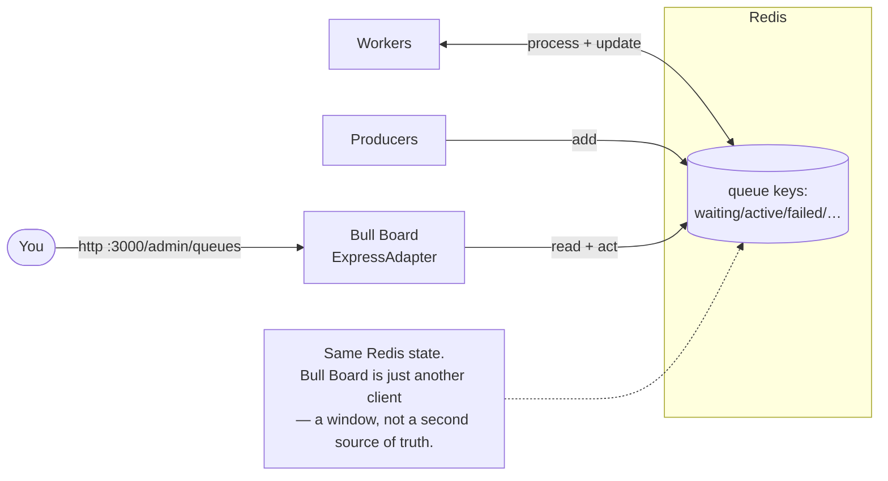

# Lesson 11 — Observability: seeing your queues (Bull Board)

You've spent ten lessons making queues *correct*. This one makes them *visible*. It's the
practical finale — and you'll use it to run and **verify your Lesson-10 Saga** with real
eyes instead of `console.log`.

## 1. Concept

Everything you've built so far, you've watched through `console.log`. That answers "what
happened in this run." It does **not** answer the questions you actually get paged about:

- How many jobs are **waiting / active / failed / delayed** right now?
- **What's in the DLQ**, and *why did each one fail* (the stack trace)?
- Can I **retry** a failed job — or **promote** a delayed one — **without a redeploy**?
- Is a queue **backing up** (producers outpacing workers)?

That's **observability**: seeing your system's live state, not just its log tail. **Bull
Board** is a web UI that gives you exactly this over your BullMQ queues.

The key mental model — and it's a callback to Lesson 07: Bull Board is **not a separate
system**. It reads the *same Redis keys* your workers read. Remember "the queue is just
data structures in Redis, and the brain lives in the clients"? Bull Board is just *another
client* rendering that data. It's a **window**, not a database. That's why it can show
in-flight state instantly and why its "retry" button really re-drives the real job.

### What it shows (per queue)

- **Counts**: waiting, active, completed, failed, delayed, paused — your queue's vitals.
- **Job detail**: `data`, `returnvalue`, `failedReason` + **stack trace**, `attemptsMade`,
  timestamps, the processing lane.
- **Actions**: retry a failed job, promote a delayed one, remove, clean, pause/resume.

Every concept you learned now has a face here: retries (attempts climbing), the DLQ
(failed tab), delayed jobs (delayed tab, Lesson 04), stalled jobs reappearing in active
(Lesson 07), backpressure (waiting count growing).

## 2. Diagram



## 3. Walkthrough (already wired for you)

The plumbing is done so you can *use* it immediately; here's what each piece is and why.

**`apps/server/src/dashboard.ts`** — the one subtlety worth understanding:

```ts
import { connection } from "@/connection";
import { createBullBoard } from "@bull-board/api";
import { BullMQAdapter } from "@bull-board/api/bullMQAdapter";
import { ExpressAdapter } from "@bull-board/express";
import { Queue } from "bullmq";

// Read-only handles BY NAME. A Queue instance is just a client on a Redis key namespace.
// Creating one here inspects that queue WITHOUT importing the worker files — which would
// start workers or fire jobs on import (several of your lesson files do exactly that).
const QUEUE_NAMES = ["payments", "shipping", "notification", "warehouse", "orders", "orders-dlq"];
const queues = QUEUE_NAMES.map((name) => new Queue(name, { connection }));

const serverAdapter = new ExpressAdapter();
serverAdapter.setBasePath("/admin/queues");
createBullBoard({ queues: queues.map((q) => new BullMQAdapter(q)), serverAdapter });

export const queuesRouter = serverAdapter.getRouter();
```

Why handles-by-name instead of importing your existing `payments_queue` etc.? Because
importing `pay/pay.duplicate.ts` or `lesson-9/create-sale.ts` would **run their top-level
code** (add jobs, start workers). A fresh `new Queue("payments", { connection })` is a
*read handle* to the same Redis data — no side effects. It's the same trick as your Lesson-9
outbox relay creating its own handle.

**`apps/server/src/index.ts`** — mount it on your Express app:

```ts
import { queuesRouter } from "@/dashboard";
app.use("/admin/queues", queuesRouter);
```

Run the server and open it:

```
pnpm --filter server dev
# → http://localhost:3000/admin/queues
```

> ⚠️ **Production note:** `/admin/queues` exposes job data *and* destructive actions
> (remove, clean, retry). In a real app it sits **behind auth** (basic auth / an admin
> session / a private network). Never ship it open.

## 4. Exercise — run your Saga *through the dashboard*

This is where Lessons 10 and 11 meet. Build and run your **Lesson-10 orchestrated Saga**
(`charge/authorize → reserve → ship → capture` with compensations), and use Bull Board as
your **verification tool** instead of `console.log`.

1. **Register your saga queues.** As you create queues (`refund`/`void-auth`,
   `release-stock`, etc.), add their names to `QUEUE_NAMES` in `dashboard.ts` so they show up.
2. **Watch the happy path.** Run an order that succeeds; watch jobs move `waiting → active →
   completed` across `authorize`, `ship`, `capture` in real time.
3. **Force a permanent failure** (throw `UnrecoverableError` in the ship step). In the
   dashboard, *observe*:
   - the ship job's `attemptsMade` and then its arrival in the **failed** tab,
   - open it and read the **stack trace** / `failedReason`,
   - your **compensation** jobs (`void-auth`, `release-stock`) appearing and completing on
     their own queues.
4. **Use an action.** Fix the cause, then **retry** the failed job *from the UI* — no
   redeploy — and watch it drain.
5. **Report what you SAW**, not what you logged: final counts per queue, the failed job's
   reason, and evidence the compensations ran and `capture` never did. The dashboard is
   your proof.

### Reflect (predict, then confirm in the UI)

1. Kill a worker mid-job (Lesson 07). In the dashboard, which tab does the job sit in, and
   for how long before it moves? What makes it move?
2. Schedule a delayed job (Lesson 04). Find it in the **delayed** tab — can you **promote**
   it to run now from the UI? What did that button just do to Redis?
3. Your `waiting` count climbs while `active` stays flat. In one sentence, what's wrong and
   which lever (Lesson 05) fixes it?

Bring me your saga code **and** a description of what the dashboard showed at each step —
I'll review by severity. That closes out the BullMQ course. 🎓
