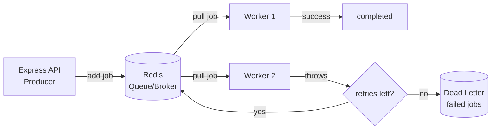

# Learn Brokers & Queues — Course Roadmap

A hands-on path from zero to production-grade event-driven architecture, using
**Redis + BullMQ** as the concrete tool. Concepts transfer to RabbitMQ, Kafka,
SQS, and NATS later.

## How these lessons work

Each lesson is one markdown file with four parts:

1. **Concept** — the idea, in plain language.
2. **Diagram** — a Mermaid visual (renders in your IDE preview / GitHub).
3. **Walkthrough** — annotated code you can read.
4. **Exercise** — *you* write the code. Tell me when done and I'll review it.

You read top-to-bottom, write the exercise, and we iterate. Lessons build on
each other, so do them in order.

## Prerequisites (already set up for you)

- ✅ Redis running in Docker on `localhost:6379`
  (start/stop: `pnpm db:start` / `pnpm db:stop` from repo root)
- ✅ `bullmq` + `ioredis` installed in `apps/server`
- ✅ `REDIS_URL` available via `@learn-broker/env/server`

Verify Redis any time with: `docker exec learn-broker-redis redis-cli ping` → `PONG`

## Roadmap

| #  | Lesson | What you'll learn |
|----|--------|-------------------|
| 01 | **Fundamentals & your first queue** | Producer / queue / consumer model; write a Queue + Worker; watch a job flow end-to-end |
| 02 | Job lifecycle & data | Job states (waiting→active→completed/failed), job data, return values, `await`-ing results |
| 03 | Failure & retries | What happens when a worker throws; `attempts`, backoff, why jobs are durable |
| 04 | Delays & scheduling | Delayed jobs, repeatable/cron jobs (replacing `setInterval`) |
| 05 | Concurrency & scaling | One queue, many workers; `concurrency`; how work is distributed; ordering caveats |
| 06 | Dead Letter Queues | Handling jobs that fail permanently; inspecting & replaying failures |
| 07 | Idempotency & exactly-once | Job IDs, deduplication, why "exactly-once" is a lie and what to do about it |
| 08 | Events & pub/sub | `QueueEvents`, fan-out, the difference between a *queue* and a *topic* |
| 09 | Real pattern: API → queue | Wire a BullMQ producer into your Express server; the transactional outbox idea |
| 10 | Observability | Bull Board dashboard; optionally a live view in your web app |

## The big picture (where we're headed)

Start with **`01-fundamentals.md`**.
