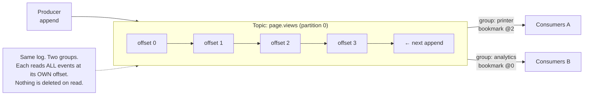

# Lesson 01 — The Log: Kafka is not a queue

You spent a whole course mastering queues. So the fastest way into Kafka is to name the
**one difference** everything else follows from — and then refuse to let you think in
"queue" terms again.

## 1. Concept

### The inversion

In **BullMQ**, when a worker processes a job, the job is **consumed and removed**. The
broker owns the truth ("this job is `completed`"), one worker wins each job, and once it's
done, it's _gone_. A queue is a **to-do list**: do the thing, cross it off.

In **Kafka**, a producer **appends** an event to a **log**, and it just… stays there.
Reading it does **not** remove it. Any number of independent readers can read the same
event, and each reader remembers **its own position**. A Kafka topic is a **ledger**: an
append-only history you can replay.

> **The inversion:** in a queue, the **broker** tracks state and _deletes on consume_. In
> Kafka, the **consumer** tracks its own position (**offset**) and the log _retains_
> everything until a time/size policy expires it — **independent of who has read it**.

That single change — _retained log + consumer-owned position_ — is the seed of replay,
multiple independent consumers, event sourcing, and reprocessing. It's the whole reason
EDA can do things a queue fundamentally cannot.

### The vocabulary (mapped to what you know)

| Kafka              | What it is                                             | BullMQ analogy                                               |
| ------------------ | ------------------------------------------------------ | ------------------------------------------------------------ |
| **Topic**          | a named, append-only log                               | a queue's name                                               |
| **Partition**      | one ordered shard of a topic (a topic is split into N) | _(no real equivalent — this is new)_                         |
| **Offset**         | an event's integer index **within a partition**        | _(the broker's internal job order, but now visible & yours)_ |
| **Producer**       | appends events                                         | `queue.add()`                                                |
| **Consumer group** | a set of cooperating readers with a shared position    | a set of `Worker`s on a queue                                |
| **Retention**      | how long events live, regardless of reads              | _(none — jobs vanish on complete)_                           |

Two things that will bite you if you keep thinking "queue":

1. **Reading doesn't delete.** A consumer that reads offset 42 doesn't remove it. It just
   moves _its own bookmark_ to 43. Event 42 is still there for everyone else — and for a
   replay.
2. **A partition, not a topic, is the unit of order.** Events are strictly ordered
   _within a partition_, never across the whole topic. (We'll go deep on this in Lesson 02
   — for now just plant the flag: **order is per-partition**.)

### Before you read on — predict

You produce 5 events, then start a consumer with group `printer` and `fromBeginning:true`.
It prints all 5. Now you **stop it and start it again**, same group `printer`.

**Does it print the 5 events again? Why or why not?** Hold your answer — the walkthrough
will confirm it, and the mini-challenge will test whether you really believe it.

## 2. Diagram



Notice what's impossible in a queue: **two independent groups**, each reading _every_
event, at _different_ positions, from _one_ log. That's queue⊕topic behavior in a single
primitive — and it's why we spent Lesson 08 of the last course distinguishing them.

## 3. Walkthrough

A Kafka client is one `Kafka` instance; from it you make an **admin**, **producer**, and
**consumer**. Brokers come from your env (`localhost:9092`).

```ts
// kafka.ts
import { Kafka } from "kafkajs";
import { env } from "@learn-broker/env/server";

export const kafka = new Kafka({
  clientId: "shop",
  brokers: env.KAFKA_BROKERS.split(","), // ["localhost:9092"]
});
```

**Create the topic explicitly** — Kafka won't auto-create it (we turned that off on
purpose, because _how many partitions_ is a decision you should make consciously):

```ts
const admin = kafka.admin();
await admin.connect();
await admin.createTopics({
  topics: [{ topic: "page.views", numPartitions: 3 }], // 3 shards → up to 3-way parallel reads
});
await admin.disconnect();
```

**Produce** — appending events to the log:

```ts
const producer = kafka.producer();
await producer.connect();
await producer.send({
  topic: "page.views",
  messages: [
    { value: JSON.stringify({ path: "/", userId: "u1" }) },
    { value: JSON.stringify({ path: "/pricing", userId: "u2" }) },
  ],
});
await producer.disconnect();
```

**Consume** — a group reads and prints its position for each event:

```ts
const consumer = kafka.consumer({ groupId: "printer" });
await consumer.connect();
await consumer.subscribe({ topic: "page.views", fromBeginning: true });
await consumer.run({
  eachMessage: async ({ partition, message }) => {
    // offset is the event's index WITHIN its partition — the thing you'd never see in a queue
    console.log(`p${partition} @${message.offset}:`, message.value?.toString());
  },
});
```

**The moment that proves the whole lesson — replay.** Run that consumer once; it prints
everything and commits its offset. Run the _same group_ again → it prints **nothing new**
(its bookmark is already at the end). But start a consumer with a **new** `groupId` and
`fromBeginning:true` → it replays **the entire history** from offset 0, because the events
were never deleted. A queue can't do that; the jobs would be long gone.

> `fromBeginning` only applies the **first time a group is seen** (when it has no committed
> offset). After that, the group's _committed offset_ wins. This trips up everyone once —
> "why didn't `fromBeginning` re-read?" Because the group already had a bookmark.

## 4. Exercise

Build a tiny **event stream** and prove to yourself that a Kafka topic is a replayable log,
not a queue. The domain is yours (page views, sensor readings, chat messages — whatever);
the _how_ (files, naming) is yours too. Requirements:

1. **Create a topic** with **more than one partition** (you pick the count — and be ready
   to say why).
2. **Produce a burst** of ~10 events.
3. **Consume** them with a group that prints `partition + offset + value` for each. Note
   how the events are spread across partitions.
4. **Prove replay two ways:**
   - restart the **same** group → show it reads **nothing new**;
   - start a **new** group `fromBeginning:true` → show it **re-reads all 10**.
5. Open the **Kafka UI** at **http://localhost:8080** and find your topic — look at its
   partitions, and at the two consumer groups and their offsets/lag. Seeing your code's
   effect in the dashboard is half the point.

Run a file with: `pnpm --filter server exec tsx apps/server/src/kafka/<your-file>.ts`

### Mini-challenge (predict first, then verify — no peeking)

1. Back to the pre-read prediction: same group `printer`, run twice. What happens the
   second time, and **which single stored value** decides it?
2. Retention is 7 days. A consumer group is **offline for 8 days**, then reconnects with a
   committed offset that has since been **deleted by retention**. What does it read now?
   (KafkaJS calls this `auto.offset.reset` — reason about what the two sane choices are.)
3. You produced 10 events to a **3-partition** topic with **no message key**. When your
   consumer prints them, are they in the **exact order you produced them**? If not, where
   _is_ order guaranteed — and what do you think a **key** would change?

Get #3 and you've already written the first question of Lesson 02. Bring me your code and
your answers, and I'll review by severity.
