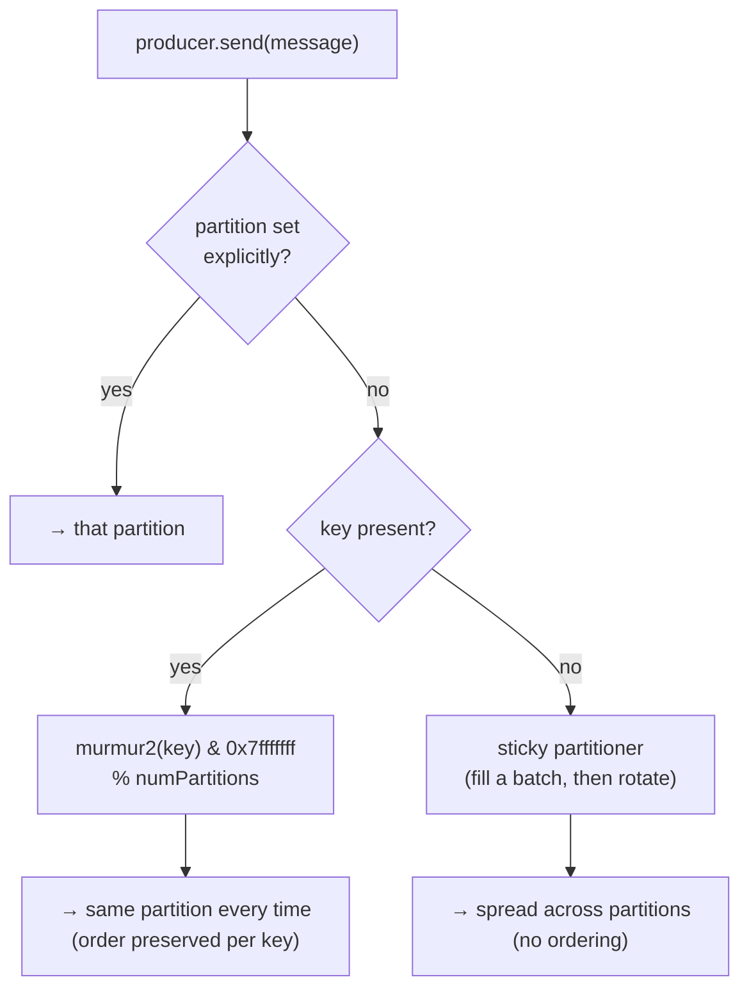

# Lesson 02 — Producing: keys, partitioning & ordering

In Lesson 01 you proved a topic is a **replayable log**. You also — by accident, in your own
broker — proved the thing this lesson is *about*: your keyless `test` messages spread `5/5/4`
across three partitions, while every `text`-keyed message piled onto **partition 2**. You
already found the answer. This lesson is the *why*, precise enough that you can predict the
partition before you hit send.

> **The one idea:** a producer's real job isn't "send bytes" — it's **decide which partition a
> record lands in**. That decision, and nothing else, determines what stays ordered.

## 1. Concept

### 1.1 — The producer picks a partition, three ways

When you call `producer.send({ topic, messages })`, each message gets routed to exactly one
partition by this decision ladder:

1. **You set `partition` explicitly** → it goes there. (Rare; you're overriding the brain.)
2. **You set a `key`** → partition = `murmur2(key) % numPartitions`. Deterministic. Same key,
   same partition count → **same partition, every time, forever**.
3. **No key, no partition** → the **sticky partitioner** picks one partition, fills the current
   batch there, then rotates to another on the next batch.

That's it. Case 2 is the one you'll use 90% of the time, and it's worth seeing the actual math.

### 1.2 — The hash is not a metaphor — it's `murmur2`

Kafka's default partitioner runs a specific hash, [murmur2][murmur], over the key's bytes, forces
it positive, and takes it modulo the partition count:

```
partition = (murmur2(keyBytes) & 0x7fffffff) % numPartitions
```

This is real and reproducible. Your `text` key, on a 3-partition topic:

```
murmur2("text")           = -1500274689
& 0x7fffffff  (toPositive) =  647208959
647208959 % 3              =  2          ← partition 2, exactly where your broker put it
```

Two consequences fall straight out of "it's `% numPartitions`":

- **It's deterministic and stateless.** The producer needs no coordination, no lookup — just the
  key and the partition count. That's why Kafka producers scale horizontally.
- **It depends on `numPartitions`.** Change the count and the modulo changes, so the *same key can
  route somewhere new*. Hold that thought — it's §1.6.

> **Predict before reading on.** You have a topic with 3 partitions. You produce two records with
> key `"user-1"` and one with key `"user-2"`. How many *distinct* partitions could those three
> records occupy — and what's the minimum? (Answer at the end of §1.3.)

### 1.3 — Per-partition ordering is the entire point

Here is the guarantee, stated as tightly as it exists:

> Kafka guarantees order **within a single partition** — offsets only increase, and a consumer
> reads them in that order. It guarantees **nothing** about order *across* partitions.

So a **key is how you choose your unit of ordering.** Key by `userId` and every event for one user
is strictly ordered (they share a partition); different users may interleave, and you don't care.
Key by `orderId` and one order's `created → paid → shipped` can never arrive out of order.

This reframes partitioning from "sharding for throughput" (true, but secondary) into its real role:
**partitioning is how you declare what must stay in order and what is free to parallelize.** The key
is that declaration.

*(Answer to the predict:* `user-1` and `user-2` each hash to *some* partition; both `user-1` records
share one partition (same key), so the minimum is **1** distinct partition (if `user-2` happens to
hash there too) and the max is **2**. Three records, but only two keys, so never three partitions.)*

### 1.4 — The sticky partitioner (what "no key" really does)

You might have read that keyless records go "round-robin." That *was* the old default (one partition
per record). Modern Kafka and KafkaJS use the **sticky partitioner**: pick one partition, send the
whole current *batch* there, and only switch partitions when the batch is flushed. Over many records
it still spreads evenly (your `5/5/4`), but it batches far more efficiently — fewer, fatter requests.

Don't over-index on the mechanism. The **guarantee** is the negative one, and it never changes:

> **No key ⇒ no cross-partition ordering.** Full stop.

If you don't hand Kafka a key, you are telling it *"these events have no ordering relationship."* Make
sure that's true before you leave the key off.

### 1.5 — `acks`: the other half of `send()`

Routing decides *where*. `acks` decides *when `send()` is allowed to resolve* — i.e. how durable the
write is before you believe it:

| `acks`      | Producer waits for…                          | You can lose data when…                         |
| ----------- | -------------------------------------------- | ----------------------------------------------- |
| `0`         | nothing — fire and forget                    | anything hiccups; the record may never land     |
| `1`         | the **leader** replica to write it           | the leader dies before followers copy it        |
| `all` / `-1`| **all in-sync replicas** to have it          | (only if you also misconfigure `min.insync.replicas`) |

KafkaJS defaults to **`acks: -1` (all)** — the safe choice, so you likely never touched it. On your
setup it's a bit of a no-op: a single broker with replication-factor 1 means "all replicas" *is* "the
leader," so `all` and `1` behave identically **today**. Write `acks: -1` anyway — it's correct the day
this graduates to a real 3-broker cluster, and it costs nothing now. (Replication, ISR, and
`min.insync.replicas` are Lesson 10; for now: `all` = "don't tell me it's saved until it really is.")

### 1.6 — Two foot-guns that quietly break ordering

You now know order lives *inside a partition*. Two things can still violate it:

**(a) Retries + multiple in-flight requests.** If a batch fails and is retried while later batches to
the same partition are already in flight, the retried batch can land *after* them — reordered, inside
one partition, the one place you thought was safe. The fix is the **idempotent producer**
(`idempotent: true` in KafkaJS): the broker stamps each batch with a sequence number, rejects
duplicates, and refuses out-of-order batches — restoring order *and* giving you exactly-once *append*.
It's nearly free; many teams turn it on by default. (Full treatment in Lesson 04.)

**(b) Repartitioning.** Because routing is `% numPartitions`, growing a topic from 3 → 6 partitions
means a key that used to hash to partition 2 may now hash to partition 5. Its *old* records stay in
partition 2; its *new* records go to partition 5 — so for that key, history is now split across two
partitions with **no ordering between the halves**. This is why:

- `admin.createPartitions` only ever **grows** a topic (never shrinks), and
- reshaping partition count is a deliberate, disruptive act — not something you do to a live keyed
  topic without a migration plan.

Choose your partition count *up front*, sized for the throughput and consumer parallelism you expect,
because changing it later is a data-ordering event, not a config tweak.

## 2. Diagram — trace the routing yourself

The routing decision is small but its *consequences* (ordering, skew, repartitioning) are exactly the
kind of thing that clicks only when you move a slider. Open the interactive router:

> **▶ [learn/visuals/kafka/02-partitioning.html](../visuals/kafka/02-partitioning.html)** — type a key
> and watch it run the *real* murmur2, resolve `% N`, and drop into a partition's next offset. Then flip
> the partition count 3 → 4 → 6 and re-route the same key to *feel* it jump tapes.

Things to actually try in it:

1. Route `user-1` a few times → it always lands in the same tape. That's §1.2.
2. Hit **“Replay user-A's session”** → 5 events, all one tape, offsets climbing. That's §1.3 ordering.
3. Hit **“Fire 6 keyless events”** → watch the sticky partitioner fill a tape, then rotate. That's §1.4.
4. Switch to **6 partitions** and re-route `user-1`. Different tape. That's §1.6(b), the whole hazard.

And the decision, as a flowchart:



## 3. Walkthrough — an annotated producer

A producer you'd actually keep. Note the **key**, the explicit **acks**, and reading the **partition
+ offset back out of the result** — the metadata that proves where each record went.

```ts
import { kafka } from "./kafka.instance";

const producer = kafka.producer({
  // Turns on sequence numbers → no duplicates, no reordering on retry (Lesson 04 goes deep).
  idempotent: true,
  // Redundant with idempotent (it forces acks=-1), but say it out loud: don't ack until it's durable.
  // acks is actually set per-send below; idempotent pins it to -1 for you.
});
await producer.connect();

// A chat message keyed by ROOM — every message in a room stays strictly ordered,
// while different rooms parallelize across partitions.
const result = await producer.send({
  topic: "chat.messages",
  acks: -1, // wait for all in-sync replicas (safe default; a no-op on 1 broker, correct on many)
  messages: [
    { key: "room-42", value: JSON.stringify({ user: "u1", text: "hi" }) },
    { key: "room-42", value: JSON.stringify({ user: "u2", text: "yo" }) }, // same key → same partition, ordered after the first
    { key: "room-99", value: JSON.stringify({ user: "u3", text: "hello" }) }, // different key → maybe another partition
  ],
});

// send() hands back per-partition metadata — where the batch actually landed.
for (const r of result) {
  // r.partition: the partition murmur2 chose. r.baseOffset: the offset of the FIRST record in this batch.
  console.log(`→ partition ${r.partition}, baseOffset ${r.baseOffset}`);
}

await producer.disconnect();
```

Two things worth internalizing from this:

- **The key is a first-class routing input, not metadata.** `key: "room-42"` isn't a label you attach
  for the consumer's benefit — it's the argument to the hash that decides ordering. (It *also* becomes
  the compaction key in Lesson 05, but one job at a time.)
- **`baseOffset` is per-batch, per-partition.** Because a `send()` can spray records across several
  partitions, the result is an *array* — one entry per partition touched — each with its own offset.
  That array is your receipt for "which partition, which offset."

> **The `key` you send is bytes.** Recall your Lesson 01 review: you were `hex`-encoding the *value* and
> never decoding it. Keys have the same gotcha — `murmur2` hashes the raw key *bytes*, so `"42"` (string)
> and a hex-encoded `"42"` are **different keys** and can route to **different partitions**. Keep keys
> plain and canonical, or your ordering unit silently splits.

## 4. Exercise

Prove the ordering guarantee — and its limits — with your own producer. Domain is yours (chat rooms,
orders, sensor devices, game matches — anything with a natural "these must stay in order" grouping).

**Set up a topic with 3+ partitions** (you already have `chat.messages` at 3 — reuse or make a new one),
then:

1. **Keyed ordering.** Produce ~12 records across **3 distinct keys** (e.g. 3 rooms / 3 users), each key
   getting several records in a known sequence. Consume and print `partition + offset + key + value`.
   **Show that, for each key, the records come back in the exact order you produced them** — and note
   which partition each key claimed.
2. **Keyless spread.** Produce ~12 records with **no key**. Show they scatter across partitions and that
   there is **no** global order — the sequence you read is not the sequence you sent.
3. **Print the receipts.** For at least one `send()`, log the `result` array (`partition` + `baseOffset`)
   and reconcile it against where the consumer says the records landed. Prove the producer *told you*
   where they'd go before the consumer confirmed it.
4. **Measure skew.** With your 3 keys, is the load balanced across the 3 partitions? Report the per-
   partition counts and say whether your key choice would cause a **hot partition** at scale — and why.

Run a file with: `pnpm --filter server exec tsx apps/server/src/kafka/<your-file>.ts`
Then confirm your counts against **Kafka UI** → `http://localhost:8080` → your topic → per-partition
offsets.

### Mini-challenge (predict first, then verify — no peeking)

1. You produce key `"user-1"` to a **3**-partition topic (lands on some partition *p*). Later you grow
   the topic to **6** partitions with `createPartitions` and produce key `"user-1"` again. Are the two
   records in the same partition? If a consumer keyed-replays `"user-1"`'s history, **what breaks**, and
   why is this the reason Kafka won't shrink partitions at all?
2. Your producer has `idempotent: false`, `retries: 5`, and the default multiple in-flight requests. A
   batch to partition 0 fails and is retried while the next batch is already in flight. Describe the
   exact interleaving that ends with records **out of order inside partition 0** — and name the single
   option that makes it impossible.
3. You need **strict global order across an entire topic** (every event ordered relative to every other,
   no exceptions). There's a way to get it — what is it, and **what do you give up** to have it? (This is
   a trap question: the honest answer includes *why you almost never want this*.)

Nail #3's tradeoff and you've understood why "just make it all ordered" is the request of someone who
hasn't met Kafka yet. Bring me your code and answers; I'll review by severity.

[murmur]: https://en.wikipedia.org/wiki/MurmurHash
