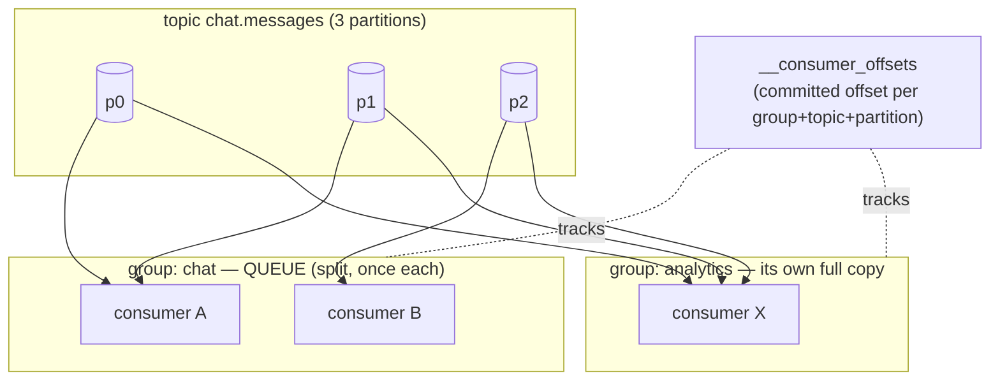

# Lesson 03 — Consuming: consumer groups & rebalancing

In Lesson 02 the **producer** decided _which partition_ a record lands in — and thereby what stays
ordered. This lesson is the other half of that sentence: given a topic split into partitions, **who
reads which partition, and what happens when readers come and go.** The answer is one mechanism —
the **consumer group** — and it's Kafka's most elegant idea, because it is _simultaneously a work
queue and a pub/sub topic_. You already built proof of this by accident in Lesson 01; this lesson is
the _why_, precise enough that you can predict a rebalance before it happens.

> **The one idea:** a consumer group is a **queue** _within_ itself (partitions split across its
> members, each message handled once) and a **topic** _across_ groups (every group gets its own full,
> independent copy of the log). The `groupId` is the single knob that chooses which behavior you get.

## 1. Concept

### 1.1 — You already built the duality (look at your own code)

Open `kafka.instance.ts`. You have two consumers on the _same_ topic `chat.messages`:

```ts
export const chat_consumer = kafka.consumer({ groupId: KAFKA_GROUPS.chat });
export const chat_analytics_consumer = kafka.consumer({
  groupId: KAFKA_GROUPS.chat_analytics,
});
```

Different `groupId`s. So when you produced your 14 messages, **both** consumers printed **all** of
them — `chat` saw everything, `chat_analytics` saw everything, each keeping its own place. That's the
**topic / pub-sub / fan-out** face: N groups ⇒ N independent readers of the whole log, each with its
own offsets. Billing, shipping, and analytics can all read `orders` without stealing events from each
other. This is the thing a BullMQ queue **cannot** do — there, a consumed job is gone.

Now imagine you started a **second** `chat_consumer` — same `groupId: "chat"`. It would **not**
re-read everything. Instead the two would **split the 3 partitions between them** (say 2 + 1), and
each message would be handled by exactly _one_ of them. That's the **queue / competing-consumers**
face: within one group, work is divided, not duplicated.

> One mechanism, two behaviors, chosen entirely by whether the `groupId` matches:
>
> | Same `groupId`                                                                         | Different `groupId`                                                             |
> | -------------------------------------------------------------------------------------- | ------------------------------------------------------------------------------- |
> | **Queue.** Partitions split across members; each record handled **once** by the group. | **Topic.** Each group gets the **whole** log, independently, at its own offset. |
> | Add a consumer → scale throughput.                                                     | Add a group → add a new _use_ of the same events.                               |

This is the single most important sentence in the whole course to internalize: **Kafka gives you
`queue ⊕ topic` in one primitive, and you dial between them with the group id.**

### 1.2 — The partition is the unit of assignment (and your parallelism ceiling)

Here is the rule that governs _everything_ inside a group:

> A partition is owned by **exactly one consumer** in the group at a time. A consumer may own many
> partitions; a partition is never split across two consumers of the same group.

Consequences fall straight out of it:

- **Your max useful parallelism = the partition count.** Your `chat.messages` has **3** partitions.
  Run 3 consumers in group `chat` → 1 partition each, fully parallel. Run a **4th** → it gets
  **nothing**; it sits idle as a hot standby. More consumers than partitions is wasted money.
- **This is the payoff of Lesson 02.** Remember "size your partition count up front, for the consumer
  parallelism you expect"? _This_ is what you were sizing for. Partition count is the ceiling on how
  many workers can share the load. You can't raise it by adding consumers — only by adding partitions
  (which, per Lesson 02 §1.6b, re-homes keys and is a disruptive act).
- **Per-partition ordering survives all the way to processing.** Because one consumer owns a whole
  partition, it reads that partition's offsets `0,1,2,…` in order and processes them in order. So the
  ordering you bought with a key in Lesson 02 is _preserved end-to-end_ — the record's key pinned it
  to a partition, and that partition has a single reader.

> **Predict before reading on.** Topic with **3** partitions, group `chat`. You start consumers one at
> a time: 1, then 2, then 3, then 4. Write down, for each step, how many partitions each consumer owns
> — and what the 4th consumer does. (Answer at the end of §1.3.)

### 1.3 — Offsets: the group's bookmark, stored _in Kafka_

Each **group** remembers, per partition, the offset of the **next** record it should read — its
_committed offset_. Crucially, this bookmark is **not** in your app; it's stored **in Kafka itself**,
in an internal topic called **`__consumer_offsets`** (compacted, keyed by
`group + topic + partition` — a foreshadow of Lesson 05's log compaction: the topic keeps only the
_latest_ committed offset per key). That's why a group's position **survives a full restart of your
app** — the truth lives in the broker.

This finally explains the Lesson 01 mini-challenge (_"restart the same group — does it re-read?"_):

- `fromBeginning: true` only decides where a group starts **when it has no committed offset yet** (a
  brand-new group). Once the group has committed _anything_, the **committed offset wins** and
  `fromBeginning` is ignored. Restart group `chat` → it resumes after its last commit, does **not**
  replay. Start a _fresh_ group id → no committed offset → `fromBeginning` kicks in → full replay.

_(Answer to the predict:_ 1 consumer → owns all 3. 2 consumers → 2 + 1. 3 consumers → 1 + 1 + 1. 4
consumers → 1 + 1 + 1 + **0** (the 4th idle). Partitions, never messages, are the unit — so 3 is the
ceiling.)\*

### 1.4 — _When_ you commit is your delivery guarantee

This is the crux of the whole lesson, and it's the same at-least-once / at-most-once distinction you
met in the BullMQ course — here it's controlled by **the order of two operations**: _process_ the
record, and _commit_ its offset.

```
at-most-once:   commit FIRST, then process.   Crash between → offset already moved → record NEVER reprocessed → LOST.
at-least-once:  process FIRST, then commit.    Crash between → offset not moved → record reprocessed on restart → DUPLICATE.
```

There is no third option without transactions (Lesson 04). You are choosing **which failure you can
tolerate**: silent loss, or duplicates. For almost everything, you pick **at-least-once** and make
processing **idempotent** — exactly the muscle you built in the last course (dedupe by a business key,
upsert not insert). "At-least-once + idempotent consumer" is the industry workhorse.

**Where does KafkaJS sit?** By default `autoCommit: true`, and it commits offsets **after your
`eachMessage`/`eachBatch` handler resolves** (throttled by `autoCommitInterval` / `autoCommitThreshold`,
both `null` by default → it commits at the end of each processed batch). Handler throws or the process
dies mid-batch → those offsets were never committed → **reprocessed**. So **KafkaJS's default is
at-least-once** — the safe one. You'd have to go out of your way (commit before processing) to get
at-most-once.

For real control, use **`eachBatch`** with `eachBatchAutoResolve: false` and call `resolveOffset(offset)`
yourself as each record succeeds, then `commitOffsetsIfNecessary()` — now the commit boundary is
exactly where you put it.

### 1.5 — Rebalancing: how the group re-divides the partitions

A **rebalance** is the group recomputing _who owns which partition_. It fires whenever the membership
or the work changes:

- a consumer **joins** (you scaled up),
- a consumer **leaves** or **crashes** (missed heartbeats — see §1.6),
- **partitions are added** to a subscribed topic,
- the subscription changes.

Mechanically: one broker is the group's **coordinator**; one consumer is elected **group leader** and
computes the assignment using a **partition assignment strategy**, then everyone adopts it. Two families
of protocol:

- **Eager ("stop-the-world") rebalance.** Every consumer **revokes all** its partitions, the new
  assignment is computed, everyone re-acquires. For the duration, **nobody consumes** — a global pause.
  Simple, but disruptive, and it gets worse as the group grows.
- **Cooperative / incremental rebalance.** Only the partitions that actually need to move are revoked;
  every other consumer **keeps processing** its partitions throughout. Far less disruption. This is the
  modern default in the **Java** client (`CooperativeStickyAssignor`, since Kafka 2.4 / the default in
  3.x).

> **KafkaJS reality check (important on your stack):** KafkaJS ships **only eager rebalancing**, with
> **`roundRobin`** assignment by default (built-ins: `roundRobin`; you can write a custom assigner).
> Incremental cooperative rebalancing is a JVM-client feature KafkaJS does not implement. So on _your_
> setup every rebalance is stop-the-world — learn the cooperative concept (the Udemy course and every
> real Java deployment use it), but expect eager pauses in your exercises. This is the same "concepts
> transfer, JVM has more knobs" caveat as the course's RESOURCES.md.

**Assignment strategies** decide the _shape_ of the split. Sticky-family strategies matter because they
**minimize movement** across a rebalance (keep each consumer on the partitions it already had where
possible), which means fewer partitions change hands, fewer offsets get reprocessed, less churn.

### 1.6 — The two foot-guns: heartbeat timeouts & rebalance duplicates

**(a) Slow processing → missed heartbeat → kicked → rebalance storm.** A consumer proves it's alive by
sending **heartbeats** (`heartbeatInterval`, default **3s**). If the coordinator hears nothing for
`sessionTimeout` (default **30s**), it declares the consumer dead and rebalances its partitions away.
The trap: in KafkaJS, heartbeats are sent **between** messages, not _during_ one. So a single
`eachMessage` handler that blocks for **> 30s** (a slow external API, a big computation) misses its
heartbeat window and gets **kicked even though it's perfectly healthy** — triggering a rebalance,
during which its half-done work is reassigned and reprocessed, which can back the group up and trigger
_another_ rebalance: a **rebalance storm**. This is the #1 real-world consumer bug. Fixes:

- use **`eachBatch`** and call the provided **`heartbeat()`** periodically inside long work;
- raise **`sessionTimeout`** / **`rebalanceTimeout`** to fit your slowest record;
- **don't block the loop** — offload genuinely long work and commit when it's done;
- (the JVM analog to name-drop for the Udemy course: **`max.poll.interval.ms`** — same disease, the
  timer that bounds "how long may I take between polls before I'm presumed dead.")

**(b) Rebalances cause duplicates _even with no crash_.** When partitions move, any records a consumer
**processed but hadn't committed yet** get handed to the new owner, which reads from the last committed
offset and **reprocesses them**. So every rebalance is a source of at-least-once duplicates. The only
thing that makes this safe is the property from §1.4: **idempotent processing.** (Yes — the BullMQ
lesson again. It keeps being the answer.)

## 2. Diagram — run a group, then break it

The assignment math is trivial; its _dynamics_ — split, rebalance, idle standby, duplicate-on-move —
are what you have to _feel_. Open the console:

> **▶ [learn/visuals/kafka/03-consumer-groups.html](../visuals/kafka/03-consumer-groups.html)** — a live
> consumer-group board. Add/remove consumers in a group and watch partitions get **revoked and
> reassigned**; add a second group and watch it get its **own full copy**; advance offsets, then **kill
> a consumer mid-record** and catch the **duplicate** the new owner reprocesses.

Things to actually try in it:

1. Group `chat`, add consumers 1→2→3→4. Watch the split `3 → 2+1 → 1+1+1 → 1+1+1+**idle**`. That's §1.2.
2. Add a second group `analytics`. It instantly owns **all** partitions independently — same log, own
   offsets. That's §1.1, the topic face.
3. Advance some offsets on C1, then **remove C1**. Its partition is revoked and reassigned; the new
   owner resumes from C1's **last committed** offset — replaying the uncommitted tail. That's §1.6b.
4. Flip **commit timing** before → after and repeat the kill. See loss vs duplicate. That's §1.4.

And the mechanism as a picture:



## 3. Walkthrough — an annotated consumer

A consumer you'd actually keep. Note the **group id** (the queue-vs-topic dial), the **assignment
readout** (proof of which partitions you own), and the **manual commit** path that puts the
delivery-semantics boundary exactly where you decide.

```ts
import { kafka } from "./kafka.instance";

const consumer = kafka.consumer({
  groupId: "chat", // ← same id = split the work; new id = independent full replay
  sessionTimeout: 30_000, // no heartbeat for this long ⇒ you're presumed dead ⇒ rebalance (§1.6a)
  heartbeatInterval: 3_000, // ~⅓ of sessionTimeout, per KafkaJS's own advice
});

// Proof of §1.2: print exactly which partitions THIS member was assigned on each (re)join.
consumer.on(consumer.events.GROUP_JOIN, ({ payload }) => {
  console.log(`joined as ${payload.memberId}`, payload.memberAssignment); // e.g. { "chat.messages": [0, 2] }
});
consumer.on(consumer.events.REBALANCING, () =>
  console.log("↻ rebalancing — partitions in flux"),
);

await consumer.connect();
await consumer.subscribe({ topic: "chat.messages", fromBeginning: true });
// fromBeginning only bites for a brand-new group with NO committed offset (§1.3).

// --- Simple path: at-least-once via KafkaJS default (commit AFTER handler resolves) ---
await consumer.run({
  eachMessage: async ({ topic, partition, message }) => {
    // One consumer owns this whole partition, so these arrive in offset order — per-key order intact.
    console.log(
      `p${partition} @${message.offset} key=${message.key?.toString() ?? "∅"} ${message.value?.toString()}`,
    );
    // If this throws or we crash here, the offset is NOT committed → this record is reprocessed. (at-least-once)
    // ⇒ make the work idempotent (dedupe by a business key), exactly like the BullMQ course.
  },
});

// --- Control path: put the commit boundary exactly where you want it ---
await consumer.run({
  autoCommit: false,
  eachBatchAutoResolve: false, // don't let KafkaJS auto-mark the batch done
  eachBatch: async ({
    batch,
    resolveOffset,
    heartbeat,
    commitOffsetsIfNecessary,
    isRunning,
    isStale,
  }) => {
    for (const message of batch.messages) {
      if (!isRunning() || isStale()) break; // stop cleanly if we were revoked mid-batch
      await handle(message); // ← process
      resolveOffset(message.offset); // ← mark THIS record done (process-then-resolve = at-least-once)
      await heartbeat(); // ← stay alive during long work (§1.6a fix)
    }
    await commitOffsetsIfNecessary(); // ← the commit boundary is now yours
  },
});
```

Three things worth internalizing:

- **`groupId` is the whole API for queue-vs-topic.** There is no separate "make this a pub/sub" flag —
  a new id _is_ a new independent subscription; a shared id _is_ work-sharing. Everything follows.
- **`memberAssignment` is your receipt.** Just like `send()` returned `partition + baseOffset` on the
  produce side (Lesson 02 §3), `GROUP_JOIN` hands the consumer the exact partitions it owns. Print it
  and you can _see_ the rebalance move partitions between your instances.
- **`resolveOffset` + `commitOffsetsIfNecessary` are where delivery semantics live.** Move that commit
  before `handle()` and you've chosen at-most-once. The guarantee isn't a config flag — it's _where in
  your code the commit happens._

## 4. Exercise

Prove the `queue ⊕ topic` duality — and its failure modes — with your own consumers, on your existing
`chat.messages` topic (3 partitions). You'll run **multiple consumer processes at once**, so open
several terminals (or a small script that forks). Keep producing with your Lesson 02 `send-message.ts`.

**First, fix the Lesson 02 gap:** make every consumer print `partition + offset + key + value` (you
were missing `key`). You'll need the key to _see_ ordering hold per partition.

1. **Topic face (fan-out).** Run your `chat` consumer and your `chat_analytics` consumer together.
   Produce a batch. **Show both groups received every message**, and show they track **independent
   offsets**: stop and restart the `chat` group — prove it **resumes** (doesn't replay), then spin up a
   consumer with a **brand-new group id** and prove it **replays from the beginning**. Explain, from
   §1.3, exactly why.
2. **Queue face (scale within a group).** Run **2**, then **3**, then **4** consumers _in the same
   group_ `chat`. On each, subscribe to `GROUP_JOIN` and print `payload.memberAssignment`. **Show the
   partition split** at each step (`2+1`, `1+1+1`, `1+1+1+idle`) and **which consumer gets nothing at
   4**. Then produce keyed records and show **each key's records all land on the single consumer that
   owns its partition, in order** — ordering preserved end-to-end.
3. **Trigger a rebalance & catch a duplicate.** With 3 consumers running, produce a steady stream and
   **kill one consumer mid-stream** (Ctrl-C). Capture: the `REBALANCING` event, the surviving consumers'
   **new** `memberAssignment`, and — the money shot — **at least one record processed twice** (printed
   by the dying consumer _and_ re-printed by its partition's new owner). Explain which offset had not
   yet been committed and why that caused the duplicate.
4. **Choose your guarantee.** Take **one** consumer and deliberately implement **at-most-once** (commit
   _before_ processing — e.g. `eachBatch` + `resolveOffset`/`commitOffsetsIfNecessary` _first_, then
   handle). Kill it mid-batch and **show a record that was lost** (committed, never fully processed).
   Then switch to at-least-once and show the same kill yields a **duplicate** instead. State which you'd
   ship for a chat app and what makes the duplicate safe.

Run a consumer with: `pnpm --filter server exec tsx apps/server/src/kafka/<your-consumer>.ts`
Watch it live in **Kafka UI** → `http://localhost:8080` → **Consumers** → your group: members, the
partition→member assignment, **committed offset**, and **lag** (how far behind each partition is).

### Mini-challenge (predict first, then verify — no peeking)

1. Your `chat.messages` has 3 partitions and you run a group with **5** consumers. What are the extra
   two doing right now, and what is the **only** way to actually raise the group's parallelism past 3?
   Tie your answer back to Lesson 02's "choose partition count up front."
2. Your `eachMessage` calls an external API that takes **~40s** per message; you left `sessionTimeout`
   at its **30s** default. Describe the exact loop that turns this into a **rebalance storm** — and name
   the **two** distinct fixes (one that changes _when you heartbeat_, one that changes _the timeout_).
3. A rebalance happens with **no crash at all** — a healthy new consumer simply joined. Explain how a
   record can still be **delivered twice** as a direct result, and name the **one property** of your
   handler that makes this a non-event. (If your answer isn't a word from the BullMQ course, think again.)

Nail #3 and you've understood why Kafka's "at-least-once by default" is a _feature_, not a flaw: it
pushes correctness into idempotent handlers, where it belongs, instead of pretending the network never
fails. Bring me your code + terminal captures (the assignments and the duplicate) + answers; I'll
review by severity.

## 5. Go deeper (read/watch after you've done the exercise)

Curated, mapped to _this_ lesson — do the exercise first, then reinforce. (Maarek's hands-on consumer
code is **Java**; watch those for the _concepts_ — your KafkaJS work is above.)

**Stephane Maarek — "Apache Kafka for Beginners v3"** (Udemy, the sub you already have):

- **Section "Kafka Consumers & Consumer Groups Theory"** → _Consumers_, _Consumer Groups_, _Consumer
  Offsets_, and especially **_Delivery Semantics for Consumers_** (at-least / at-most / exactly-once) —
  this is §1.4 in his words.
- **Section on rebalancing** → **_Consumer Groups — Partition Rebalance_** (Eager **vs** Cooperative /
  Incremental Cooperative Rebalance) and **_Static Group Membership_** — this is §1.5–1.6, and covers the
  cooperative protocol your KafkaJS stack doesn't ship but every Java deployment uses.
- **CLI section** → **`kafka-consumer-groups.sh`** (describe a group, see lag, **reset offsets**) — the
  command-line twin of the Kafka UI _Consumers_ panel you'll use in the exercise.

**Best free articles / docs (pick by depth you want):**

- **Confluent — ["Incremental Cooperative Rebalancing: Why Stop the World When You Can Change It?"](https://www.confluent.io/blog/incremental-cooperative-rebalancing-in-kafka/)**
  (Konstantine Karantasis). _The_ canonical piece on §1.5 — why stop-the-world hurts and how cooperative
  fixes it. Read this one even if you read nothing else.
- **Confluent Developer — [Consumer group protocol / partition assignment module](https://developer.confluent.io/courses/architecture/consumer-group-protocol/)**
  (free, language-agnostic) — the coordinator/leader/assignment internals behind §1.5.
- **KafkaJS docs — [Consuming](https://kafka.js.org/docs/consuming)** — your exact API: `autoCommit`
  timing, `eachBatch`, `partitionsConsumedConcurrently`, `resolveOffset`/`heartbeat`. This is the
  reference for §3 and the exercise.
- **Hello Interview — [Kafka deep dive](https://www.hellointerview.com/learn/system-design/deep-dives/kafka)**
  — how consumer-group parallelism (§1.2) shows up in an actual system-design decision.
- **Confluent docs — [`__consumer_offsets` & offset management](https://docs.confluent.io/platform/current/clients/consumer.html#offset-management)**
  — where §1.3's committed-offset bookmark actually lives.
