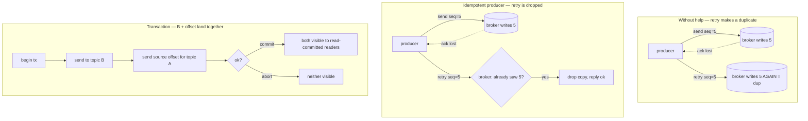

# Lesson 04 — Delivery semantics: idempotent & transactional producers

In Lesson 03 you saw the **consumer** side of duplicates: a record gets re-read after a crash,
so you make the handler **idempotent**. This lesson is the **producer** side, and how to get real
**exactly-once** _inside_ Kafka.

There are only two tools, and you already turned one of them on:

- **Idempotent producer** — stops a producer's own retries from writing the same record twice.
- **Transactions** — write to many topics **and** commit consumer offsets as one all-or-nothing step.

> **The one idea:** exactly-once in Kafka isn't magic. It's two dedupe tricks — a **sequence number**
> per record (idempotent producer), and an **all-or-nothing commit** across topics + offsets (transactions).

## 1. Concept

### 1.1 — The producer has a duplicate problem too

You already know consumers can double-process. Producers can double-**write**. Here's how:

1. You `send()` with `acks: -1` (wait for all replicas — Lesson 02).
2. The broker saves the record **and** replicates it. Success.
3. The **ack on the way back gets lost** (network blip).
4. The producer didn't hear "ok", so it **retries** the send.
5. The broker writes the record **again**. Now there are two copies.

So a plain producer is **at-least-once**: retries can make duplicates. Same disease as the consumer,
different side.

### 1.2 — The idempotent producer (you already have this on)

Look at your `kafka.instance.ts`:

```ts
export const producer = kafka.producer({ idempotent: true }); // ← good, keep it
```

How it fixes the duplicate:

- On connect, the broker gives the producer a **Producer ID (PID)**.
- Every record gets a **sequence number**, counting up per partition (`0, 1, 2, …`).
- The broker remembers the **last sequence number** it wrote for each (PID, partition).
- A retry arrives with a sequence number the broker **already saw** → it **drops the copy** and
  still replies "ok".

Result: the producer's own retries no longer create duplicates. This is basically free — leave it on
always. Turning it on also forces safe settings (`acks: -1`, retries enabled) for you.

**What it does _not_ cover** (important):

- Only within **one producer run**. Restart the app → new PID → the broker won't recognise old records.
- Only for **that producer's retries** on **its own** partitions.
- It does **nothing** for the "read from A, do work, write to B" flow — that spans two topics and an
  offset. For that you need transactions.

### 1.3 — The harder case: read-process-write

A very common shape:

```
consume from topic A  →  transform  →  produce to topic B  →  commit offset on A
```

Two writes must happen together, or not at all:

1. the new record into **B**, and
2. the **offset commit** on **A**.

Crash in the middle and you get the old choice again: **duplicate** (wrote B, didn't commit A → redo)
or **loss** (committed A, didn't write B). The idempotent producer can't help — it only guards one
producer writing to one partition, not "B plus an offset."

### 1.4 — Transactions = all-or-nothing across topics + offsets

A Kafka **transaction** wraps several sends **and** the consumer offset commit into one atomic unit.
Either everything lands, or nothing does.

The pieces:

- A producer with a **`transactionalId`** — a stable name for this logical producer.
- `initTransactions()` once, then per batch: `transaction()` → `send()` the outputs →
  `sendOffsets()` for the source offsets → `commit()` (or `abort()` on error).
- Readers must **opt in**: a consumer set to **read committed** skips records from aborted or
  still-open transactions. (KafkaJS reads committed by **default**; `readUncommitted: true` sees everything.)

Do this and the read-process-write loop becomes **exactly-once** — for a Kafka→Kafka pipeline.

### 1.5 — The honest limit (read this twice)

Exactly-once only holds **inside Kafka's boundary**. The moment your handler writes to a database,
sends an email, or calls a payment API, the transaction **can't reach there** — it can't roll those back.

So the rule is simple:

| Your flow                                      | Use                                               |
| ---------------------------------------------- | ------------------------------------------------- |
| Just producing records                         | **Idempotent producer** (always on)               |
| Read → transform → write, **all inside Kafka** | **Transactions** (true exactly-once)              |
| Kafka → **outside world** (DB, email, payment) | **Idempotent handler** — dedupe by a business key |

That last row is exactly the Lesson 03 answer, which was exactly the BullMQ course answer. It keeps
being the answer.

## 2. Diagram



## 3. Walkthrough — a transactional read-process-write

A consumer that reads `chat.messages`, transforms each record, writes it to `chat.processed`, and
commits the source offset — **all in one transaction**. Kill it mid-batch and a read-committed reader
sees **nothing** from that batch; on restart it redoes the batch cleanly. Exactly-once.

```ts
import { kafka } from "./kafka.instance";

const GROUP = "chat-processor";

// A transactional producer needs a stable id + in-flight cap of 1.
const producer = kafka.producer({
  transactionalId: "chat-processor-tx", // stable name for THIS logical producer
  maxInFlightRequests: 1,
  idempotent: true, // transactions build on top of idempotence
});

const consumer = kafka.consumer({ groupId: GROUP });
// readUncommitted defaults to false in KafkaJS → this consumer already reads only committed records.

await producer.connect();
await consumer.connect();
await consumer.subscribe({ topic: "chat.messages", fromBeginning: true });

await consumer.run({
  eachBatchAutoResolve: false,
  eachBatch: async ({ batch, resolveOffset, heartbeat }) => {
    const tx = await producer.transaction(); // ── begin
    try {
      for (const message of batch.messages) {
        const out = message.value!.toString().toUpperCase(); // "transform"

        await tx.send({
          topic: "chat.processed",
          messages: [{ key: message.key, value: out }],
        }); // write to B, inside the tx

        resolveOffset(message.offset);
        await heartbeat(); // stay alive during long work (Lesson 03 §1.6a)
      }

      // Commit the SOURCE offset as PART OF the same transaction:
      await tx.sendOffsets({
        consumerGroupId: GROUP,
        topics: [
          {
            topic: batch.topic,
            partitions: [
              {
                partition: batch.partition,
                offset: (Number(batch.lastOffset()) + 1).toString(),
              },
            ],
          },
        ],
      });

      await tx.commit(); // ── all-or-nothing: B + offset land together
    } catch (err) {
      await tx.abort(); // ── neither B nor the offset lands
      throw err;
    }
  },
});
```

Three things to hold onto:

- **`transactionalId` must be stable.** It's how the broker recognises the same logical producer
  across restarts and fences out a zombie old instance. A random id every boot defeats the point.
- **The offset commit rides inside the transaction** (`sendOffsets`, not the normal auto-commit).
  That's the whole trick — "wrote B" and "moved the offset" become one fact.
- **Readers must read committed** to get the guarantee. KafkaJS does this by default; flip
  `readUncommitted: true` and you'll _see_ aborted records show up (great for the exercise).

## 4. Exercise

Prove both dedupe tricks on your existing `chat.messages` topic. Keep producing with your Lesson 02
`send-message.ts`.

1. **Confirm idempotence is real (reason about it).** Your producer already has `idempotent: true`.
   In Kafka UI, open the topic and note the record count after one produce. Explain, using §1.2, why a
   lost ack + producer retry would **not** grow that count — and what the broker used to know it was a
   repeat. (You can't easily force a retry by hand; this one is a written answer, not a capture.)

2. **Build the transactional pipeline.** Write a `chat-processor` consumer+producer like §3: read
   `chat.messages`, uppercase each value, write to a **new** `chat.processed` topic, and commit the
   source offset **inside** the transaction. Run it, then open a plain consumer on `chat.processed`
   and show the transformed records arriving.

3. **Catch an abort.** Add a deliberate failure — `throw` before `tx.commit()` on one batch. Then run
   **two** readers on `chat.processed`: one normal (read committed) and one with `readUncommitted: true`.
   Show the money shot: the **read-uncommitted** reader briefly sees the aborted record, the
   **read-committed** reader **never** does. Explain which line made the difference.

4. **Find the boundary.** Change the pipeline so instead of writing to `chat.processed`, it writes each
   message to a **database row** (or just a local file / `console` you treat as "the outside world").
   Answer in words: the transaction still commits the Kafka offset — so what happens to that DB write if
   the process dies right after the write but before `commit()`? What's the **only** thing that makes
   that safe, and where have you used it before?

Run a consumer with: `pnpm --filter server exec tsx apps/server/src/kafka/<your-file>.ts`
Watch it in **Kafka UI** → `http://localhost:8080` → your new topic + the `chat-processor` group's
committed offset and lag.

### Mini-challenge (predict first, then verify — no peeking)

1. You restart your idempotent producer app (no transactions). It re-sends a record it had sent right
   before the crash. Does the broker dedupe it? Why or why not — what changed on restart?
2. A read-process-write job uses transactions but a teammate runs a consumer on the output topic with
   `readUncommitted: true`. What bad thing can they now observe that read-committed readers never would?
3. Your pipeline reads Kafka, writes to Postgres, then commits the offset in a transaction. Someone says
   "great, now it's exactly-once end-to-end." Why are they **wrong**, and what pattern from the BullMQ
   course actually closes the gap?

Nail #3 and you've got the real boundary of exactly-once: it's a Kafka-internal guarantee, and the
edge of Kafka is where idempotency takes back over. Bring me your code + the read-committed vs
read-uncommitted capture + answers; I'll review by severity.

## 5. Go deeper (read/watch after the exercise)

Mapped to _this_ lesson. Maarek's hands-on code is Java — watch for the concepts; your KafkaJS work is above.

**Stephane Maarek — "Apache Kafka for Beginners v3"** (your Udemy sub):

- **Producer section → _Idempotent Producer_** and **_Producer Acks / `acks=all`, `min.insync.replicas`_**
  — this is §1.1–1.2 in his words (why retries duplicate, how the PID+sequence stops it).
- **Advanced / _Exactly Once Semantics_ & _Kafka Transactions_** — §1.4. He walks the same
  read-process-write shape you build in the exercise.

**Best free reads:**

- **Confluent — ["Exactly-Once Semantics Are Possible: Here's How Kafka Does It"](https://www.confluent.io/blog/exactly-once-semantics-are-possible-heres-how-apache-kafka-does-it/)**
  (Neha Narkhede). _The_ canonical piece — PID, sequence numbers, the transaction coordinator, and why
  "exactly-once" is really "idempotence + atomic commit." Read this one even if you read nothing else.
- **KafkaJS docs — [Transactions](https://kafka.js.org/docs/transactions)** — your exact API:
  `transactionalId`, `transaction()`, `sendOffsets`, and the consumer `readUncommitted` flag for §3.
- **Confluent Developer — [Exactly-Once Semantics module](https://developer.confluent.io/courses/architecture/exactly-once/)**
  (free, language-agnostic) — the coordinator/fencing internals behind §1.4.
