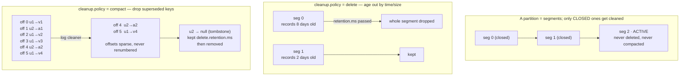

# Lesson 05 — Retention & log compaction

Lesson 01 sold you the log as **durable and replayable**. That was a half-truth: disks are finite,
so something has to go. This lesson is how Kafka bounds an infinite log — and how one of the two
answers quietly turns a topic into a **table**.

> **The one idea:** `cleanup.policy=delete` throws records away because they are **old**.
> `cleanup.policy=compact` throws records away because they are **superseded**. The first keeps a
> _window of history_; the second keeps _current state, forever_.

That second one is the big unlock. A compacted topic is a database table that happens to be a log —
and it's how a brand-new service bootstraps its whole world by replaying from offset 0.

## 1. Concept

### 1.1 — Segments: the thing that actually gets deleted

Before either policy makes sense you need to know that **a partition is not one file**. It's a
directory of **segments**. Here is your own broker, right now:

```
$ docker exec learn-broker-kafka ls -la /tmp/kafka-logs/chat.messages-0/

00000000000000000041.index
00000000000000000041.log        ← the records themselves
00000000000000000041.snapshot
00000000000000000041.timeindex
leader-epoch-checkpoint
partition.metadata
```

The filename is the **base offset** of the segment. Note yours starts at `41`, not `0` — an earlier
segment already aged out. Retention has been running on your topic this whole course.

The newest segment is the **active segment** — the one being appended to right now. It **rolls** into
a closed segment when either limit trips:

| Config          | Default              | Meaning                        |
| --------------- | -------------------- | ------------------------------ |
| `segment.bytes` | `1073741824` (1 GiB) | roll after this much data      |
| `segment.ms`    | `604800000` (7 days) | roll after this much wall time |

**Here is the rule that explains 90% of "why didn't my retention work":**

> Kafka only ever deletes or compacts **closed** segments. The **active segment is never touched.**

So you set `retention.ms=1000` on a low-traffic topic, wait a minute, and nothing disappears. Not a
bug. Your one and only segment is still the active one, and Kafka won't delete the file it's
currently writing to. It has to **roll** first. Whenever you want to _observe_ cleanup, you must also
shrink `segment.ms` — otherwise you're waiting seven days.

**And `segment.ms` is not a timer.** Rolling is checked **lazily, inside the append path** — Kafka
only asks "should I roll?" when a record actually arrives. No background thread rolls an idle
segment. So an idle partition never rolls, never closes a segment, and therefore **is never cleaned**,
no matter how aggressive its config looks. Here is that on a real topic with `segment.ms=100` — one
hundred milliseconds — across three partitions:

```
partition 0:  0000...0000.log   0000...0037.log     ← rolled; cleaned to offset 37
partition 1:  0000...0000.log                       ← never rolled; absent from the cleaner checkpoint
partition 2:  0000...0000.log   0000...0027.log     ← rolled; cleaned to offset 27
```

Partition 1 sat for hours past its 100 ms limit without rolling once, because nothing was written to
it. Rolling and cleaning are also strictly **per partition**: an append to partition 2 does nothing
for partition 0.

The chain to keep in your head, because every later confusion in this lesson resolves to it:

> **append → may trigger a roll → roll closes a segment → only then can the cleaner touch it.**

An append never compacts anything directly. It only ever creates the *conditions* for cleaning.

### 1.2 — Policy 1: `delete` (the default)

Throw away segments whose records are older than a time bound, or once the partition exceeds a size
bound.

| Config            | Default              | Meaning                                             |
| ----------------- | -------------------- | --------------------------------------------------- |
| `retention.ms`    | `604800000` (7 days) | drop segments older than this                       |
| `retention.bytes` | `-1` (unlimited)     | drop oldest segments once the **partition** exceeds |

Two things to internalise:

- **`retention.bytes` is per partition, not per topic.** A 3-partition topic with
  `retention.bytes=1GB` can hold 3 GB.
- **Granularity is the whole segment.** A segment is deleted when its _newest_ record is older than
  the bound. So records live somewhat _longer_ than `retention.ms` — that setting is a floor, not a
  stopwatch.
- **Deletion is two-stage.** Kafka first _renames_ the dead segment to `….log.deleted`, then actually
  unlinks it `file.delete.delay.ms` later (default `60000` — one minute), so readers holding an open
  file handle don't break mid-fetch. If you're watching the directory, expect `.deleted` files to
  linger for a minute before vanishing.

This is the right policy for an **event stream**: `chat.messages`, `page.views`, `orders.placed`.
Facts that happened. You want a window of history, and you're fine losing the distant past.

### 1.3 — Policy 2: `compact` — the log becomes a table

Compaction asks a completely different question. Not "how old is this record?" but:

> **"Has a later record with the same key replaced this one?"**

If yes, the older one is garbage. The **log cleaner** (a background broker thread) recopies closed
segments, keeping **at least the latest value for each key** and dropping the superseded ones.

The consequence is the whole point of this lesson:

```
Append-only log                          After compaction
─────────────────────────────            ─────────────────
off 0  u1 → "v1"    (superseded)
off 1  u2 → "a1"    (superseded)
off 2  u1 → "v2"    (superseded)   ──▶
off 3  u1 → "v3"    (superseded)
off 4  u2 → "a2"                         off 4  u2 → "a2"
off 5  u1 → "v4"                         off 5  u1 → "v4"
```

A compacted topic is a **changelog**: an append-only stream of updates that, replayed, reconstructs
a key→value **table**. Retention is no longer about time at all. `u1` can sit untouched for three
years and it will still be there, because nothing ever superseded it. **Current state, forever, in a
Kafka topic.**

That is the stream⇄table duality we'll formalise in Lesson 09, and the storage substrate behind
event sourcing in Lesson 08.

### 1.4 — Tombstones: how you delete a key

If the latest value is kept forever, how do you ever remove `u2`? You append a record with the key
and a **`null` value**. That's a **tombstone**, and it means "this key is deleted."

Consumers see it as a real record with `value === null` — that's their cue to remove the key from
whatever table they're building. Then, after a grace period, the cleaner removes the tombstone too.

| Config                | Default             | Meaning                                        |
| --------------------- | ------------------- | ---------------------------------------------- |
| `delete.retention.ms` | `86400000` (24 hrs) | keep tombstones this long **after** a cleaning |

Why the grace period? Because a tombstone is the **only** notification a consumer ever gets that a
key died. Delete it instantly and a consumer that was offline during that window rebuilds its table,
never sees the tombstone, and keeps `u2` forever — a **resurrected ghost record**. The 24-hour
default is Kafka saying: you have a day to be caught up, or you may miss a delete.

**Removing a tombstone takes two cleaning passes, not one.** The clock does not start when you
_write_ the tombstone — it starts when the cleaner first _sees_ it:

1. **Pass 1** finds the tombstone in a newly closed segment, deduplicates it against any earlier
   tombstones for the same key, and stamps the record batch with a **delete horizon** =
   `now + delete.retention.ms`. It keeps the tombstone.
2. **Pass 2**, running some time after that horizon, physically drops it.

You can see the stamp in `kafka-dump-log.sh` output — every ordinary batch reads
`deleteHorizonMs: OptionalLong.empty`, and the tombstone's batch reads `OptionalLong[1785432255636]`.

The consequence surprises people: **an expired horizon is not enough.** Pass 2 has to actually be
triggered, and the cleaner only runs when there's dirty data — so once a log has been cleaned up to
the active segment, the tombstone sits there indefinitely until a _further_ append rolls a new
segment. A tombstone long past its grace period is still perfectly normal on a quiet partition.

### 1.5 — Compaction is **not** deduplication (read this twice)

The most common wrong mental model is "a compacted topic has exactly one record per key." It does
not, and code that assumes it will break.

Compaction is a **background, best-effort, eventually-consistent** process:

- The **active segment is never cleaned** (§1.1). Everything recently written is still duplicated.
- The cleaner only bothers when a log is dirty enough: `min.cleanable.dirty.ratio` (default `0.5`) —
  it waits until half the cleanable log is uncleaned before spending the I/O.
- `min.compaction.lag.ms` (default `0`) can hold records out of compaction for a guaranteed window;
  `max.compaction.lag.ms` (default: effectively infinite) forces a clean even when the log is not dirty.

Here is that, proved on your broker. Nine records went in. After the cleaner ran:

```
Offset:4    u2    a2
Offset:5    u1    v4
Offset:6    u2    null      ← tombstone
Offset:7    u1    v5
Offset:8    u3    z1
```

Look carefully at what that output is telling you:

- **Offsets 0–3 are gone.** Superseded, cleaned away.
- **Offsets are now sparse.** The log starts at 4. There is no 0, 1, 2, 3. Offsets are _not_
  renumbered — a record's offset is permanent (§1.6).
- **`u1` still appears twice** (offset 5 `v4`, offset 7 `v5`), and so does `u2` (offset 4, then the
  tombstone at 6). Why? Offsets 6–8 are in the **active segment**. Never cleaned.

**Therefore:** any consumer building a table from a compacted topic must still apply
**last-write-wins per key** as it replays. Compaction bounds your disk and your replay time. It does
not hand you a pre-deduplicated dataset.

### 1.6 — The four guarantees you can actually rely on

Straight from Kafka's own contract:

1. **A consumer that stays caught up sees every message.** Compaction only ever touches the older
   part of the log, so a live consumer near the head misses nothing.
2. **Ordering is never changed.** Compaction only _removes_ records. It never reorders them.
3. **An offset never changes.** It is a permanent address. Compaction makes offsets **sparse**, never
   renumbered — which is exactly why `off 4, 5, 6, 7, 8` above has holes below it.
4. **A consumer replaying from the start sees at least the final state of every key** — plus every
   tombstone, _provided_ it catches up within `delete.retention.ms`.

Guarantee 4 is the one you build on. Guarantee 3 is the one that surprises people writing
`assert(offset === previous + 1)`.

### 1.7 — A compacted topic **rejects** keyless records

Not "discourages." Rejects. Send a record with no key to a compacted topic and the broker refuses it:

```
org.apache.kafka.common.InvalidRecordException:
  Compacted topic cannot accept message without key in topic partition scratch.compact-0
```

Obvious once you say it out loud: compaction dedupes _by key_, so a record without one is
meaningless. But go look at your [send-message.ts](apps/server/src/kafka/chat/send-message.ts) —
none of those three messages sets a `key`. Your `chat.messages` topic **could not be switched to
compact** as written. Worth knowing _before_ you try it in the exercise.

### 1.8 — `compact,delete`: both at once

`cleanup.policy` accepts both. Compaction dedupes by key **and** `retention.ms` still ages out old
segments outright. You get "latest state per key, but nothing older than N days" — a bounded table
that forgets keys nobody has touched in a while. Kafka Streams uses this for windowed state stores.

### 1.9 — You've been using a compacted topic since Lesson 03

Ask your broker what policy the internal offsets topic uses:

```
$ docker exec learn-broker-kafka /opt/kafka/bin/kafka-configs.sh \
    --bootstrap-server localhost:9092 --entity-type topics \
    --entity-name __consumer_offsets --describe --all | grep cleanup.policy

  cleanup.policy=compact
```

**`__consumer_offsets` is a compacted topic.** Every offset commit you made in Lessons 03 and 04 —
including `tx.sendOffsets()` — was a produce to that topic, keyed by
`(group, topic, partition)`, valued with the offset.

That's the whole answer to a question you may not have thought to ask: how does Kafka store "the
group's current position" without an unbounded history of every commit ever made? It doesn't store
state at all. It stores a **changelog** and lets compaction collapse it to current state. Kafka's own
consumer-group state is built out of the mechanism in this lesson.

Same for the transaction coordinator's state, and for every Kafka Streams state store's backing topic.

### 1.10 — Choosing

| You're storing                                | Policy           | Key is…                      |
| --------------------------------------------- | ---------------- | ---------------------------- |
| Facts that happened (`chat.messages`, clicks) | `delete`         | optional (routing/ordering)  |
| Current state per entity (profiles, prices)   | `compact`        | **mandatory** — the identity |
| Bounded state (windowed aggregates)           | `compact,delete` | mandatory                    |

The tell: **can a later record make an earlier one meaningless?** "User 7 changed their email" makes
the old email irrelevant → compact. "User 7 sent a message at 10:03" never becomes irrelevant → delete.

## 2. Diagram



**Interactive:** open [`learn/visuals/kafka/05-compaction.html`](../visuals/kafka/05-compaction.html)
in a browser — a log-cleaner bench where you append keyed records, roll segments, run the cleaner,
and watch offsets go sparse while the materialized table stays identical. That invariant —
_compaction never changes the result of a full replay_ — is the thing to feel in your hands.

## 3. Walkthrough

### 3.1 — Creating a compacted topic

Topic configs go in `configEntries` at creation time:

```ts
import { kafka } from "./kafka.instance";

const admin = kafka.admin();
await admin.connect();

await admin.createTopics({
  waitForLeaders: true,
  topics: [
    {
      topic: "chat.profiles",
      numPartitions: 3,
      configEntries: [
        { name: "cleanup.policy", value: "compact" },
        // ── everything below is ONLY to make compaction observable in a lesson.
        // ── Production defaults exist because cleaning is expensive I/O.
        { name: "segment.ms", value: "100" }, // roll almost immediately (default: 7 days)
        { name: "min.cleanable.dirty.ratio", value: "0.01" }, // clean eagerly (default: 0.5)
        { name: "min.compaction.lag.ms", value: "0" },
        { name: "max.compaction.lag.ms", value: "1000" }, // force a clean even if not dirty
        { name: "delete.retention.ms", value: "100" }, // drop tombstones fast (default: 24h)
      ],
    },
  ],
});
```

Changing the policy on a topic that already exists:

```ts
import { ConfigResourceTypes } from "kafkajs";

await admin.alterConfigs({
  validateOnly: false,
  resources: [
    {
      type: ConfigResourceTypes.TOPIC,
      name: "chat.profiles",
      configEntries: [{ name: "cleanup.policy", value: "compact" }],
    },
  ],
});
```

### 3.2 — Writing state and deleting it

```ts
// An update: key = the entity's identity. NEVER null on a compacted topic (§1.7).
await producer.send({
  topic: "chat.profiles",
  messages: [{ key: "u1", value: JSON.stringify({ name: "Bobur", status: "online" }) }],
});

// A tombstone: same key, null value. "u1 is deleted."
await producer.send({
  topic: "chat.profiles",
  messages: [{ key: "u1", value: null }],
});
```

### 3.3 — Rebuilding a table by replaying the log

This is the payoff — a service with **no database** that boots its entire state from Kafka:

```ts
const profiles = new Map<string, unknown>();

const consumer = kafka.consumer({ groupId: `profile-cache-${Date.now()}` }); // fresh group → full replay
await consumer.connect();
await consumer.subscribe({ topic: "chat.profiles", fromBeginning: true });

await consumer.run({
  eachMessage: async ({ message }) => {
    const key = message.key!.toString();

    if (message.value === null) {
      profiles.delete(key); // ← tombstone: the delete notification
    } else {
      profiles.set(key, JSON.parse(message.value.toString())); // ← last-write-wins (§1.5!)
    }
  },
});
```

Three things worth pausing on:

- **`profiles.set` unconditionally overwrites.** That's the last-write-wins from §1.5 — mandatory,
  because the uncompacted head still holds duplicate keys. Ordering guarantee #2 makes it correct:
  within a partition, the last one you see _is_ the latest one written.
- **A fresh `groupId` each boot** means no committed offsets, so `fromBeginning` genuinely replays
  everything. A stable group would resume mid-log and rebuild a partial table.
- **`message.value === null` is a first-class case,** not a parse error. Miss this branch and your
  cache resurrects deleted users.

### 3.4 — Forensics: proving it actually happened

Consumers can't show you compaction directly (they only show what survived). To see the segments:

```bash
# which segments exist — filenames are base offsets
docker exec learn-broker-kafka ls -la /tmp/kafka-logs/chat.profiles-0/

# dump one segment's records (keySize -1 = null key, valueSize -1 = tombstone)
docker exec learn-broker-kafka /opt/kafka/bin/kafka-dump-log.sh \
  --files /tmp/kafka-logs/chat.profiles-0/00000000000000000000.log --print-data-log

# how far the log cleaner has cleaned each partition
docker exec learn-broker-kafka cat /tmp/kafka-logs/cleaner-offset-checkpoint

# read it back with offsets, keys, and nulls visible
docker exec learn-broker-kafka /opt/kafka/bin/kafka-console-consumer.sh \
  --bootstrap-server localhost:9092 --topic chat.profiles --from-beginning \
  --property print.offset=true --property print.key=true --property print.null=true
```

The `cleaner-offset-checkpoint` file is the best signal that the cleaner ran at all — your topic
appears in it only after a cleaning pass.

## 4. Exercise

Build a **compacted state topic** alongside your existing event topic, and prove each claim above on
your own broker. Both topics, side by side, is the point: `chat.messages` is history,
`chat.profiles` is state.

1. **Prove the keyless rejection.** Create `chat.profiles` with `cleanup.policy=compact` (§3.1). Now
   try to produce to it using your existing keyless pattern from
   [send-message.ts](apps/server/src/kafka/chat/send-message.ts). Capture the error. Then explain in
   one sentence why the broker _has_ to reject it.

2. **Watch offsets go sparse.** Write several versions of a profile for 3 users — e.g. `u1` five
   times, `u2` twice, `u3` once — all to **one partition** (same key ⇒ same partition, so use one
   user per key and check §1.5's capture for the shape). Wait for the cleaner, then use §3.4 to show:
   which offsets survived, which vanished, and that the survivors are **not** contiguous.

3. **Find a key that survived twice.** In your dump, locate a key that still appears more than once
   after cleaning. Identify _which_ segment each copy is in and explain, using §1.5, exactly why the
   cleaner left one of them. This is the single most important thing in the lesson — don't skip it.

4. **Tombstone and rebuild.** Delete one user with a `null` value. Then run the §3.3 rebuild with a
   **fresh group id** and show the final `Map` — the tombstoned user must be absent, the others
   present at their latest values. Then answer: your `delete.retention.ms` is `100` ms. What breaks
   for a consumer that boots up ten minutes later, and which of §1.6's guarantees did you just void?

5. **The boundary question (words, not code).** A brand-new analytics service joins the system and
   replays both topics from offset 0. From `chat.messages` (policy `delete`) it gets one thing; from
   `chat.profiles` (policy `compact`) it gets another. Name precisely what each one can and **cannot**
   answer — and say which of the two you'd need in order to answer _"how many times did u1 change
   their status last week?"_

Run consumers with: `pnpm --filter server exec tsx apps/server/src/kafka/<your-file>.ts`
In **Kafka UI** (http://localhost:8080) the topic's **Settings** tab shows the live config — watch
`cleanup.policy` and the message count there as you go.

### Mini-challenge (predict first, then verify — no peeking)

1. You set `retention.ms=1000` on `chat.messages` and wait five minutes. Nothing is deleted. Give the
   two-part reason, and name the **one other config** you must also change to see anything happen.
2. A service caches a compacted topic in memory. It goes down for 48 hours, comes back, and replays
   from offset 0. `delete.retention.ms` is the default. What specific class of bug can it now have in
   its cache, and what is the record it never saw?
3. You want to keep `chat.messages` forever for audit, so you set `cleanup.policy=compact` to bound
   disk growth. Two independent things go wrong. What are they? _(One is in §1.7. The other is about
   what a "message" event fundamentally is — and it's the more serious of the two.)_

Get #3 and you've internalised the real distinction: compaction is only valid when a later record
**makes an earlier one meaningless**. Bring me your code + the dump-log capture showing sparse offsets

- the surviving-duplicate explanation from #3, and I'll review by severity.

## 5. Go deeper

**Stephane Maarek — "Apache Kafka for Beginners v3"** (your Udemy sub):

- **Topic Configuration section → _Log Cleanup Policies_, _Log Cleanup: Delete_, _Log Compaction
  (Theory + Practice)_** — this is §1.2–1.5 in his words, with the same segment-rolling gotcha.
- **_Segments and Indexes_** — §1.1. Worth it for the `.index`/`.timeindex` files you saw in your own
  log dir and we skipped over.

**Best free reads:**

- **[Apache Kafka docs — Log Compaction](https://kafka.apache.org/documentation/#compaction)** — _the_
  canonical text, and unusually readable for a spec. The four guarantees in §1.6 are lifted from here.
  Read it even if you read nothing else; it's about six screens.
- **[Confluent Developer — Kafka Internals: Storage](https://developer.confluent.io/courses/architecture/broker/)**
  (free) — segments, the cleaner thread, and why sequential segment I/O is what makes Kafka fast.
- **Martin Kleppmann — ["Turning the database inside-out"](https://www.confluent.io/blog/turning-the-database-inside-out-with-apache-samza/)**
  — the philosophical version of §1.3/§1.9: if a compacted topic is a table, the log isn't a pipe
  _between_ databases, it's the source of truth _under_ them. This is the direct on-ramp to Lessons 08–09.

Next: **`06-schemas-contracts.md`** — you now have topics that outlive any single service. So what
happens when the shape of the data in them changes?
