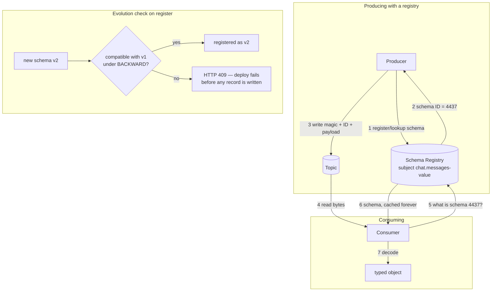

# Lesson 06 — Schemas & contracts

Lesson 05 gave you topics that outlive the services reading them. A compacted `chat.profiles` holds
`u1`'s state **forever**; a `delete` topic holds a week of history. Either way, records written by
last quarter's code get read by code written today.

So here's the question this lesson exists to answer: **when the shape of your data changes, what
stops every downstream consumer from breaking?**

> **The one idea:** In a queue you own both ends, so the payload shape is a private detail. In a log
> you own neither end — the topic is a **public API** with an unknown number of clients, some of them
> not written yet. A schema is how you version that API without breaking them.

## 1. Concept

### 1.1 — The failure this prevents

Concretely. Your `chat.messages` records look like this today:

```json
{ "is_failed": false, "value": "Assalomu Alaykum" }
```

Next sprint you rename `value` → `text`, because `value` was a bad name. You deploy the producer.
Now:

- Your **live consumers** crash on `undefined.toUpperCase()`.
- Your **replay** breaks too — a consumer reading `fromBeginning: true` hits both shapes in one
  stream, old records with `value` and new ones with `text`.
- Nothing warned you. The broker accepted every byte, because **to Kafka a record value is an opaque
  byte array.** It has no idea what's inside.

That last point is the whole problem. Kafka will happily store garbage forever and hand it to
everyone. It enforces nothing about content.

### 1.2 — Why this is worse in Kafka than it was in BullMQ

In the BullMQ course, a queue had one producer and one worker, usually in the same repo, deployed
together. Change the job payload and the worker's types change in the same commit. TypeScript caught
it at build time.

A Kafka topic breaks all three of those assumptions:

|                    | BullMQ queue          | Kafka topic                                     |
| ------------------ | --------------------- | ----------------------------------------------- |
| Consumers          | one worker            | any number of groups (Lesson 03)                |
| Deployed together? | usually               | never — independent services, maybe other teams |
| Old data           | consumed and gone     | **retained and replayed** (Lesson 05)           |
| Shared types       | same repo, same `tsc` | maybe another language entirely                 |

The killer is the third row. Even if every service deploys in lockstep, **the old records are still
in the log**. A schema change doesn't just have to work for the next record — it has to work for
every record already written that anyone might replay.

### 1.3 — What a schema actually is here

Not documentation, and not a type. A schema is:

1. A **machine-readable description** of the record's shape,
2. **stored centrally** so any service in any language can fetch it,
3. **enforced at serialization time**, so a producer physically cannot publish a record that violates it,
4. and **version-checked**, so an incompatible change is rejected _at deploy time_ rather than
   discovered at 3 a.m. by a consumer.

Point 4 is the one people underestimate. The value isn't validation — it's **refusing to let you
make a breaking change.**

### 1.4 — The three formats

|                            | Avro                           | Protobuf                        | JSON Schema       |
| -------------------------- | ------------------------------ | ------------------------------- | ----------------- |
| Wire size                  | small (binary, no field names) | smallest (binary, numeric tags) | large (JSON text) |
| Human-readable on the wire | ✗                              | ✗                               | ✓                 |
| Schema needed to decode    | **yes, always**                | mostly                          | no                |
| Evolution rules            | excellent, explicit defaults   | excellent, tag-based            | workable, looser  |
| Kafka ecosystem default    | ✓ the traditional choice       | growing fast                    | easiest to adopt  |

**Avro** is the historical Kafka default: compact, and its evolution rules are the strictest and
best-specified. Its quirk is that you _cannot_ decode a record without its writer schema — which is
exactly why a registry exists.

**Protobuf** wins on size and on cross-language tooling, and gRPC shops already have it.

**JSON Schema** is the pragmatic pick for a TypeScript shop that already speaks JSON. Biggest payload,
but you can read records in Kafka UI without tooling, and the migration from "we just `JSON.stringify`"
is smallest. **For this course, that's you.**

### 1.5 — The Schema Registry and the 5-byte header

A **Schema Registry** is a small HTTP service that stores schemas and hands out integer IDs. The
clients do the interesting part.

When a producer serializes a record, it doesn't write only your data. It writes:

```
┌────────┬──────────────────┬───────────────────────────┐
│ byte 0 │   bytes 1 – 4    │        bytes 5 …          │
│ magic  │  schema ID (int) │   serialized payload      │
│  0x00  │    big-endian    │                           │
└────────┴──────────────────┴───────────────────────────┘
```

That's the **Confluent wire format**. The consumer reads bytes 1–4, asks the registry "what is schema
4437?", caches the answer forever (IDs are immutable), and decodes the payload with it.

The consequences are worth spelling out:

- **Every record is self-describing** — it carries the ID of the exact schema that wrote it. A replay
  spanning three schema versions decodes correctly, record by record.
- **The registry is not in the hot path.** It's hit once per schema ID, then cached. It being down
  doesn't stop a warm producer or consumer.
- **Records are no longer plain JSON.** Reading them with a naive consumer gives you 5 bytes of junk
  in front. This surprises everyone once.

Schemas are registered under a **subject**, and by default the subject is `<topic>-value` (and
`<topic>-key` for keys). So `chat.messages-value` is the versioned contract for that topic's values.

**A callback you've earned:** the registry stores its schemas in a Kafka topic called `_schemas`,
with `cleanup.policy=compact`. Same trick as `__consumer_offsets` in Lesson 05 — current state per
key, kept forever, in a log. You'll keep seeing this.

### 1.6 — Compatibility modes (the part everyone gets wrong)

This is the core of the lesson. When you register a new version of a schema, the registry checks it
against the old one and **rejects it** if it breaks the configured compatibility mode.

The trick to keeping these straight is to ask: **which side can I upgrade first?**

| Mode                   | Guarantee                        | Who upgrades **first** | You may…                               |
| ---------------------- | -------------------------------- | ---------------------- | -------------------------------------- |
| `BACKWARD` _(default)_ | new schema can read **old** data | **consumers**          | delete fields, add **optional** fields |
| `FORWARD`              | old schema can read **new** data | **producers**          | add fields, delete **optional** fields |
| `FULL`                 | both directions                  | either                 | add/delete **optional** fields only    |
| `NONE`                 | no checking                      | 🙈                     | anything, and suffer                   |

And the `_TRANSITIVE` variants (`BACKWARD_TRANSITIVE`, etc.) check against **all previous versions**,
not just the most recent one.

That distinction matters more than it looks. Plain `BACKWARD` only compares v3 against v2. Do that
three times and v4 may be unable to read v1 — while every individual step passed. **If you replay
topics from the beginning, plain `BACKWARD` is not enough**, because your consumer will meet v1 data.
Compaction (Lesson 05) makes this concrete: an untouched key can hold a v1 record for years.

> **Rule of thumb:** default to `BACKWARD` for event streams you replay recently, and
> `BACKWARD_TRANSITIVE` for anything you truly replay from offset 0 — which includes every compacted
> state topic.

**Why `BACKWARD` means "consumers first":** the new schema is the one _consumers_ will use to read.
For it to read data still being written by not-yet-upgraded producers, it must understand the old
shape. So you roll consumers out first, then producers. `FORWARD` is the mirror image: old consumers
must cope with new records, so producers can go first.

### 1.7 — The rules of safe evolution

Independent of format, these hold:

| Change                                   | Safe?                | Why                                                 |
| ---------------------------------------- | -------------------- | --------------------------------------------------- |
| Add an **optional** field with a default | ✅                   | old readers ignore it; new readers fill the default |
| Delete an **optional** field             | ⚠️ forward-safe only | old readers need it to have had a default           |
| Add a **required** field                 | ❌                   | old records have no value for it                    |
| **Rename** a field                       | ❌                   | it is a delete plus an add — the worst of both      |
| Change a field's **type**                | ❌                   | `int` → `string` breaks every existing record       |
| Widen a type (`int` → `long`)            | ⚠️ format-dependent  | Avro allows some promotions                         |
| Add a value to an **enum**               | ⚠️                   | old readers hit an unknown symbol                   |

The practical summary is short: **only ever add optional fields with defaults, and never rename
anything.** A rename is a new field plus a deprecation of the old one, carried in parallel until
every consumer has migrated and the retention window has rolled past the last old record.

### 1.8 — Your `ZmessageSchema` is not this (and why)

You already wrote a schema — [z-message.schema.ts](apps/server/src/kafka/chat/schema/z-message.schema.ts):

```ts
export const ZmessageSchema = z.discriminatedUnion("type", [
  z.object({ type: z.literal("text"), value: z.string().min(1).max(500) }),
  z.object({
    type: z.enum(["video", "image", "pdf"]),
    srcUrl: z.url(),
    value: z.string().min(1).max(500),
  }),
]);
```

That's a good schema. It is **not** a contract, and the difference is exactly this lesson:

|                                    | zod                 | Schema Registry               |
| ---------------------------------- | ------------------- | ----------------------------- |
| Validates a record                 | ✅                  | ✅                            |
| Enforced on the **producer**       | only if you call it | always, at serialize time     |
| Readable by **another service**    | ✗ (it's TypeScript) | ✅ (HTTP + JSON)              |
| Readable by **another language**   | ✗                   | ✅                            |
| Tells you a change is **breaking** | ✗                   | ✅ — rejects the registration |
| Attached to the **record**         | ✗                   | ✅ (the 5-byte header)        |

zod catches _bad data going in_. A registry prevents _incompatible schemas going out_. The second is
the problem you actually have with a log, and no amount of runtime validation solves it — a consumer
that validates old records against the new schema just fails politely instead of crashing.

Also worth noticing: your zod schema doesn't match what you actually produce. `send-message.ts`
publishes `{ is_failed, value }` — no `type` field at all. `ZmessageSchema` has never validated a
single real record. That's the natural end state of a schema nothing enforces.

### 1.9 — When you can skip all this

Honest guidance, because a registry is real operational weight:

**Skip it when:** one team owns producer and consumer, they deploy together, retention is short, and
the topic isn't replayed from the beginning. A shared TypeScript type in a monorepo package genuinely
is enough. (That is most of your repo today.)

**You need it when** any of these are true:

- Another **team** or another **language** consumes the topic.
- The topic is **compacted** or replayed from offset 0 — old records live forever, so old schemas do too.
- You cannot deploy producers and consumers **atomically** (i.e. always, in production).
- The data lands in a warehouse, lake, or anything with a fixed table shape.

The trigger is not scale. It's **the number of independent deploy units reading the topic.** At one,
skip it. At two, you want it.

## 2. Diagram



The bottom box is the point of the whole lesson: the failure moves from **runtime, in production,
in a consumer you don't own** to **deploy time, in your own CI**.

## 3. Walkthrough

### 3.1 — Adding a registry to your stack

Your compose has no registry yet. Add the service (it talks to the broker over the `DOCKER`
listener, same as Kafka UI):

```yaml
schema-registry:
  image: confluentinc/cp-schema-registry:7.7.1
  container_name: learn-broker-schema-registry
  depends_on: [kafka]
  ports:
    - "8081:8081"
  environment:
    SCHEMA_REGISTRY_HOST_NAME: schema-registry
    SCHEMA_REGISTRY_KAFKASTORE_BOOTSTRAP_SERVERS: "PLAINTEXT://kafka:19092"
    SCHEMA_REGISTRY_LISTENERS: "http://0.0.0.0:8081"
  restart: unless-stopped
```

and point Kafka UI at it so you get a Schemas tab:

```yaml
kafka-ui:
  environment:
    KAFKA_CLUSTERS_0_SCHEMAREGISTRY: http://schema-registry:8081
```

Then: `pnpm add @kafkajs/confluent-schema-registry --filter server`

### 3.2 — Registering and producing

```ts
import { SchemaRegistry, SchemaType } from "@kafkajs/confluent-schema-registry";
import { producer } from "@/kafka/kafka.instance";

const registry = new SchemaRegistry({ host: "http://localhost:8081" });

// v1 of the contract. Note every field is required — that's fine for a FIRST version.
const schema = {
  type: "object",
  properties: {
    type: { type: "string" },
    value: { type: "string" },
  },
  required: ["type", "value"],
  additionalProperties: false,
};

// Registering under the topic's subject. Returns a stable, immutable integer id.
const { id } = await registry.register(
  { type: SchemaType.JSON, schema: JSON.stringify(schema) },
  { subject: "chat.messages-value" },
);

await producer.send({
  topic: "chat.messages",
  messages: [
    {
      key: "room-1",
      // encode() writes magic byte + schema id + payload, and VALIDATES as it goes.
      value: await registry.encode(id, { type: "text", value: "Assalomu Alaykum" }),
    },
  ],
});
```

Try `registry.encode(id, { type: "text" })` — no `value` — and it throws **before** anything reaches
Kafka. That's the enforcement point.

### 3.3 — Consuming

```ts
await consumer.run({
  eachMessage: async ({ message }) => {
    // decode() reads the schema id from the header and fetches (then caches) that exact schema.
    const decoded = await registry.decode(message.value!);
    console.log(decoded); // { type: "text", value: "Assalomu Alaykum" }
  },
});
```

Note what you did **not** write: any version check, any `if ("text" in msg)`. The record told the
consumer which schema wrote it.

### 3.4 — Setting the compatibility mode

Per subject, over HTTP:

```bash
# read the current mode
curl -s http://localhost:8081/config/chat.messages-value

# require compatibility with EVERY past version, not just the latest
curl -s -X PUT http://localhost:8081/config/chat.messages-value \
  -H "Content-Type: application/json" \
  -d '{"compatibility": "BACKWARD_TRANSITIVE"}'

# list versions, and fetch one
curl -s http://localhost:8081/subjects/chat.messages-value/versions
curl -s http://localhost:8081/subjects/chat.messages-value/versions/1
```

And the one that saves you — ask _before_ deploying whether a change is legal:

```bash
curl -s -X POST http://localhost:8081/compatibility/subjects/chat.messages-value/versions/latest \
  -H "Content-Type: application/json" \
  -d '{"schemaType":"JSON","schema":"{\"type\":\"object\",\"properties\":{...}}"}'
# → {"is_compatible": false}
```

Put that call in CI and a breaking schema change fails the build.

## 4. Exercise

Turn `chat.messages` from an untyped byte stream into a versioned contract, then try to break it.

1. **Stand up the registry.** Add the compose service from §3.1, confirm
   `curl localhost:8081/subjects` returns `[]`, and check the Schemas tab appears in Kafka UI.

2. **Register v1 and produce through it.** Write the JSON Schema for what you _actually_ send today
   (`{ is_failed, value }` — not your zod shape), register it as `chat.messages-value`, and produce a
   few records with `registry.encode`. Then look at a record in Kafka UI: note whether the UI renders
   it as JSON, and explain what those first 5 bytes are.

3. **Prove the producer is now constrained.** Try to `encode` a record that violates the schema
   (missing field, wrong type). Capture the error, and say precisely _where_ it was caught — which
   process, and how many network hops away from the broker.

4. **Make a safe change.** Add an optional field (say `edited_at`) **with a default**, register it as
   v2, and confirm the registry accepts it. Now run your **v1 consumer, unchanged**, against records
   written with v2. It must still work. Explain which compatibility mode made that safe.

5. **Make a breaking change and get rejected.** Rename `value` → `text` and try to register it. Capture
   the 409. Then answer: the registry rejected this in _milliseconds_, at deploy time. Without a
   registry, when and where would you have found out instead? Be specific about which service fails
   and who gets paged.

6. **The replay trap.** Set the subject to plain `BACKWARD`, then evolve the schema three times
   (v1→v2→v3→v4), each step individually legal. Now reason about a consumer on **v4** replaying the
   topic `fromBeginning: true`. Is it guaranteed to read your v1 records? Which mode would have
   guaranteed it, and what does Lesson 05's compaction have to do with the answer?

Run files with: `pnpm --filter server exec tsx apps/server/src/kafka/<your-file>.ts`
Registry UI: the **Schemas** tab in http://localhost:8080, or raw at http://localhost:8081/subjects

### Mini-challenge (predict first, then verify — no peeking)

1. A teammate points a plain consumer (no registry client) at your schema-encoded topic and
   `JSON.parse`s `message.value.toString()`. What exactly do they see, and why?
2. Your registry container dies. Which of these break **immediately**: a producer that's been running
   an hour, a consumer that's been running an hour, a producer starting fresh, a consumer starting
   fresh? Explain each using §1.5.
3. You set compatibility to `NONE` "just for local dev" and evolve the schema. Six months later
   someone replays the topic from offset 0 to rebuild a read model. What do they get — and which is
   worse here, a crash or no crash?

Nail #3 and you've got the deep version of this lesson: with `NONE`, a schema mismatch may not throw
at all. It may **silently decode into the wrong shape**, and your rebuilt read model is quietly wrong.
Bring me your v2-accepted and v4-rejected captures and I'll review by severity.

## 5. Go deeper

**Stephane Maarek — "Apache Kafka for Beginners v3"** (your Udemy sub):

- **Kafka Schema Registry section** — the whole thing, ~40 min. He builds the Avro version of §3;
  the concepts map 1:1 onto the JSON Schema you'll use.
- His **Confluent Schema Registry & REST Proxy** course goes deeper on compatibility modes if §1.6
  doesn't land the first time.

**Best free reads:**

- **[Confluent — Schema Evolution and Compatibility](https://docs.confluent.io/platform/current/schema-registry/fundamentals/schema-evolution.html)**
  — _the_ reference for §1.6/§1.7, with the exact allowed-change table per format. The one to keep
  bookmarked.
- **[Confluent — Schema Registry Concepts](https://docs.confluent.io/platform/current/schema-registry/fundamentals/index.html)**
  — the wire format, subjects, and subject-naming strategies from §1.5.
- **[Martin Kleppmann — Schema evolution in Avro, Protocol Buffers and Thrift](https://martin.kleppmann.com/2012/12/05/schema-evolution-in-avro-protocol-buffers-thrift.html)**
  — the clearest thing ever written on _why_ these formats evolve the way they do. Old, still the best.
- **[@kafkajs/confluent-schema-registry docs](https://github.com/kafkajs/confluent-schema-registry)** —
  your exact API for §3.2–3.3.

**Book:** _Kafka for Architects_ has the strongest treatment of **data contracts** as an
organisational problem rather than a technical one — worth it once you've felt §1.9's trigger.

Next: **`07-eda-patterns.md`** — you can now evolve what's _in_ an event. Next question is what an
event should have been in the first place.
