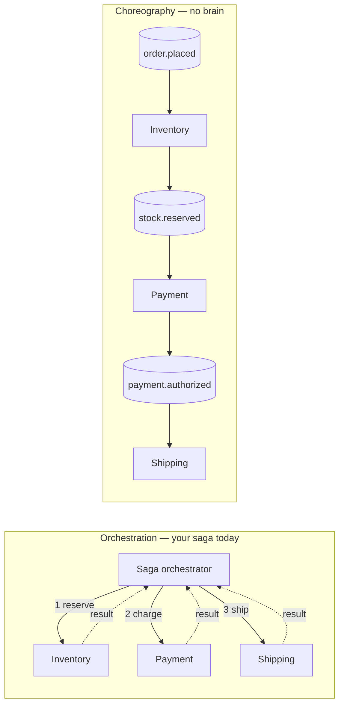
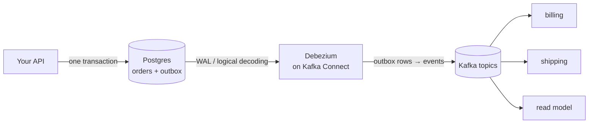
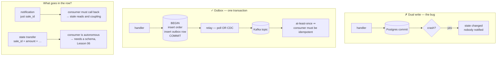

# Lesson 07 — Event-driven patterns: notification, state transfer, outbox & CDC

Lesson 06 taught you to evolve what's _inside_ an event. This lesson asks the harder question that
comes before it: **what should the event have contained in the first place?**

You've already built the machinery — a transactional outbox and an orchestrated saga, in this repo,
on BullMQ. This lesson does two things: names the design choices you made implicitly, and moves the
whole thing onto Kafka.

> **The one idea:** "Send an event" is not one decision, it's three — **how much state** the event
> carries, **who decides** what happens next, and **how the event escapes your database**. Get the
> first wrong and you build a distributed monolith. Get the third wrong and you lose data.

## 1. Concept

### 1.1 — Three kinds of event, and they are not interchangeable

|                                  | Carries                                    | Receiver must…             | Coupling                  |
| -------------------------------- | ------------------------------------------ | -------------------------- | ------------------------- |
| **Event notification**           | just an ID: "order 42 changed"             | call back to fetch details | to your **API**           |
| **Event-carried state transfer** | the whole new state                        | nothing — it's all there   | to your **schema**        |
| **Event sourcing**               | the change itself, as the system of record | replay to derive state     | to your **event history** |

Most "should this be an event?" arguments are actually arguments about which of these three you meant.

### 1.2 — Event notification: thin, and your repo is full of it

Look at your own outbox table — [packages/db/src/schema/index.ts](packages/db/src/schema/index.ts):

```ts
export const saga_outbox = pgTable("saga_outbox", {
  id: serial("id").primaryKey(),
  step: text().notNull().$type<TSagaForwardStep | TSagaBackwardStep>(),
  sale_id: uuid().notNull(), // ← an ID, and nothing else
  is_published: boolean().notNull().default(false),
  created_at: timestamp().defaultNow().notNull(),
});
```

There's no payload. The row says _"step X happened for sale Y"_ and stops. Sure enough, your relay
has to go get the rest — [outbox-saga-relay.ts](apps/server/src/bullmq/sale/outbox-saga-relay.ts):

```ts
.innerJoin(t.orders, d.eq(t.orders.id, t.saga_outbox.sale_id))   // ← the callback, as a JOIN
```

That is textbook **event notification**, and for a single-service saga it's a perfectly good choice:
tiny rows, no duplicated state, no schema to version.

Its costs appear the moment a _second_ service cares:

- **Temporal coupling.** The consumer can't act unless your API/DB is up right now. You've reintroduced
  the synchronous dependency that events were supposed to remove.
- **A stampede.** 10,000 events → 10,000 lookups against the source database.
- **The staleness race, and it's the nasty one.** The event says "order 42 changed at 10:00." The
  consumer fetches order 42 at 10:03 and gets the state as of 10:03 — which may include _three more
  changes_. It processes the wrong version, and worse, two consumers of the same event can see
  **different** states. Your ordering guarantees (Lesson 02) protected the event stream, and you threw
  them away at the JOIN.

### 1.3 — Event-carried state transfer: fat, autonomous

Put the state in the event:

```json
{
  "sale_id": "a3f…",
  "step": "payment_authorized",
  "amount": 4500,
  "currency": "UZS",
  "customer_id": "u_88",
  "region": "Tashkent",
  "occurred_at": "2026-07-30T22:04:35.536Z"
}
```

Now the consumer needs nothing from you. It can process at 3 a.m. while your API is down, build its
own local read model, and replay history without hammering your database. **The event is a fact, not
a pointer to a fact** — so it can never go stale.

You already have this shape sketched, commented out, right below the other one:

```ts
export const outbox = pgTable("outbox", {
  topic: text("topic").$type<"sale">().notNull(),
  status: text("status").$type<"new" | "payment_authorize" | "completed" | "cancelled">().notNull(),
  payload: jsonb("payload").notNull(),   // ← the state, carried
  ...
});
```

The costs are real too: bigger records, the same data duplicated into every consumer, and — the
important one — **you now have a published schema**, so every change is a compatibility question.
That's Lesson 06, and this is why it came first.

**The rule:** notification inside one service; state transfer across a service boundary. The instant
a team you don't control consumes the topic, the JOIN in your relay becomes their outage.

### 1.4 — Event sourcing is a _different axis_

The most common confusion in this area: event sourcing is not "a fatter event." It's the decision to
make the event log the **system of record** — you stop storing current state at all and derive it by
replaying. Your `orders` table wouldn't exist; it'd be a projection you can delete and rebuild.

You can do event-carried state transfer without event sourcing (that's most systems), and it's the
sane default. Lesson 08 is where we actually do it. For now just don't conflate the two: §1.2/§1.3 are
about **what you put in a message**; event sourcing is about **where the truth lives**.

### 1.5 — Choreography vs orchestration

Your saga is an **orchestration** — [saga-orchestration.ts](apps/server/src/bullmq/sale/saga-orchestration.ts)
is a central brain that knows every step and drives the next one.



|                                 | Orchestration                        | Choreography                         |
| ------------------------------- | ------------------------------------ | ------------------------------------ |
| Flow is                         | explicit, in one file                | emergent, spread across services     |
| Add a step                      | edit the orchestrator                | new service subscribes, nobody edits |
| "What happens on order.placed?" | read one file                        | grep every repo 😱                   |
| Compensation (Lesson 10)        | straightforward — the brain knows    | genuinely hard                       |
| Coupling                        | services coupled to the orchestrator | coupled to the event schema          |

**The honest guidance:** choreography is fashionable and orchestration is usually right for anything
with money, compensation, or a compliance story. You chose correctly for a sale saga. Use
choreography for _reactions_ that may fail independently — send a receipt, update analytics, warm a
cache — and orchestration for _transactions_ that must complete or unwind.

The failure mode to fear is the middle: a choreographed flow where step 4 implicitly depends on step 2,
written down nowhere.

### 1.6 — Commands vs events: name them differently or suffer

|                  | Command                          | Event                                 |
| ---------------- | -------------------------------- | ------------------------------------- |
| Name             | imperative — `authorize_payment` | **past tense** — `payment_authorized` |
| Means            | "please do this"                 | "this happened"                       |
| Recipients       | exactly **one**                  | **any number**, including none        |
| Can be rejected? | yes                              | no — it already happened              |

A "command topic" has exactly one legitimate consumer, which means **it's a queue** — the BullMQ
shape, wearing a Kafka costume. That's fine and often correct; just be aware you're not getting the
fan-out you're paying partitions for.

Your `saga_outbox.step` values (`initial`, `payment_authorize`, `initial_return`) are **commands** —
the orchestrator telling a worker to do something. That's consistent with orchestration. It's also
why publishing that table straight to a public Kafka topic would be a design error: you'd be exposing
your internal state machine's instructions as if they were facts about your business.

### 1.7 — Outbox → Kafka: the same trick, one system over

The dual-write problem from BullMQ Lesson 09 is unchanged, and Kafka does **not** fix it:

```ts
await db.insert(orders).values(order);            // ✅ committed
await producer.send({ topic: "sale.events", … }); // 💥 process dies here
// order exists, nobody was ever told
```

Two systems, no shared transaction. Lesson 04's transactions are **Kafka-internal only** — they
cannot enroll a Postgres write. So the answer is the one you already built: write the event to an
outbox table **in the same transaction as the state change**, and let a relay publish it.

What changes when the relay targets Kafka instead of BullMQ:

|                     | BullMQ relay (yours today) | Kafka relay               |
| ------------------- | -------------------------- | ------------------------- |
| Publishes to        | `queue.add()`              | `producer.send()`         |
| Dedupe on republish | `jobId` — BullMQ drops it  | **nothing built in** ←    |
| Ordering            | none across jobs           | per partition, if you key |
| Consumers           | one worker                 | any number of groups      |

That second row matters. Your current relay leans on BullMQ's `jobId` to make republishing harmless:

```ts
{
  jobId: `${row.saga_outbox.step}_${row.saga_outbox.sale_id}`;
}
```

**Kafka has no equivalent.** `producer.send()` always appends. And the relay's own crash window is
real: publish succeeds → process dies → `is_published` never set → next tick republishes. So a Kafka
outbox relay is **at-least-once, always**, and the duplicate lands in the topic permanently.

Which means the answer is the same one this course keeps arriving at: **the consumer must be
idempotent.** Carry a stable business key in the event (`sale_id + step`, or an event UUID) and let
consumers dedupe on it. Idempotent producer (Lesson 04) doesn't help — it only covers one producer
session's retries, not a relay restart.

### 1.8 — CDC: delete the relay entirely

Your relay polls:

```ts
setInterval(relayOnce, 1000);
```

Every second, forever, whether or not anything happened. At low volume that's wasted queries; at high
volume it's latency (up to 1s) plus contention on the outbox table.

**Change Data Capture** replaces polling with tailing the database's own write-ahead log. Postgres
already writes every change to the WAL for crash recovery and replication; **Debezium** reads that
stream and produces each change to Kafka.



Why it's strictly better than polling:

- **No polling.** Latency drops to milliseconds; zero queries when nothing changes.
- **Nothing missed.** The WAL is the same mechanism Postgres replication trusts.
- **Ordered.** Changes arrive in commit order, which polling can reorder under concurrency.
- **No app code.** The relay stops being something you maintain.

The costs: Kafka Connect is another service to run, Postgres needs `wal_level=logical`, and a stalled
replication slot will grow your WAL until the disk fills — a genuinely dangerous ops failure mode
worth knowing before you deploy it.

**Outbox + CDC together** is the production-grade pattern, and it's worth being precise about why you
keep the outbox table rather than just capturing the `orders` table directly:

- CDC on `orders` gives you **row diffs** — "column `status` went `new` → `paid`". That's a database
  event, not a business event. Consumers end up reverse-engineering your intent from column changes,
  and every schema refactor becomes their breaking change.
- CDC on an **outbox** gives you the event _you deliberately wrote_, with the name and payload you
  chose. Your table shape stays private.

Debezium has first-class support for this (`io.debezium.transforms.outbox.EventRouter`), which expects
columns roughly like `id`, `aggregatetype`, `aggregateid`, `type`, `payload` — it routes each row to a
topic based on `aggregatetype` and keys it by `aggregateid`. Note your `saga_outbox` matches none of
those names, and has no payload at all. Reshaping it is part of the exercise.

### 1.9 — Topic design, briefly

- **One topic per aggregate, not per event type.** `sale.events` carrying `placed|paid|shipped`, not
  three topics. Ordering is per partition (Lesson 02), so splitting event types across topics
  destroys the ordering between them — and "paid before placed" is a real bug.
- **Key by the aggregate id** (`sale_id`). Same sale → same partition → correct order. This is
  Lesson 02 doing the work.
- **Past tense, and never a verb you can refuse.**
- **Don't publish your internal state machine.** §1.6.

## 2. Diagram



## 3. Walkthrough

### 3.1 — The outbox row, reshaped for Kafka + Debezium

```ts
export const event_outbox = pgTable("event_outbox", {
  id: uuid("id").primaryKey().defaultRandom(),
  aggregate_type: text("aggregate_type").notNull(), // → topic:  "sale"
  aggregate_id: uuid("aggregate_id").notNull(), // → key:    ordering per sale (Lesson 02)
  event_type: text("event_type").notNull(), // → "payment_authorized" (past tense!)
  payload: jsonb("payload").notNull(), // → state transfer (§1.3)
  created_at: timestamp("created_at").defaultNow().notNull(),
});
```

Four deliberate differences from your `saga_outbox`: a **UUID** id (a stable dedupe key consumers can
use), an explicit **aggregate id** to key on, a **past-tense event type**, and a **payload**.

### 3.2 — The atomic write (unchanged in spirit from BullMQ Lesson 09)

```ts
await db.transaction(async (tx) => {
  await tx.insert(orders).values(order);

  await tx.insert(event_outbox).values({
    aggregate_type: "sale",
    aggregate_id: order.id,
    event_type: "sale_placed",
    payload: { sale_id: order.id, amount: order.amount, customer_id: order.customer_id },
  });
});
// Both rows land, or neither. No Kafka call inside the transaction — that's the whole point.
```

### 3.3 — The relay, now producing to Kafka

```ts
const relayOnce = async () => {
  await db.transaction(async (tx) => {
    const rows = await tx
      .select()
      .from(event_outbox)
      .orderBy(event_outbox.created_at) // commit order matters
      .limit(100)
      .for("update", { skipLocked: true }); // safe with N relay instances

    if (rows.length === 0) return;

    await producer.send({
      topic: "sale.events",
      messages: rows.map((r) => ({
        key: r.aggregate_id, // ← per-sale ordering
        value: JSON.stringify(r.payload),
        headers: { event_id: r.id, event_type: r.event_type }, // ← consumer dedupes on event_id
      })),
    });

    await tx.delete(event_outbox).where(
      inArray(
        event_outbox.id,
        rows.map((r) => r.id),
      ),
    );
  });
};
```

Trace the crash window deliberately, because it does not close:

- die **before** `send` → rows still there, republished next tick. Fine.
- die **after** `send`, before the delete → **the events are in Kafka twice.** Not fine, and
  unavoidable.

There is no arrangement of these two statements that fixes it, because they're in different systems.
`event_id` in the headers is the mitigation: consumers keep a seen-set and drop repeats. This is the
same conclusion as Lesson 03, Lesson 04, and BullMQ Lesson 07 — **at the edge of one system,
idempotency takes over.**

### 3.4 — The idempotent consumer

```ts
await consumer.run({
  eachMessage: async ({ message }) => {
    const eventId = message.headers!.event_id!.toString();

    await db.transaction(async (tx) => {
      const [seen] = await tx
        .insert(processed_events)
        .values({ event_id: eventId })
        .onConflictDoNothing()
        .returning();

      if (!seen) return; // already handled — drop silently

      await handle(JSON.parse(message.value!.toString()), tx);
    });
  },
});
```

The dedupe insert and the business work share **one** transaction, so "marked seen" and "actually
done" can't diverge.

### 3.5 — Swapping the relay for CDC (sketch)

Postgres needs logical decoding — in your compose:

```yaml
postgres:
  command: ["postgres", "-c", "wal_level=logical"]
```

Then Kafka Connect + the Debezium Postgres connector, with the outbox router doing the mapping from
§3.1:

```json
{
  "name": "sale-outbox-connector",
  "config": {
    "connector.class": "io.debezium.connector.postgresql.PostgresConnector",
    "database.hostname": "postgres",
    "database.port": "5432",
    "database.user": "postgres",
    "database.password": "password",
    "database.dbname": "learn-broker",
    "topic.prefix": "lb",
    "table.include.list": "public.event_outbox",
    "transforms": "outbox",
    "transforms.outbox.type": "io.debezium.transforms.outbox.EventRouter",
    "transforms.outbox.route.by.field": "aggregate_type",
    "transforms.outbox.table.field.event.key": "aggregate_id",
    "transforms.outbox.table.field.event.payload": "payload"
  }
}
```

Your `relayOnce` and its `setInterval` are then deleted. Note what did **not** change: §3.2's atomic
write, and §3.4's idempotent consumer. CDC removes the polling, not the need for idempotency —
Debezium is also at-least-once.

## 4. Exercise

Move your existing sale flow off BullMQ and onto Kafka, and feel each design choice.

1. **Classify what you already built.** In writing, before any code: for your current `saga_outbox`,
   name which of §1.1's three kinds it is, and whether your saga is choreography or orchestration.
   Then name one concrete thing that breaks if a _second, external_ service starts consuming it.

2. **Build the event outbox.** Add the §3.1 table alongside `saga_outbox` (don't delete anything yet)
   and write the §3.2 atomic insert. Prove atomicity: force an error between the two inserts and show
   that **neither** row exists.

3. **Relay to Kafka.** Write the §3.3 relay against a new `sale.events` topic, keyed by `aggregate_id`.
   Then verify the ordering claim from §1.9 — publish three events for the _same_ sale and show in
   Kafka UI that all three landed on one partition, in order.

4. **Reproduce the duplicate, then defeat it.** Kill the relay between `send` and the delete (a `throw`
   works). Show the duplicate in the topic. Then implement §3.4 and show the consumer processing the
   business work exactly once despite two records. Explain why Lesson 04's `idempotent: true` does
   **not** help here.

5. **Fan out — the thing BullMQ couldn't do.** Add a _second_ consumer group on `sale.events` that
   does something unrelated (log an audit line, count by region). Both groups must see every event.
   Then answer: what would you have had to change in your BullMQ design to add this consumer, and what
   do you change here?

6. **Notification vs state transfer, measured.** Make your event thin (`{ sale_id }` only) and have
   the consumer JOIN back for details. Then make it fat (§1.3). Describe the concrete difference in
   what happens when the consumer runs **while your Postgres is stopped** — actually stop it and see.

**Stretch (optional, real infra):** stand up Kafka Connect + Debezium from §3.5 and delete your relay
entirely. Worth doing once, but the lesson lands without it.

### Mini-challenge (predict first, then verify — no peeking)

1. You publish `sale.events` keyed by `sale_id` with 3 partitions. A consumer must process each sale's
   events strictly in order but wants max parallelism. What's the highest useful consumer count, and
   what happens at one more than that? _(Lessons 02 + 03.)_
2. Your relay dies for two hours. On restart, what does it do — and is the resulting Kafka topic
   _correct_, _duplicated_, _out of order_, or some combination? Justify each.
3. A teammate says: "the outbox is redundant now, Kafka has transactions — just use
   `producer.transaction()` around the DB write and the send." Explain exactly why that's wrong, in
   one sentence, using Lesson 04 §1.5.
4. You switch from notification to state transfer. Which _earlier lesson_ just became mandatory
   rather than optional, and why?

Get #4 and you've seen the through-line: fat events buy autonomy, and pay for it with a public
schema. Bring me your atomicity proof, the duplicate capture, and the two-consumer-group fan-out;
I'll review by severity.

## 5. Go deeper

**Stephane Maarek** (your Udemy sub):

- **[Kafka Connect Hands-on](https://www.udemy.com/course/kafka-connect/)** — the one to actually do
  for §1.8/§3.5. Connect is how CDC reaches Kafka, and it's the least Java-bound of his advanced
  courses since you configure it with JSON, not code.

**Best free reads:**

- **Martin Fowler — [What do you mean by "Event-Driven"?](https://martinfowler.com/articles/201701-event-driven.html)**
  — the origin of §1.1's taxonomy, and short. If you read one thing, this.
- **Ben Stopford — [Designing Event-Driven Systems](https://www.confluent.io/resources/ebook/designing-event-driven-systems/)**
  (free PDF) — chapters on event collaboration and the "event-carried state transfer" trade-off are
  §1.2–1.3 at book length. The single most relevant book to what's in your repo.
- **[Debezium — Outbox Event Router](https://debezium.io/documentation/reference/stable/transformations/outbox-event-router.html)**
  — the exact SMT config from §3.5, with the expected column names.
- **[microservices.io — Saga](https://microservices.io/patterns/data/saga.html)** and
  **[Transactional Outbox](https://microservices.io/patterns/data/transactional-outbox.html)**
  (Chris Richardson) — crisp pattern write-ups; the saga page has the clearest choreography-vs-
  orchestration comparison anywhere.

Next: **`08-event-sourcing-cqrs.md`** — you've been carrying state _in_ events. Next we stop storing
state at all and let the log **be** the database.
