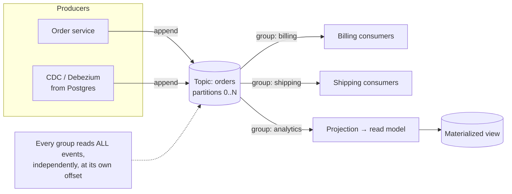

# Learn Kafka & Event-Driven Architecture — Course Roadmap

You just finished the brokers/queues course (BullMQ + Redis + Postgres): job lifecycle,
retries, DLQ, concurrency, **idempotency & exactly-once**, **queue vs topic**, the
**transactional outbox**, and **sagas**. This course builds *directly* on that — we won't
re-teach what a queue or idempotency is. Instead we go up a level to **log-based event
streaming**, using **Apache Kafka** (KRaft mode) with **KafkaJS** on your existing stack.

The one-line thesis you'll spend Lesson 01 unpacking:

> A BullMQ queue is a **to-do list** — a job is consumed and *removed*. A Kafka topic is a
> **durable, replayable log** — an event is *retained* and any number of readers replay it
> at their own pace. That single difference reshapes everything downstream.

## How these lessons work

Each lesson is a numbered markdown file with four parts:

1. **Concept** — the idea and, crucially, the *why*.
2. **Diagram** — Mermaid inline (Cmd+Shift+V to preview); a standalone interactive HTML
   visual for the genuinely hard bits (partitioning, rebalancing, offset commit timing).
3. **Walkthrough** — annotated reference code (KafkaJS/TypeScript).
4. **Exercise** — an open-ended, real problem. *You* write the code; I review by severity.
   I won't hand you the solution unless you're stuck.

We move **step by step** and I'll often stop to ask you to predict/derive before revealing
— same Socratic rhythm as the last course.

## Prerequisites (set up for you)

- ✅ **Kafka** (KRaft, single broker) in Docker on `localhost:9092`
- ✅ **Kafka UI** at **http://localhost:8080** — your visual window into topics, partitions,
  consumer groups, offsets, and lag (the Bull Board of Kafka)
- ✅ **KafkaJS** installed in `apps/server`
- ✅ `KAFKA_BROKERS` in `@learn-broker/env/server` (default `localhost:9092`)

Start/stop everything: `pnpm db:start` / `pnpm db:stop` (the compose now includes Kafka).
Sanity check: `docker exec learn-broker-kafka /opt/kafka/bin/kafka-topics.sh --bootstrap-server localhost:9092 --list`

## Roadmap

| #   | Lesson | What you'll learn |
| --- | ------ | ----------------- |
| 01  | **The Log — Kafka is not a queue** | Topics, partitions, offsets, retention, replay; why consumers track their own position |
| 02  | Producing: keys, partitioning & ordering | How records route to partitions, `acks` & durability, the *per-partition* ordering guarantee |
| 03  | Consuming: consumer groups & rebalancing | The queue⊕topic duality in one mechanism; partition assignment, rebalances, offset commits |
| 04  | Delivery semantics: idempotent & transactional producers | Kafka's exactly-once: idempotent producer, transactions, read-process-write |
| 05  | Retention & log compaction | The log as a durable store; compacted topics, tombstones, latest-state-per-key |
| 06  | Schemas & contracts | Schema registry, Avro/Protobuf/JSON Schema, forward/backward compatibility, why contracts matter |
| 07  | EDA patterns | Event notification vs event-carried state transfer vs event sourcing; choreography vs orchestration; **outbox → Kafka + CDC/Debezium** |
| 08  | Event Sourcing & CQRS | State *is* the log; projections, read models, rebuilding state by replay |
| 09  | Stream processing | Stateful ops, windows, joins, the stream⇄table duality |
| 10  | Production reliability & ops | Replication & ISR, leader election, consumer lag, DLQ topics, backpressure, poison pills |
| 11  | Capstone | Build an event-driven system end-to-end: outbox → Kafka → multiple independent consumers + a rebuildable read model |

## The big picture (where we're headed)

Start with **`01-the-log.md`**.
